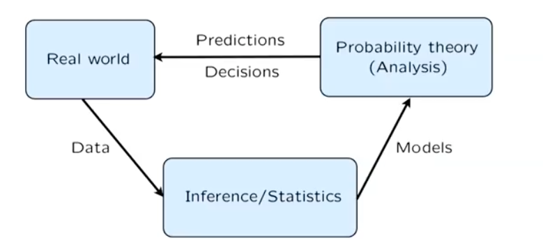
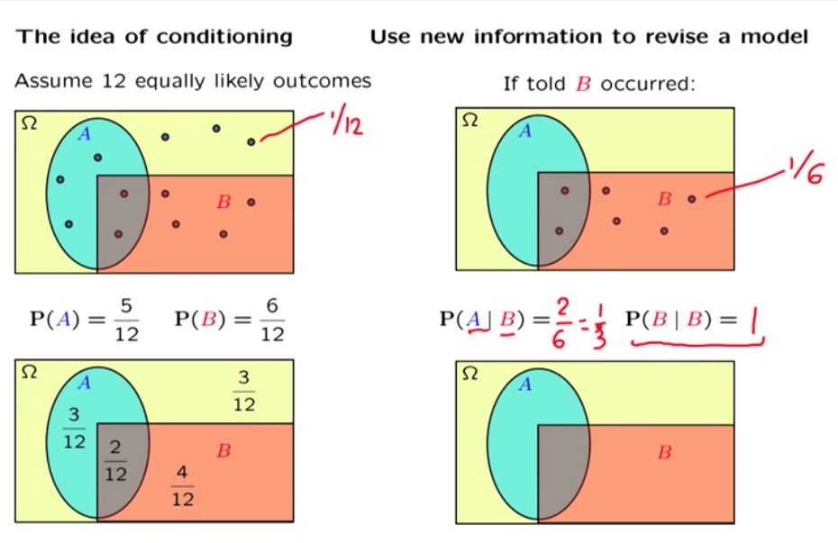
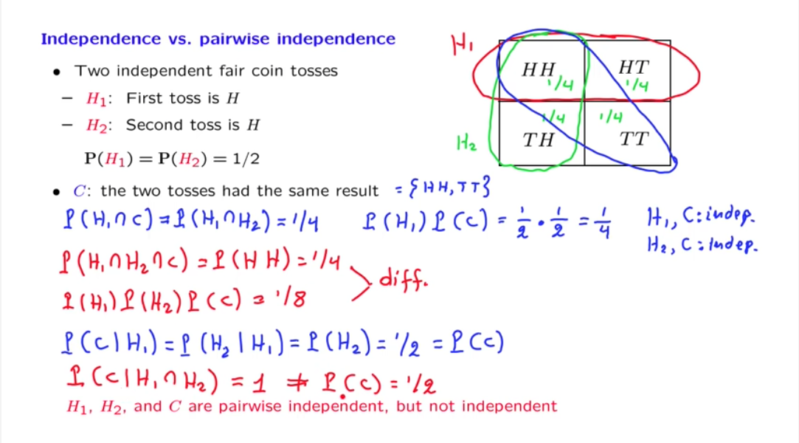

# 6.041/6.431 Probability - The Science of Uncertainty and Data

## Lecture 1 (September 10, 2018)

### Probability Models

To specify such a model, it includes 2 steps:

1. Sample space: describe possible outcomes of an experiment
2. Probability laws: describe beliefs about the likelihood of outcomes (or assign a probability to outcomes)

### Sample space

list of possible outcomes must be mutually exclusive, collectively exhaustive, and at the right granularity.

### Probability laws

#### Probability axioms

> Motivation:
> Assign individual probability to a single dot is a challenge (in the dart example, each dot has zero probability), so we assign a probability to the subset of the sample space.

1. Nonnegativity: ${\bf P}(A) \geq 0$
2. Normalization: ${\bf P}(\Omega) = 1$
3. (Finite) Additivity: if $A \cap B = \emptyset$ then ${\bf P}(A \cup B) = {\bf P}(A) + {\bf P}(B)$ (need to be refined in future)

### Consequences of axioms (properties of probability axioms)

* ${\bf P}(A) \leq 1$
* ${\bf P}(\emptyset) = 0$
* ${\bf P}(A) + {\bf P}(A^c) = 1$
* $A, B, \text{and } C$ are disjoint: ${\bf P}(A \cup B \cup C) = {\bf P}(A) + {\bf P}(B) + {\bf P}(C)$
* $A_1, \cdots A_k,$ are disjoint: ${\bf P}(A_1 \cup \cdots, \cup A_k) = \sum_{i - 1}^k{\bf P}(A_i)$
* If $A \subset B$, then ${\bf P}(A) \leq {\bf P}(B)$
* ${\bf P}(A \cup B) = {\bf P}(A) + {\bf P}(B) - {\bf P}(A \cap B)$
* ${\bf P}(A \cup B \cup C) = {\bf P}(A) + {\bf P}(A^c \cap B) + {\bf P}(A^c \cap B^c \cap C)$
* Union Bound: ${\bf P}(A \cup B) \leq {\bf P}(A) + {\bf P}(B)$

### Probability calculation steps

1. Specify the sample space
2. Specify a probability law
3. Identify an event of interest
4. Calculate

### Countable additivity

The 3rd probability axiom previously mentioned can be extended to countable set (all integers),
which means that the element in the set can be arranged in a sequence. This is contrary to
the concept of uncountable set (i.e. a dart board, 2D plane). So you need to distinguish the
following concepts:

* discrete set (countable set)
* continuous set (uncountable set, impossible to arrange in a sequence)
* finite set
* infinite set (possible to be arranged in a sequence)
* discrete (countable) finite set (i.e. {1, 2, 3})
* discrete (countable) infinite set (i.e. all integers, all even integers, all old integers)
* continuous (uncountable) infinite set (i.e. $\{x | 0 \leq x \leq 1\}$)

Example:
Sample space $\{1, 2, 3, \cdots\}$, given ${\bf P}(n) = \frac{1}{2^n}, n = 1, 2, \cdots$.
Check the against the probability axioms that $\sum_{n = 1}^{\infty}{\bf P}(n) = 1$.
What about the probability ${\bf P}(\text{outcome is even})$? Using countable additivity axiom.

### Countable Additivity Axiom (refined probability axiom)

!!! Note
    if $A_1, A_2, A_3, \cdot$ is an infinite __sequence__ of disjoint events,
    then ${\bf P}(A_1 \cup A_2 \cup A_3 \cdots) = {\bf P}(A_1) + {\bf P}(A_2) + {\bf P}(A_3) + \cdots$

To refine the 3rd probability axiom, additivity holds only for "countable" sequences of events.
That means the additivity axiom must be a __sequence__, with finite or infinite elements.

Note the following contradiction, the additivity axiom can not be applied to continuous sample space.

$A_1, A_2, A_3, \cdots$ are real coordinates, if you apply the additivity axiom, you will get:

\begin{align*}
1={\bf P}(\Omega ) &={\bf P}\big (\{ A_1\} \cup \{ A_2\} \cup \{ A_3\} \cdots \big )\\
&={\bf P}(\{ A_1\} )+{\bf P}(\{ A_2\} )+{\bf P}(\{ A_3\} )+\cdots \\
&= 0+0+0+\cdots =0,
\end{align*}

which is contradicts. This is because "unit square" is not a countable set.

### Interpretations of probability theory

* frequency of events A?
     * What is P(the president will be reelected)?

* Probability is often interpreted as:
     * Description of beliefs
     * Betting preference

## Lecture 2 Conditioning and Baye's rule

### Conditional probability

use new information to review a model

!!! Notes "Definition"
    ${\bf P}(A|B) =$ "probability of A given that B occurred"

    ${\bf P}(A|B)=\frac{{\bf P}(A \cap B)}{{\bf P}(B)}$, defined only when ${\bf P}(B) > 0$

Conditional probability share properties of ordinary probabilities (finite and infinite countable additivity)

If $A \cap C = \emptyset$, then ${\bf P}(A \cup C|B) = P(A|B) + {\bf P}(C|B)$

### Multiplication rule

${\bf P}(A \cap B) = {\bf P}(A){\bf P}(B|A) = {\bf P}(B){\bf P}(A|B)$

${\bf P}(A \cap B \cap C) = {\bf P}(A){\bf P}(B|A){\bf P}(C|A \cap B)$

It also applies to n events.

### Total probability theorem (divide and conquer)

The settings:

* Partition of sample space into $A_1, A_2, A_3$,
* have ${\bf P}(A_i)$ for every $i$
* have${\bf P}(B|A_i)$ for every $i$

${\bf P}(B) = \sum_{i} {\bf P}(A_i){\bf P}(B|A_i)$

It also applies to infinite countable sets according to the countable additivity axiom.

### Baye's rule

The setting is the same as the total probability theorem.

* Partition of sample space into $A_1, A_2, A_3$,
* have ${\bf P}(A_i)$ for every $i$ (initial believes)
* have${\bf P}(B|A_i)$ for every $i$

revise "believe" given that B occurred:

${\bf P}(A_i|B) = \frac{{\bf P}(A_i \cap B)}{{\bf P}(B)}$

It turns out that we can use multiplication rule to calculate the nominator and use the total probability rule to calculate the denominator, thusly

${\bf P}(A_i|B) = \frac{{\bf P}(A_i){\bf P}(B|A_i)}{\sum_j{\bf P}(A_j){\bf P}(B|A_i)}$

## Lecture 3 Independence

### Independence of two events

!!! Note "Motivation"
    coin toss example: First toss is head or tail doesn't affect the probability of second toss is head.

Occurance of $A$ privides no new information about $B$: ${\bf P}(B|A) = {\bf P}(B)$.

### Definition of independence

!!! Note "Formal definition"
    ${\bf P}(A \cap B) = {\bf P}(A) \cdot {\bf P}(B)$

* symmetric with respect to events.
* implies ${\bf P}(A|B) = {\bf P}(A)$.
* Applies even if ${\bf P}(A) = 0$.

!!! Warning "Distinction between disjoin and independence"
    Disjoin usually means dependent, because if one event happens we know the other event will not happen.
    

### Independence of event complements

If $A$ and $B$ are independent, the $A$ and $B^c$ are independent.

If $A$ and $B$ are independent, the $A^c$ and $B^c$ are independent.

### Conditioning independence

Ordinary independence properties also apply to conditional independence.
But independence doesn't imply conditional independence.

### Independence of a collection of events

Ituition "definition": Information on some of the events doesn't change probability related to the remaining events.

!!! Note "Formal definition"
    

### pairwise independence

#### independence V.S. pairwise independence

Used two independence fair coin tosses as an example to show that pariwise independence isn't enough to show independence of collection of events.

### Reliability

The king's sibling puzzle

### Monty Hall problem

## Lecture 4

## Lecture 5

### Definition of random variables

* A random variable ("r.v.") associates a value (a number) to every possible outcome.
* Mathematically, A function from sample space $\Omega$ to the real numbers (discrete or continuous).
* We can have several random variables defined on the same sample space. (In Lecture 18, $X_1, X_2, \cdots$ are independent random variables from the same distribution)
* A function of one or several random variables is also another random variable.
* A concrete example to understand the concept of a random variable is take a class of students, selecting students and measuring their body mass or height will give us the random variable $W$ and $H$. The "Body mass index" is another random variable that is a function of the random variable $W$ and $H$.

### Bernoulli and indicator random variables

* Bernoulli random variable $X$:
* models a trial that results in success/failure, heads/tails, etc.
* indicator random variables of event $A$: $I_A = 1$ if $A$ occurs.
* connection between events and random variables. $P(A) = P(I_A = 1) = P_{I_A}(1)$,
* $P(A)$: probability of event A happens
* $P(I_A = 1)$: probablistic notition of indication R.V. when $I_A$ equal to $1$
* $P_{I_A}(1)$: PMF notation.

## Lecture 6

## Lecture 7

### Independence, variances, and binomial variance

## Lecture 8

### Exponential random variables

* PDF:
$f_{X}(x) =
\begin{cases}
  \lambda e^{-\lambda x}, & x \ge 0 \\
  0,  &  x < 0
\end{cases}$

* Probability of greater than $a$,

\begin{align*}
P(X \ge a) &= \displaystyle \int_a^{+\infty} \lambda e^{-\lambda x}dx \\
&= - \displaystyle \int_a^{+\infty} de^{-\lambda x} \\
&= -e^{-\lambda x}\Big|_a^{+\infty} = -e^{-\lambda \cdot +\infty} + e^{-\lambda a} = e^{-\lambda a}
\end{align*}

* Expectation of exponential random variable

${\bf E}\big[X\big] = \displaystyle \int_0^{\infty} x \cdot \lambda e^{-\lambda x} dx = 1/\lambda$

* Second moment of an exponential random variable

${\bf E}\big[X^2 \big] = \displaystyle \int_0^{\infty} x^2 \cdot \lambda e^{-\lambda x} dx = 2/\lambda^2$

* Variance of an exponential random variable

$\textbf{Var}(X) = {\bf E}\big[X^2 \big] - \Big({\bf E}\big[X\big]\Big)^2 = 1/\lambda^2$

## Lecture 9

### Conditioning a continuous random variable on an event

### Memorylessness of the exponential PDF

### Total probability and expectation theorems

## Lecture 10

### Total probability and total expectation theorems

Follows from the discrete cases:

| Rules | Discrete | continous |
|:------|----------|-----------|
| Total probability | $p_X(x) = \displaystyle \sum\limits_{y} p_Y(y)p_{X \mid Y}(x \mid y)$ | $f_X(x) = \displaystyle \int_{-\infty}^{+\infty} f_Y(y) f_{X \mid Y}(x \mid y) dy$ |
| Conditional expectation | ${\bf E}\big[X \mid Y = y \big] = \displaystyle \sum\limits_{x} x p_{X \mid Y}(x \mid y)$ | ${\bf E}\big[X \mid Y = y \big] = \displaystyle {\int_{-\infty}^{+\infty}} x f_{X \mid Y}(x \mid y) dx$ |
| Total expectation | ${\bf E}\big[X \big] = \displaystyle \sum\limits_{y} p_{Y}(y){\bf E} \big[X \mid Y = y \big]$ derivation hint: replace with the conditional expectatioin| ${\bf E}\big[X \big] = \displaystyle {\int_{-\infty}^{+\infty}} f_{Y}(y){\bf E}\big[X \mid Y = y \big] dy$ derivation hint: replace with the conditional expectatioin |
| Expected value rule| ${\bf E}\big[ g(X) \mid Y = y \big] = \displaystyle {\sum\limits_{x}} g(x) p_{X \mid Y}(x \mid y)$ | ${\bf E}\big[ g(X) \mid Y = y \big] = \displaystyle {\int_{-\infty}^{+\infty}} g(x) f_{X \mid Y}(x \mid y) dx$  |

### Solved problems (Lecture 8 - 10)

#### 10 Buffon's needle and Monte Carlo Simulation

This problem is discussed in the text page 161, Example 3.11.

## Lecture 11

## Lecture 12

### Covariance

* Definition: $\textbf{cov}(X, Y) = {\bf E}\big[(X - {\bf E}[X]) (Y - {\bf E}[Y])\big]$
* Covariance tell use whether two r.v.s tend to move together, both to low or both to high
* Two random variables $X$ and $Y$ are independent indicates: $\textbf{cov}(X, Y) = 0$, but the converse it not true.

### Covariance properties

## Lecture 13

### The conditional expectation as a random variable ${\bf E} \big[X \mid Y\big]$

* Given a function $h(x) = x^2$ for all $x$, and a random variable $X$. what is $h(X)$?
* $h(X)$ is a function of a random variable $X$. $h(X)$ itself is a random variable that take value $x^2$ if $X$ happens to take the value $x$. (you should really understand this statement, it is crucial to understand the concept of conditional expectatioin)
* For discrete case: ${\bf E}\big[X \mid Y = y \big] = \displaystyle \sum\limits_{x} x p_{X \mid Y}(x \mid y)$, in which different vaule of $y$ will give us the different value of conditional expectation of $X$. Then we can really treat ${\bf E}\big[X \mid Y = y \big]$ as a function of $y$, noted as $g(y)$.
* From the above reasoning, because $Y$ is a random variable, $g(Y)$ is also a reandom variable, that takes the value of $g(y) = {\bf E}\big[X \mid Y = y \big]$ if $Y$ happens to take the value $y$.
* $g(Y) = {\bf E}\big[X \mid Y\big]$, is
  * a function of $Y$
  * a random variable
  * has a distribution, mean, variance, etc.

### The law of iterated expectations

By calculate ${\bf E}\Big[{\bf E}\big[X \mid Y\big]\Big]$, we could abtain that it is equal to ${\bf E}\big[X\big]$

### The conditional variance as a random variable $\textbf{Var}(X \mid Y = y)$

* definition: $\textbf{Var}(X \mid Y = y) = {\bf E}\Big[\big(X - {\bf E}\big[X \mid Y = y \big]\big)^2\mid Y = y\Big]$
* $\textbf{Var}(X\mid Y)$ is also a random variable, it takes the value $\textbf{Var}(X\mid y)$ when $Y$ happens to take the value of $y$.
* Total variance rule: $\textbf{Var}(X) = {\bf E}\Big[\textbf{Var}(X \mid Y)\Big] + \textbf{Var}\Big({\bf E}\big[X\mid Y\big]\Big)$

## Lecture 14 Introduction to Bayesian Inference

### The Bayesian inference framework

Treat the unknown $\Theta$ as a random variable. with prior $p_{\Theta}$ or $f_{\Theta}$. With the observations $X$, using Bayes rule to obtain the posterior probability of $\Theta$, $P_{\Theta|X}(\cdot|X=x)$. Once the posterior is available, the estimator can be obtained via maximize a posterioral probability (MAP) rule or leaset mean squares (LMS). The performance can be measured by "probability of error" or "mean squared error".

![Screen Shot 2018-11-12 at 8.28.07 PM.png-74.4kB][2]

### Conditional probability of error and total probability of error

* The conditional probability of other estimators that made a mistake. One of the properties of MAP rule is the it guarantee smallest probability of error.
* The taotal probability of error is an abstract notion of error for MAP rule to estimator. It can be caculated using total probability theory.

### Discrete unknowns, discrete observation example (8. Exercise: Discrete unknowns)

Let $\Theta_1$ and $\Theta_2$ be some unobserved Bernoulli random variables and let be an observation. Conditional on $X = x$, the posterior joint PMF of $\Theta_1$ and $\Theta_2$ is given by

$p_{\Theta _1,\Theta _2\mid X}(\theta _1,\theta _2\mid x) =
\begin{cases} 0.26, &  \mbox{if } \theta _1=0, \theta _2=0,
    \\ 0.26, &  \mbox{if } \theta _1=0, \theta _2=1,
    \\ 0.21, &  \mbox{if } \theta _1=1, \theta _2=0,
    \\ 0.27, &  \mbox{if } \theta _1=1, \theta _2=1,
    \\ 0, &  \mbox{otherwise.}
\end{cases}$

* What is the estimate of $(\Theta_1, \Theta_2)$ provided by MAP rule?
  * (1, 1), because the $p_{\Theta _1,\Theta _2\mid X}(1, 1\mid x)$ is the maximum of all.
* What is the MAP estimate of $\Theta_1$ based on $X$, that is, the one that maximizes $p_{\Theta_1 \mid X}(\theta_1 \mid x)$?
  * 0, from the marginal PMF, you can see that $p_{\Theta_1 \mid X}(0 \mid x)$ is maximized
* The moral of this problem is that an estimate of $ \Theta_1 $ obtained by identifying the maximum of the join PMF of all unknown random variables can be different from the MAP estimate of $\Theta_1$ from the marginal PMF.

### Discrete parameter, continuous observation

* Digital signal transmission

### continous parameter, continuous observation

* Analog signal transmission

## Lecture 15 Linear models with normal noise

### recognizing normal PDFs

$f_X(x) = c \cdot e^{-(\alpha x^2 + \beta x + \gamma)}$ is a normal random variable with $\mu = -\frac{\beta}{2\alpha}$ and variance $\frac{1}{2\alpha}$

### The mean squared error

The most important take away from this section is that for normal unknown and normal noise signal, $X = \Theta + W$, no matter which $x_i$ we observed, the mean squared error estimates ${\hat \theta}$ are the same (the variance of $\Theta$). In other words, the remaining uncertainty about $\theta$ after an observation is the same no matter what the observation is. The observation only determined the estimated mean of the random variable $\theta$. (See the drawing at the end of the lecture)

### Measurement, estimate, and learning

* How to measure the gravitational attraction constant

## Lecture 16 Least mean square (LMS) estimation

### LMS estimation without any observations

* Given the prior $p_{\Theta}(\theta)$ unknow random variable $\Theta$, what's you realy want to estimate?
  * You may interested in a point estimate.
  * You may interested in find the estimator.
* With no observation, to minimize the mean squared error (MSE), ${\bf E}\Big[\big(\Theta - \hat \theta \big)^2\Big]$, the value $\hat \theta = {\bf E}\big[X\big]$ minimize the error. and the minimum error equal to $\textbf{Var}(\Theta)$
* Optimal mean squared error:  ${\bf E}\Big[\big(\Theta - {\bf E}\big[\Theta \big] \big)^2\Big] = \textbf{Var}(\Theta)$. Because ${\bf E}\big[\Theta \big]$ is the optimal value that minimize the MSE, if we replace $\hat \theta$ with ${\bf E}\big[\Theta \big]$ in the expression MSE, it coincidently match the definition of variance. You can alse use the ${\bf E}\Big[\big(\Theta - \hat \theta \big)^2\Big] = \textbf{Var}(\Theta - \hat \theta) + \Big({\bf E}\big[\Theta - \hat \theta \big]\Big)^2$ to derive $\hat \theta = {\bf E}\big[X\big]$ is the optimal value.

### LMS estimation; single unknown and observation

* Goal: interested in a point estimate $\hat \theta$ of unknow random variable $\Theta$, with prior $p_{\Theta}(\theta)$. (Given observation $X$; model $p_{X\mid \Theta}(x\mid \theta)$)
* We want to minimize the MSE, because this time we have the particular observation $X = x$, we now live in a conditional universe, we need to minimize the conditional MSE, ${\bf E}\Big[\big(\Theta - {\bf E}\big[\Theta \big] \big)^2 \mid X = x \Big]$, the optimal value is $\hat \theta = {\bf E}\big[\Theta \mid X = x\big]$
* By the "happens to take" reasoning and the iterated expection rule, we can achieve the conclusion: that $\hat \Theta_{LMS} = {\bf E}\big[\Theta \mid X\big]$ minimize the MSE ${\bf E}\Big[\big(\Theta - g(X) \big)^2 \Big]$ over all estimators $\hat \Theta = g(X)$.

### LMS performance evaluation

* MSE: ${\bf E}\Big[\big(\Theta - {\bf E}\big[\Theta \mid X = x\big] \big)^2 \mid X = x \Big] = \textbf{Var}(\Theta \mid X = x)$
* Expected performance of the design: ${\bf E}\Big[\big(\Theta - {\bf E}\big[\Theta \mid X\big] \big)^2 \Big] = {\bf E}\Big[\textbf{Var}(\Theta \mid X)\Big]$
* LMS relavant to estimation (not hypothesis testing)
* Same as MAP if the posterior is unimodal and symmetric around the mean.
  * e.g. when  the posterior is normal (the case in "linear-normal" models)

### The multidimensional case

## Lecture 17 Linear least mean squares (LLMS) estimation

## Lecture 18 Inequalities, convergence, and the Weak Law of Large Numbers

### The Weak Law of Large Numbers

* $X_1, X_2, \cdots, X_n$, i.i.d.; finite mean $\mu$ and variance $\sigma^2$

* Sample mean $M_n$: it is not a constant, but a function of multiple random variables. You can understand it this way. In a experiment which you draw the exam score of student one by one, once you finish the first draw $X_1$, the first sample is a fixed real number. But before your first draw, $X_1$ can be any score and it is a random variable. After you draw a total of $n$ scores, you have all the fixed value of $X_1, X_2, \cdots, X_n$, the sample mean is determined for this draw. However, abstractly, sample mean is a random variable, if you draw another $n$ example scores to get the sample mean, you get a different set of $X_1, X_2, \cdots, X_n$. The randomness comes from the randomness of different experiments, in each of the experiment, the sample $X_i$ is not random.

* ${\bf E}\big[M_n\big] =\mu$. Two level of averaging. $M_n$ itself is averaging over n samples. Since these n samples are drawn randomly, taking the expectation of $M_n$ is averaging all possible sample means obtained through many (infinity) experiments.

* $\textbf{Var}(M_n) = \frac{1}{n^2} \cdot n \cdot \textbf{Var}(X_1) = \frac{\sigma^2}{n}$.

* Apply Chebyshev inequality: $\textbf{P}(|M_n - \mu| \ge \epsilon) \le \frac{\textbf{var}(M_n)}{\epsilon^2} = \frac{\sigma^2}{n\epsilon^2} \rightarrow 0$, as $n \rightarrow \infty$

* Weak Law of Large Numbers
!!! note "Weak Law of Large Numbers"
    For $\epsilon > 0$, $\textbf{P}(|M_n - \mu| \ge \epsilon) = \textbf{P}\Big(\Big|\frac{X_1 + X_2 + \cdots + X_n}{n} - \mu\Big| \ge \epsilon \Big) \rightarrow 0$, as $n \rightarrow \infty$.

### Interpreting the WLLN

* One experiment
  * many measurements $X_i = \mu + W_i$, where $W_i$ is noise, $\textbf{E}[W_i] = 0$, independent $W_i$.
  * Sample mean $M_n$ is unlikely to be far off from true mean $\mu$
* Many independent repetitions of the same experiments
  * event $A$, with $p = \textbf{P}(A)$
  * $X_i$: indicator of event $A$
  * The sampel mean $M_n$ is the empirical frequency of event $A$

### Application of WLLN - polling

* The probability of error greater than $\epsilon$ is smaller than a certain probability.
* You can use Chebyshev inequality and WLLN to estimate how many samples you need to fulfill a specific error probability requirement.

### Convergence in probability

* Definition:

> A sequence $Y_n$ converges in probability to a number $a$ if For any $\epsilon > 0$, $\displaystyle \lim_{n\rightarrow\infty}\textbf{P}(|Y_n - a| \ge \epsilon) = 0$
* Comparison between ordinary convergence and convergence in probability:

![understanding convergence in probability][3]

### Convergence in probability examples

* convergence in probability doesn't imply convergence of the expectations.
* How to find what value it converges to? Make an educated conjecture about the limit $\tau$, write ${\bf P}(|Y_n - \tau| \ge \epsilon)$, and derive the value of it to where you can observe from the expression that the probability $\to 0$, when $n \to \infty$.

### Related topics

* Better bounds/approximations on tail probabilities
  * Markov and Chebyshev inequalities
  * Chernoff bound
  * Central limit theorem
* Different types of convergence
  * Convergence in probability
  * Convergence "with probability 1"
  * Strong law of large numbers
  * Convergence of a sequence of distributions (CDFs) to a limiting CDF.

## Lecture 19 The Central Limit Theorem (CLT)

* Considering the sum of random variable $S_n = X_1 + X_2, + \cdots + X_n$, ($X_1, X_2, \cdots, X_n$ are i.i.d. with finite mean $\mu$ and variance $\sigma^2$) $Z_n = \frac{S_n - n\mu}{\sqrt{n}\sigma}$, then we have the central limit Theorem,
> Central Limit Theorem: For every $z$: $\displaystyle \lim_{n \to \infty}\textbf{P}(Z_n \le z) = \textbf{P}(Z \le z)$

### What exactly does the CLT say? - Practice

* The practice of normal approximations:
> We have linear expression between $S_n$ and $Z_n$: $S_n = \sqrt n \sigma Z_n + n\mu$, since $Z_n$ can be treated as if it were normal, $S_n$ can be treated as if normal: $N(n\mu, n\sigma^2)$
* Can we use the CLT when n is "moderate"? i.e. n = 30?
* Usually, yes. When the distribution of $X$ has common features with a normal distribution.
* symmetry and unimodality help

### Central Limit Theory examples

* $\textbf{P}(S_{\color{red}n} \le {\color{red}a}) \approx {\color{red}b}$ Given two parameters, find the third.
* Package weight $X_i$, i.i.d. exponential, $\lambda = 1/2$, $\mu = \sigma = 2$
  1. Load container with $n = 100$ packages, what's the probability that the overall weight is heavier than 210? $\textbf{P}(S_n \ge 210) = ?$
  2. Load container with $n = 100$ packages. Choose the "capacity" a so that $\textbf{P}(S_n \ge a) \approx 0.05$
  3. Fix the capacity at 210, how large can $n$ be, so that $\textbf{P}(S_n \ge 210) \approx 0.05$
  4. Load container until wight exceeds 210, $N$ is the number of packages loaded, find $\textbf{P}(N > 100)$

#### Airline booking

> For any given flight, an airline tries to sell as many tickets as possible. Suppose that on average,  of ticket holders fail to show up, all independent of one another. Knowing this, an airline will sell more tickets than there are seats available (i.e., overbook the flight) and hope that there is a sufficient number of ticket holders who do not show up, to compensate for its overbooking. Using the Central Limit Theorem, determine, the maximum number of tickets an airline can sell on a flight with 400 seats so that it can be approximately confident that all ticket holders who do show up will be able to board the plane. Use the de Moivre-Laplace -correction in your calculations. Hint: You may have to solve numerically a quadratic equation.

Solution:
Each ticket can either be used or not used by the the passager. It can be modeled with the random variable: $X \sim \operatorname{Bern} \left({p}\right)$, $p=0.8$, then the total passergers presented at airport is $S_n = X_1 + X_2 + \cdots + X_n$, which is a Binomial: $S_n \sim \operatorname{B} \left({n, p}\right)$. For binomial random variable, $\mu = np = 0.8n, \sigma^2 = np(1-p) = 0.16n$. Our requirements is $\textbf{P}(S_n \le 400) \approx 0.99$. Normalize $S_n$ in the probability and treat the normalized random variable $Z_n$ as a normal distribution, refer to the normal table, and solve the number $n$.

\begin{align*}
\textbf{P}(S_n \le 400) &\approx 0.99 \\
\textbf{P}\Big(\frac{S_n - 0.8n}{0.4\sqrt{n}} \le \frac{400.5 - 0.8n}{0.4\sqrt{n}}\Big) &\approx 0.99 \\
\textbf{P}\Big(Z_n \le \frac{400.5 - 0.8n}{0.4\sqrt{n}}\Big) &\approx 0.99 \\
\Phi\Big(\frac{400.5 - 0.8n}{0.4\sqrt{n}}\Big) &\approx 0.99 \\
\frac{400.5 - 0.8n}{0.4\sqrt{n}} &= 2.33
\end{align*}

Solve $n$ to obtain $n = 475$

### Normal approximation to the binomial

* Take $X_i$ as independent Bernuolli random variables: $X \sim \operatorname{Bern} \left({p}\right)$, $0 < p < 1$, then $S_n = X_1 + X_2 + \cdots + X_n$ is Binomial: $X \sim \operatorname{B} \left({n, p}\right)$. Binomial random variable $S_n$ have $\mu = np$, $\sigma^2=np(1-p)$. According CLT, The normalized random variable $\frac{S_n-np}{\sqrt{np(1-p)}}$ is a standard normal. In order to find the $\textbf{P}(S_n \le 21)$ (given $n = 36$, $p = 0.5$), we use the equvilent of events to transform the probability $\textbf{P}(S_n \le 21)$ into another probability about a normal random vairable $\textbf{P}\Big(\frac{S_n - 18}{3} \le \frac{21-28}{3}\Big) = \textbf{P}(Z_n \le 1) = \Phi(1) = 0.8413$.
* The 1/2 correction for integer random variables. To get a improved estimate of binomial from normal, we can take the middle point of two integers. Instead using $\textbf{P}(S_n \le 21)$ or $\textbf{P}(S_n \lt 22)$, we use $\textbf{P}(S_n \lt 21.5)$ which is very accurate
* De Moivre-Laplace CLT to the binomial. To estimate $\textbf{P}(S_n=19)$, we take $\textbf{P}(18.5 \le S_n \le 19.5)$ and get an accurate estimate.

## Lecture 20 Introduction to classical statistics

### Overview of the classical statistical framework

| attributes | Bayesian | classical |
|:------|----------|-----------|
| unkonwn | $\Theta$ is r.v. | $\theta$ is a fixed value |
| known   | $p_\Theta$ prior distribution and samples $X_i$| only sample $X_i$ |
| model   | $p_{X \mid \Theta}$, where observation is generated  | $p_X(x; \theta)$,$\theta$ is a real-valued parameter of the model, |
| method  | use bayes rule to obtain $p_{\Theta \mid X}$, $\big(p_X = {\int_{-\infty}^{+\infty}} p_\Theta \cdot p_{X \mid \Theta}d\theta\big)$, then determind the estimate | Design a estimator $\hat\Theta$, to keep estimate error $\hat\Theta - \theta$ small |
| estimator | MAP, LMS| ML |

![Screen Shot 2018-11-27 at 11.53.51 AM.png-268.5kB][4]

### Confidence intervals interpretation

> Every day, I try to estimate an unknown parameter using a fresh data set. I look at the data and then I use some formulas to calculate a 70% confidence interval, $[\hat\Theta^-, \hat\Theta^+]$, based on the day's data.

#### Classical statsistic interpretation

If today I got the confidence interval $[0.41, 0.47]$, that doesn't mean there is $70\%$ probability that the true value will be inside $[0.41, 0.47]$. What the confidence interval is that 70% of those confidence intervals you obtained in all those days will include the true value. The "confidence" (or probability) can be think of $\frac{\text{All CIs that include the true value}}{\text{All CIs that include the true value + CIs that exclude the true value}}$. You cannot speak about a particular interval, and once you do that, there is no randomness anymore, the true value is either inside the interval or not, there are no other probabilities so to speak.

#### Bayes' interpretation (Bayesian's Confidence Interval)

Alternatively, I decided to use a Bayesian approach, by viewing the unknown parameter, denoted by $\Theta$, as a continuous random variable and assuming a prior PDF for $\Theta$. I observe a specific value $x$, calculate the posterior $f_{\Theta}{X}(\theta|x)$, and find out that

\begin{align*}
\int _{0.41}^{0.47} f_{\Theta |X}(\theta \, |\, x)\, d\theta =0.70.
\end{align*}

This time, I can say that there is a probability $70\%$ that the unknown parameter is inside the (Bayesian) confidence interval $[0.41, 0.47]$.

#### Confidence intervals for the estimation of the mean

> I asked you to estimate the mean of i.i.d variables $X_1, X_2, \cdots, X_n$ with true mean $\theta$, and variance $\sigma^2$, and the estimate should achieve $95\%$ confidence interval. How you proceed with it?

1. By Central Limit Theory, your estimate values $\hat\Theta$ is an normal distribution. By standardizing it, you get the standard normal $Z_n = \frac{\hat\Theta - \theta}{\sigma/\sqrt{n}}$. $95\%$ confidence interverl means standard normal is between symetric $95\%$ intervals $[-b, b]$. By looking up the normal table, $b = 1.69$ corresponds to the probability $97.5\%$, so $\textbf{P}(-1.69 \le Z_n \le 1.69) = 95\%$ thus $\textbf{P}\big(\frac{|\hat\Theta - \theta|}{\sigma/\sqrt{n}} \le 1.69\big) = 95\%$, which can be rewrite as

\begin{align*}
\textbf{P}\Big(\hat\Theta -\frac{1.96\sigma}{\sqrt n} \le \theta \le \hat\Theta +\frac{1.96\sigma}{\sqrt n}\Big) = 95\%.
\end{align*}

This is the way to construct the confidence interval. If you have the $\sigma$ and $n$, you have a concrete $95\%$ confidence interval to report.

However, the $\sigma$ is usually unknown, what you can do is to use the estimated $\hat\Theta$ to estimate the $\sigma$.

## Lecture 21

## Lecture 22

## Lecture 23

## Lecture 24

## Lecture 25

## Lecture 26

  [1]: http://static.zybuluo.com/iurnah/8m3o1sun81kyu4max0vikox5/Screen%20Shot%202018-09-10%20at%207.04.27%20PM.png
  [2]: http://static.zybuluo.com/iurnah/2ivtzqonj3ubmoa2hntahbmy/Screen%20Shot%202018-11-12%20at%208.28.07%20PM.png
  [3]: http://static.zybuluo.com/iurnah/5uynu5cc4lzzjrnwn4401ccx/Screen%20Shot%202018-11-22%20at%2011.36.38%20AM.png
  [4]: http://static.zybuluo.com/iurnah/9g342so1e6z2xlagd1eqgaf6/Screen%20Shot%202018-11-27%20at%2011.53.51%20AM.png