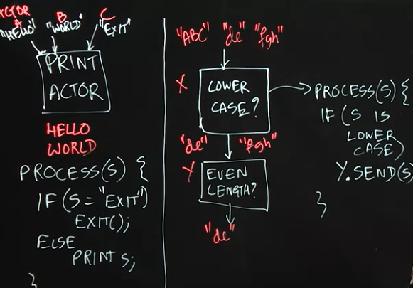
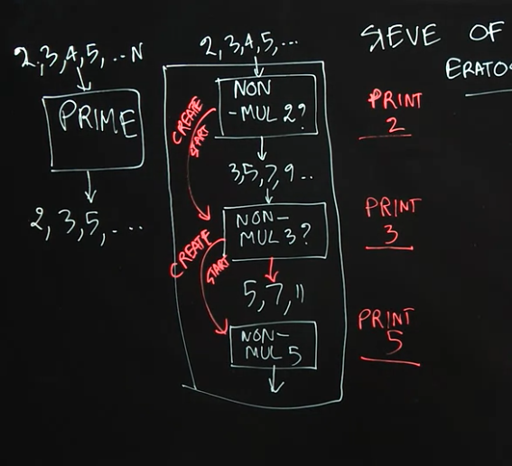
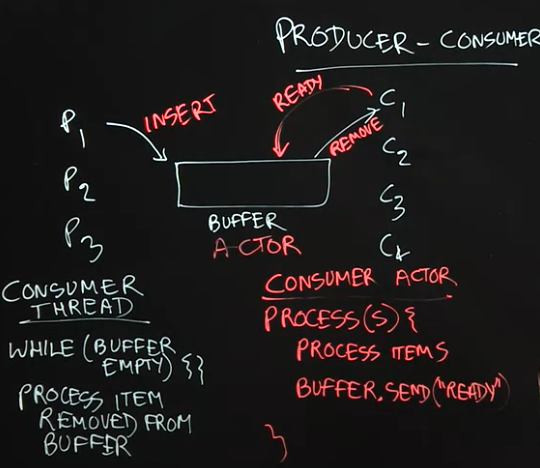
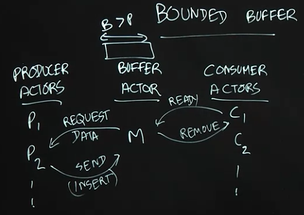

# Concurrent Programming in Java

parallelStream()
fork/join
conditional variable

## Week 1

### 1.1 Threads

=== "Thread Example"

    ```java
    // main thread T0
    t1 = new Thread(s1); // s1 is the computation assign val x
    t1.start();          // start thread t1 by main thread t0
    s2;                  // execute computation task by t0
    t1.join();           // wait the val x computation from t1 for use in s3
    s3;                  // computation read val x
    ```

=== "Deadlock"

    ```java
    // If s1 have t2.join() and s1` have t1.join(), deadlock will happen
    // main thread T0
    t1 = new Thread(s1);   // s1 is the computation assign val x
    t2 = new Thread(s1`);  // s1` is the computation assign val x
    t1.start();            // start thread t1 by main thread t0
    t2.start()             // start thread t2 by main thread t0
    s2;                    // execute computation task by t0
    t1.join();             // wait the val x computation from t1 for use in s3
    s3;                    // computation read val x
    ```

1.1 Lecture Summary

In this lecture, we learned the concept of threads as lower-level building
blocks for concurrent programs. A unique aspect of Java compared to prior
mainstream programming languages is that Java included the notions of threads
(as instances of the `java.lang.Thread` class in its language definition right
from the start.

When an instance of `Thread` is created (via a `new` operation), it does not
start executing right away; instead, it can only start executing when its `start()`
method is invoked. The statement or computation to be executed by the thread is
specified as a parameter to the constructor.

The Thread class also includes a wait operation in the form of a `join()` method.
If thread `t0` performs a `t1.join()` call, thread `t0` will be forced to wait
until thread `t1` completes, after which point it can safely access any values
computed by thread `t1`. Since there is no restriction on which thread can perform
a `join` on which other thread, it is possible for a programmer to erroneously
create a deadlock cycle with `join` operations. (A deadlock occurs when two threads
wait for each other indefinitely, so that neither can make any progress.)

1.1 Optional Reading

1. Wikipedia article on [Threads](https://en.wikipedia.org/wiki/Thread_(computing))
2. [Tutorial on Java threads](https://docs.oracle.com/javase/tutorial/essential/concurrency/runthread.html)
3. [Documentation on Thread class in Java 8](https://docs.oracle.com/javase/8/docs/api/java/lang/Thread.html)

### 1.2 Structured Locks

=== "Synchronized"

    ```java
    incr(A) {
      synchronized (A) {
        A.count = A.count + 1;
      } // release A
    }
    ```

=== "Unbounded Buffer"

    ```java
    // x = {BUF, IN, OUT}
    insert(item) {
      synchronized (x) {
        buf[in] = item;
        in++;
      }
    }

    remove() {
      synchronized (x) {
        item = buf[out];
        out++;
        return item;
      }
    }
    ```

=== "Bounded Buffer"

    ```java
    // x = {BUF, IN, OUT} with size K
    insert(item) {
      synchronized (x) {
        wait(); // wait if x is full
        buf[in] = item;
        in++;
        notify();
      }
    }

    remove() {
      synchronized (x) {
        wait(); // wait if x is empty
        item = buf[out];
        out++;
        notify();
        return item;
      }
    }
    ```

1.2 Lecture Summary

In this lecture, we learned about structured locks, and how they can be
implemented using `synchronized` statements and methods in Java. Structured
locks can be used to enforce mutual exclusion and avoid data races, as
illustrated by the `incr()` method in the `A.count` example, and the `insert()`
and `remove()` methods in the the `Buffer` example. A major benefit of structured
locks is that their acquire and release operations are implicit, since these
operations are automatically performed by the Java runtime environment when
entering and exiting the scope of a `synchronized` statement or method, even if
an exception is thrown in the middle.

We also learned about `wait()` and `notify()` operations that can be used to
block and resume threads that need to wait for specific conditions. For example,
a producer thread performing an `insert()` operation on a bounded buffer can call
`wait()` when the buffer is full, so that it is only unblocked when a consumer
thread performing a `remove()` operation calls `notify()`. Likewise, a consumer
thread performing a `remove()` operation on a bounded buffer can call `wait()`
when the buffer is empty, so that it is only unblocked when a producer thread
performing an `insert()` operation calls `notify()`. Structured locks are also
referred to as intrinsic locks or monitors.

1.2 Optional Reading

1. [Tutorial on Intrinsic Locks and Synchronization in Java](https://docs.oracle.com/javase/tutorial/essential/concurrency/locksync.html)
2. [Tutorial on Guarded Blocks in Java](https://docs.oracle.com/javase/tutorial/essential/concurrency/guardmeth.html)
3. Wikipedia article on [Monitors](https://en.wikipedia.org/wiki/Monitor_(synchronization))

### 1.3 Unstructured Locks

=== "Hand-over-hand lock"

    ```java
    // LinkedList: N1->N2->N3->N4
    // Lock4Nodes: L1  L2  L3  L4
    lock(L1);
    lock(L2);
    WORK with N1, N2
    unlock(L1);
    lock(L3);
    WORK with N2, N3
    unlock(L2);
    lock(L4);
    WORK with N3, N4
    unlock(L3);
    ```

=== "Hand-over-hand lock using try_lock"

    ```java
    // LinkedList: N1->N2->N3->N4
    // Lock4Nodes: L1  L2  L3  L4
    try
      lock(L1);
    if (success) {
      lock(L2);
      WORK with N1, N2
      unlock(L1);
      lock(L3);
      WORK with N2, N3
      unlock(L2);
      lock(L4);
      WORK with N3, N4
      unlock(L3);
    }
    ```

=== "R/W lock"

    ```java
    // data: Array[]
    // R/W lock: L
    search (x) {
      read_lock(L)
      A[i] == x;  // read only
      unlock(L)
    }

    update(i, y) {
      write_lock(L)
      A[i] = y;   // write
      unlock(L)
    }
    ```

1.3 Lecture Summary

In this lecture, we introduced unstructured locks (which can be obtained in Java
by creating instances of `ReentrantLock()`, and used three examples to demonstrate
their generality relative to structured locks. The first example showed how
explicit `lock()` and `unlock()` operations on unstructured locks can be used to
support a hand-over-hand locking pattern that implements a non-nested pairing of
lock/unlock operations which cannot be achieved with synchronized statements/methods.
The second example showed how the `tryLock()` operations in unstructured locks
can enable a thread to check the availability of a lock, and thereby acquire it
if it is available or do something else if it is not. The third example illustrated
the value of read-write locks (which can be obtained in Java by creating instances
of `ReentrantReadWriteLock()`, whereby multiple threads are permitted to acquire
a lock `L` in "read mode", `L.readLock().lock()`, but only one thread is permitted
to acquire the lock in “write mode”, `L.writeLock().lock()`.

However, it is also important to remember that the generality and power of
unstructured locks is accompanied by an extra responsibility on the part of the
programmer, e.g., ensuring that calls to `unlock()` are not forgotten, even in the
presence of exceptions.

1.3 Optional Reading

1. [Tutorial on Lock Objects in Java](https://docs.oracle.com/javase/tutorial/essential/concurrency/newlocks.html)
2. [Documentation on Java’s Lock interfaces](http://docs.oracle.com/javase/7/docs/api/java/util/concurrent/locks/Lock.html)

### 1.4 Liveness

=== "Deadlock"

    ```java
    // T1
    synchronized (A) {
      synchronized (B) {
      }
    }
    // T2
    synchronized (B) {
      synchronized (A) {
      }
    }
    ```

=== "Livelock"

    ```java
    // T1
    do {
      synchronized (B) {
        x.incr();
        r = x.get();
      }
    } while (R < 2)
    // T2
    do {
      synchronized (B) {
        x.decr();
        r = x.get();
      }
    } while (R > -2)
    ```

=== "Starvation"

    ```java
    // T1
    do {
      int1 = s1.readline();
      print int1;
    } while (...)
    // ...
    // T100
    do {
      int100 = s100.readline();
      print int100;
    } while (...)
    ```

1.4 Lecture Summary

In this lecture, we studied three ways in which a parallel program may enter
a state in which it stops making forward progress. For sequential programs,
an "infinite loop" is a common way for a program to stop making forward
progress, but there are other ways to obtain an absence of progress in a
parallel program. The first is **deadlock**, in which all threads are blocked
indefinitely, thereby preventing any forward progress. The second is **livelock**,
in which all threads repeatedly perform an interaction that prevents forward
progress, e.g., an infinite “loop” of repeating lock acquire/release patterns.
The third is **starvation**, in which at least one thread is prevented from making
any forward progress.

The term "liveness" refers to a progress guarantee. The three progress
guarantees that correspond to the absence of the conditions listed above are
deadlock freedom, livelock freedom, and starvation freedom.

1.4 Optional Reading

1. [Deadlock example with synchronized methods in Java](https://docs.oracle.com/javase/tutorial/essential/concurrency/deadlock.html)
2. [Starvation and Livelock examples in Java](https://docs.oracle.com/javase/tutorial/essential/concurrency/starvelive.html)
3. Wikipedia article on [Deadlock and Livelock](https://en.wikipedia.org/wiki/Deadlock)

### 1.5 Dining Philosophers

* think
* pick up chopsticks (left, right)
* eat
* put down chopsticks

=== "Structured locks"

    ```java
    // if all pick up the left first, deadlock
    while (...) {
      Think;
      sychronized (Left) {
        sychronized (Right) {
          Eat;
        }
      }
    }
    ```

=== "unstructured locks"

    ```java
    // if all pick up the left first, livelock, but no deadlock
    while (...) {
      Think;
      s1 = tryLock(Left);
      if (!s1) continue;
      s2 = tryLock(Right);
      if (!s2) {
        unlock(Left);
        continue;
      }
      Eat;
    }
    ```
=== "Modified version"

    ```java
    // have one of the philosophers pick right first and then left.
    // However, this can also cause the starvation problem. To solve
    // the problem completely, we need to use another synchronization
    // premitive called semaphore.
    ```

1.5 Lecture Summary

In this lecture, we studied a classical concurrent programming example that
is referred to as the **Dining Philosophers Problem**. In this problem, there are
five threads, each of which models a "philosopher" that repeatedly performs a
sequence of actions which include think, pick up chopsticks, eat, and put
down chopsticks.

First, we examined a solution to this problem using structured locks, and
demonstrated how this solution could lead to a deadlock scenario (but not
livelock). Second, we examined a solution using unstructured locks with
`tryLock()` and `unlock()` operations that never block, and demonstrated how
this solution could lead to a livelock scenario (but not deadlock). Finally, we
observed how a simple modification to the first solution with structured locks,
in which one philosopher picks up their right chopstick and their left, while
the others pick up their left chopstick first and then their right, can guarantee
an absence of deadlock.

1.5 Optional Reading

1. Wikipedia article on the [Dining Philosophers Problem](https://en.wikipedia.org/wiki/Dining_philosophers_problem)

### 1.6 Mini Project

The mini project used Java `ReentrantLock` and `ReentrantReadWriteLock` to ensure
the list operations are free of bugs if run by multiple threads. One practical
tip is that when using the basic lock primitive the lock statement can be put in
the `try` and unlock in the `finally` statement, respectively.

## Week 2

### 2.1 Critical Sections (Isloated Construct)

=== "Balance Transfer"

    ```java
    // My balance:       5000
    // Family balance:   1000
    // Daughter balance: 0
    T1 {
      myBal = myBal - 100;         // R1
      familyBal = familyBal + 100; // W1
    }

    T2 {
      familyBal = familyBal - 100; // R2
      DauBal = DarBal + 100;       // W2
    }
    ```

=== "Use isolated"

    ```java
    // My balance:       5000
    // Family balance:   1000
    // Daughter balance: 0
    T1 {
      isolated {
        myBal = myBal - 100;         // R1
        familyBal = familyBal + 100; // W1
      }
    }

    T2 {
      isolated {
        familyBal = familyBal - 100; // R2
        DauBal = DarBal + 100;       // W2
      }
    }
    ```

2.1 Lecture Summary

In this lecture, we learned how critical sections and the isolated construct
can help concurrent threads manage their accesses to shared resources, at a
higher level than just using locks. When programming with threads, it is well
known that the following situation is defined to be a data race error — when
two accesses on the same shared location can potentially execute in parallel,
with least one access being a write. However, there are many cases in
practice when two tasks may legitimately need to perform concurrent accesses
to shared locations, as in the bank transfer example.

With critical sections, two blocks of code that are marked as isolated, say
`A` and `B`, are guaranteed to be executed in mutual exclusion with `A`
executing before `B` or vice versa. With the use of isolated constructs, it is
impossible for the bank transfer example to end up in an inconsistent state
because all the reads and writes for one isolated section must complete before
the start of another isolated construct. Thus, the parallel program will see the
effect of one isolated section completed before another isolated section can start.

2.1 Optional Reading

1. Wikipedia article on [Critical Sections](https://en.wikipedia.org/wiki/Critical_section)
2. Wikipedia article on [Atomicity](https://en.wikipedia.org/wiki/Atomicity_(database_systems))

### 2.2 Object Based Isolation (Monitors)

=== "DoubleLinkedList Example"

    ```java
    // A <-> B <-> C <-> D <-> E
    delete(cur) {
      cur.prev.next = cur.next;
      cur.next.prev = cur.prev;
    }
    // T1: Delete(B)
    // T2: Delete(C)
    // T3: Delete(E)
    ```

=== "DoubleLinkedList using isolated"

    ```java
    // A <-> B <-> C <-> D <-> E
    delete(cur) {
      isolated (cur, cur.prev, cur.next) {
        cur.prev.next = cur.next;
        cur.next.prev = cur.prev;
      }
    }
    // T1: Delete(B) touch (A, B, C)
    // T2: Delete(C) touch (B, C, D)
    // T3: Delete(E) touch (D, E, F)
    // T1 and T3 can be done in the same time.
    ```

=== "Monitor intuition"

    ```java
    // P1, process 1
    // P2, process 2
    Isolated(M1)
    M1 {
      P1: Isolated(M1);
      P2: Isolated(M1);
    }
    M2 {
      P1: Isolated(M2);
      P2: Isolated(M2);
    }
    Isolated(M2)
    ```

2.2 Lecture Summary

In this lecture, we studied object-based isolation, which generalizes the
isolated construct and relates to the classical concept of monitors. The
fundamental idea behind object-based isolation is that an isolated construct
can be extended with a set of objects that indicate the scope of isolation,
by using the following rules: if two isolated constructs have an empty
intersection in their object sets they can execute in parallel, otherwise
they must execute in mutual exclusion. We observed that implementing this
capability can be very challenging with locks because a correct implementation
must enforce the correct levels of mutual exclusion without entering into
deadlock or livelock states. The linked-list example showed how the object set
for a `delete()` method can be defined as consisting of three objects — the
current, previous, and next objects in the list, and that this object set is
sufficient to safely enable parallelism across multiple calls to `delete()`. The
Java code sketch to achieve this object-based isolation using the PCDP library
is as follows:

```java
isolated(cur, cur.prev, cur.next, () -> {
    . . . // Body of object-based isolated construct
});
```

The relationship between object-based isolation and monitors is that all
methods in a monitor object, `M1`, are executed as object-based isolated
constructs with a singleton object set, `M1`. Similarly, all methods in a
monitor object, `M2`, are executed as object-based isolated constructs with a
singleton object set, `M2` which has an empty intersection with `M1`.

2.2 Optional Reading

1. Wikipedia article on [Monitors](https://en.wikipedia.org/wiki/Monitor_(synchronization))

### 2.3 Concurrent Spanning Tree Algorithm

=== "Spanning Tree Algorithm"

    ```java
    Compute(v) {
      for each neighbor c of v
        s <- MakeParent(v, c)
        if (s)
          Compute(c);
    }

    MakeParent(v, c) {
      if (c.parent == Null) {
        c.parent = v;
        success = true;
      } else {
        success = false;
        return success;
      }
    }
    ```

=== "Isolation Construct"

    ```java
    Compute(v) {
      for each neighbor c of v
        s <- MakeParent(v, c)
        if (s)
          Compute(c);
    }

    MakeParent(v, c) {
      isolated(c) {
        if (c.parent == Null) { // compare-and-set premitive
          c.parent = v;
          success = true;
        } else {
          success = false;
          return success;
        }
      }
    }
    ```

2.3 Lecture Summary

In this lecture, we learned how to use object-based isolation to create a
parallel algorithm to compute spanning trees for an undirected graph. Recall
that a spanning tree specifies a subset of edges in the graph that form a
tree (no cycles), and connect all vertices in the graph. A standard recursive
method for creating a spanning tree is to perform a depth-first traversal of
the graph (the `Compute(v)` function in our example), making the current vertex
a parent of all its neighbors that don’t already have a parent assigned in
the tree (the `MakeParent(v, c)` function in the example).

The approach described in this lecture to parallelize the spanning tree
computation executes recursive `Compute(c)` method calls in parallel for all
neighbors, `c`, of the current vertex, `v`. Object-based isolation helps avoid a
data race in the `MakeParent(v,c)` method, when two parallel threads might
attempt to call `MakeParent(v1, c)` and `MakeParent(v2, c)` on the same vertex `c`
at the same time. In this example, the role of object-based isolation is to
ensure that all calls to `MakeParent(v,c)` with the same `c` value must execute
the object-based isolated statement in mutual exclusion, whereas calls with
different values of `c` can proceed in parallel.

2.3 Optional Reading

1. Wikipedia article on [Spanning Trees](https://en.wikipedia.org/wiki/Spanning_tree)

### 2.4 Atomic Variables

=== "Atomic Variables (Integer)"

    ```java
    // X[0, ... N-1]
    do {
      j = curr;       // curr.getAndAdd(1); atomic integer!!!.
      cur = cur + 1;
      if (j >= N) break;
      process(X[j])
    } while (true)
    ```

=== "Atomic Reference (compareAndSet)"

    ```java
    compareAndSet(expected, new) {
      isolated (this) {
        if (this.val == expected) {
          this.val = new;
          return true;
        } else {
          return false;
        }
      }
    }
    ```

2.4 Lecture Summary

In this lecture, we studied **Atomic Variables**, an important special case of
object-based isolation which can be very efficiently implemented on modern
computer systems. In the example given in the lecture, we have multiple
threads processing an array, each using object-based isolation to safely
increment a shared object, `cur`, to compute an index `j` which can then be used
by the thread to access a thread-specific element of the array.

However, instead of using object-based isolation, we can declare the index
`cur` to be an **Atomic Integer** variable and use an atomic operation called
`getAndAdd()` to atomically read the current value of cur and increment its
value by 1. Thus, `j = cur.getAndAdd(1)` has the same semantics as `isolated
(cur) { j = cur; cur = cur+1;}` but is implemented much more efficiently
using hardware support on today’s machines.

Another example that we studied in the lecture concerns **Atomic Reference**
variables, which are reference variables that can be atomically read and
modified using methods such as `compareAndSet()`. If we have an atomic
reference `ref`, then the call to `ref.compareAndSet(expected, new)` will compare
the value of `ref` to `expected`, and if they are the same, set the value of `ref`
to `new` and return `true`. This all occurs in one atomic operation that cannot
be interrupted by any other methods invoked on the `ref` object. If `ref` and
`expected` have different values, `compareAndSet()` will not modify anything and
will simply return false.

2.4 Optional Reading

1. [Tutorial on Atomic Integers in Java](https://docs.oracle.com/javase/tutorial/essential/concurrency/atomicvars.html)
2. Article in Java theory and practice series on [Going atomic](https://www.ibm.com/developerworks/library/j-jtp11234/)
3. Wikipedia article on [Atomic Wrapper Classes in Java](https://en.wikipedia.org/wiki/Primitive_wrapper_class#Atomic_wrapper_classes)

### 2.5 Read, Write Isolation

=== "Read/Write Isolation"

    ```java
    // T1: C.Get(k1), C.Get(k3), C.Get(k5)
    // T2: C.Get(k1), C.Get(k3), C.Get(k5)
    // T3: C.Put(k1)
    isolated (read(C)) {
      V = C.get(k1);
    }

    isolated (write(C)) {
      C.put(k2, v2);
    }
    ```

=== "Read/Write Isolation in LinkedList example"

    ```java
    delete (cur) {
      isolated (write(cur.next, cur.prev), read(cur)) {
        cur.prev.next = cur.next;
        cur.next.prev = cur.prev;
      }
    }
    ```

2.5 Lecture Summary

In this lecture we discussed **Read-Write Isolation**, which is a refinement of
object-based isolation, and is a higher-level abstraction of the read-write
locks studied earlier as part of Unstructured Locks. The main idea behind
read-write isolation is to separate read accesses to shared objects from
write accesses. This approach enables two threads that only read shared
objects to freely execute in parallel since they are not modifying any shared
objects. The need for mutual exclusion only arises when one or more threads
attempt to enter an isolated section with write access to a shared object.

This approach exposes more concurrency than object-based isolation since it
allows read accesses to be executed in parallel. In the doubly-linked list
example from our lecture, when deleting an object `cur` from the list by
calling `delete(cur)`, we can replace object-based isolation on `cur` with
read-only isolation, since deleting an object does not modify the object
being deleted; only the previous and next objects in the list need to be
modified.

2.5 Optional Reading

 1. Wikipedia article on [Readers-writer lock](https://en.wikipedia.org/wiki/Readers%E2%80%93writer_lock)

### 2.6 Mini project

## Week 3

* [Akka](https://doc.akka.io/docs/akka/2.5/guide/introduction.html#how-to-get-started)

### 3.1 Actors

```java
getAndAdd(){
  j = cur;
  cur = cur + delta;
  return j;
}

// method doesn't doing correct isolation
foo () {
  cur = ...  
}
```

**Actor** (reactive)

* Mailbox
* Method
* Local State

3.1 Lecture Summary

In this lecture, we introduced the Actor Model as an even higher level of
concurrency control than locks or isolated sections. One limitation of locks,
and even isolated sections, is that, while many threads might correctly
control the access to a shared object (e.g., by using object-based isolation)
it only takes one thread that accesses the object directly to create subtle
and hard-to-discover concurrency errors. The Actor model avoids this problem
by forcing all accesses to an object to be isolated by default. The object is
part of the local state of an actor, and cannot be accessed directly by any
other actor.

An Actor consists of a Mailbox, a set of Methods, and Local State. The Actor
model is reactive, in that actors can only execute methods in response to
messages; these methods can read/write local state and/or send messages to
other actors. Thus, the only way to modify an object in a pure actor model is
to send messages to the actor that owns that object as part of its local
state. In general, messages sent to actors from different actors can be
arbitrarily reordered in the system. However, in many actor models, messages
sent between the same pair of actors preserve the order in which they are sent.

3.1 Optional Reading

1. Wikipedia article on the [Actor Model](https://en.wikipedia.org/wiki/Actor_model)

2. Documentation on the [Akka Actor Library](http://doc.akka.io/docs/akka/2.5.3/java/guide/index.html)
  (though Akka is not used in this course, it is a useful library to be aware
  of if you are interested in using the actor model with Java and Scala
  applications)

### 3.2 Actor Examples

```java
// print actor
process (s) { // like a callback
  if (s == "Exit")
    exit();
  else
    print s;
}
```



3.2 Lecture Summary

In this lecture, we further studied the Actor Model through two simple
examples of using actors to implement well-known concurrent programming
patterns. The `PrintActor` in our first example processes simple String
messages by printing them. If an `EXIT` message is sent, then the
`PrintActor` completes its current computation and exits. As a reminder, we
assume that messages sent between the same pair of actors preserve the order
in which they are sent.

In the second example, we created an actor pipeline, in which one actor
checks the incoming messages and only forwards the ones that are in lower
case. The second actor processes the lowercase messages and only forwards the
ones that are of even length. This example illustrates the power of the actor
model, as this concurrent system would be much more difficult to implement
using threads, for example, since much care would have to be taken on how to
implement a shared mailbox for correct and efficient processing by parallel
threads.

3.2 Optional Reading

1. Wikipedia article on [Pipeline Parallelism](https://en.wikipedia.org/wiki/Pipeline_(computing)).

### 3.3 Sieve of Eratosthenes Algorithm



3.3 Lecture Summary

In this lecture, we studied how to use actors to implement a pipelined
variant of the Sieve of Eratosthenes algorithm for generating prime numbers.
This example illustrates the power of the Actor Model, including dynamic
creation of new actors during a computation.

To implement the Sieve of Eratosthenes, we first create an actor, Non-Mul-2,
that receives (positive) natural numbers as input (up to some limit), and
then filters out the numbers that are multiples of 2. After receiving a
number that is not a multiple of 2 (in our case, the first would be 3), the
Non-Mul-2 actor creates the next actor in the pipeline, Non-Mul-3, with the
goal of discarding all the numbers that are multiples of 3. The Non-Mul-2
actor then forwards all non-multiples of 2 to the Non-Mul-3 actor. Similarly,
this new actor will create the next actor in the pipeline, Non-Mul-5, with
the goal of discarding all the numbers that are multiples of 5. The power of
the Actor Model is reflected in the dynamic nature of this problem, where
pieces of the computation (new actors) are created dynamically as needed.

A Java code sketch for the `process()` method for an actor responsible for
filtering out multiples of the actor's "local prime" in the Sieve of
Eratosthenes is as follows:

```java
public void process(final Object msg) {
  int candidate = (Integer) msg;
  // Check if the candidate is a non-multiple of the "local prime".
  // For example, localPrime = 2 in the Non-Mul-2 actor
  boolean nonMul = ((candidate % localPrime) != 0);
  // nothing needs to be done if nonMul = false
  if (nonMul) {
    if (nextActor == null) {
      . . . // create & start new actor with candidate as its local prime
    }
    else nextActor.send(msg); // forward message to next actor
  }
} // process
```

3.3 Optional Reading

1. Wikipedia article on the [Sieve of Eratosthenes problem](https://en.wikipedia.org/wiki/Sieve_of_Eratosthenes)

### 3.4 Producer-Consumer Problem

```java
// consumer thread
while (buffer.empty()) { }
// process item removed from buffer
```



3.4 Lecture Summary

In this lecture, we studied the producer-consumer pattern in concurrent
programming which is used to solve the following classical problem: how can
we safely coordinate accesses by multiple producer tasks, $P_1$, $P_2$, $P_3$
... and multiple consumer tasks, $C_1$, $C_2$, $C_3$​, ... to a shared buffer
of unbounded size without giving up any concurrency? Part of the reason that
this problem can be challenging is that we cannot assume any a priori
knowledge about the rate at which different tasks produce and consume items
in the buffer. While it is possible to solve this problem by using locks with
wait-notify operations or by using object-based isolation, both approaches
will require low-level concurrent programming techniques to ensure
correctness and maximum performance. Instead, a more elegant solution can be
achieved by using actors as follows.

The key idea behind any actor-based solution is to think of all objects
involved in the concurrent program as actors, which in this case implies that
producer tasks, consumer tasks, and the shared buffer should all be
implemented as actors. The next step is to establish the communication
protocols among the actors. A producer actor can simply send a message to the
buffer actor whenever it has an item to produce. The protocol for consumer
actors is a bit more complicated. Our solution requires a consumer actor to
send a message to the buffer actor whenever it is ready to process an item.
Thus, whenever the buffer actor receives a message from a producer, it knows
which consumers are ready to process items and can forward the produced item
to any one of them. Thus, with the actor model, all concurrent interactions
involving the buffer can be encoded in messages, instead of using locks or
isolated statements.

### 3.5 Bounded Buffer Problem



3.5 Lecture Summary

A major simplification made in the previous lecture was to assume that the
shared buffer used by producer and consumer tasks can be unbounded in size.
However, in practice, it is also important to consider a more realistic
version of the the producer-consumer problem in which the buffer has a
bounded size. In fact, the classical producer-consumer problem statement
usually assumes a bounded buffer by default. In this lecture, we studied how
the actor-based solution to the unbounded buffer case can be extended to
support a bounded buffer.

The main new challenge with bounding the size of the shared buffer is to
ensure that producer tasks are not permitted to send items to the buffer when
the buffer is full. Thus, the buffer actor needs to play a master role in the
protocol by informing producer actors when they are permitted to send data.
This is akin to the role played by the buffer/master actor with respect to
consumer actors, even in the unbounded buffer case (in which the consumer
actor informed the buffer actor when it is ready to consume an item). Now,
the producer actor will only send data when requested to do so by the buffer
actor. Though, this actor-based solution appears to be quite simple, it
actually solves a classical problem that has been studied in advanced
operating system classes for decades.

3.5 Optional Reading

Wikipedia article on the [Producer-Consumer problem](https://en.wikipedia.org/wiki/Producer%E2%80%93consumer_problem)

## Week 4

### 4.1 Optimistic concurrency

```java
class Integer {
  get();
  set();
  getAndAdd(delta) {
    curr = this.get();
    next = cur + delta;
    this.set(next);  // RACE CONDITION
    return cur;
  }
}
```

```java
class AutomicInteger {
  get();
  set();
  compareAndSet();
  getAndAdd(delta) {
    while(true) {
      curr = this.get();
      next = cur + delta;
      if (this.compareAndSet(curr, next)) {
        return cur;
      }
    }
  }
}
```

4.1 Lecture Summary

In this lecture, we studied the optimistic concurrency pattern, which can be
used to improve the performance of concurrent data structures. In practice, this
pattern is most often used by experts who implement components of concurrent
libraries, such as `AtomicInteger` and `ConcurrentHashMap`, but it is useful for all
programmers to understand the underpinnings of this approach. As an example, we
considered how the `getAndAdd()` method is typically implemented for a shared
`AtomicInteger` object. The basic idea is to allow multiple threads to read the
existing value of the shared object (`curVal`) without any synchronization, and
also to compute its new value after the addition (`newVal`) without
synchronization. These computations are performed optimistically under the
assumption that no interference will occur with other threads during the period
between reading `curVal` and computing `newVal`. However, it is necessary for each
thread to confirm this assumption by using the `compareAndSet()` method as
follows. (`compareAndSet()` is used as an important building block for optimistic
concurrency because it is implemented very efficiently on many hardware
platforms.)

The method call `A.compareAndSet(curVal, newVal)` invoked on `AtomicInteger A`
checks that the value in `A` still equals `curVal`, and, if so, updates `A`’s value to
`newVal` before returning true; otherwise, the method simply returns false without
updating `A`. Further, the `compareAndSet()` method is guaranteed to be performed
atomically, as if it was in an object-based isolated statement with respect to
object `A`. Thus, if two threads, $T_1$ and $T_2$ call `compareAndSet()` with the
same `curVal` that matches `A`’s current value, only one of them will succeed in
updating `A` with their `newVal`. Furthermore, each thread will invoke an operation
like `compareAndSet()` repeatedly in a loop until the operation succeeds. This
approach is guaranteed to never result in a deadlock since there are no blocking
operations. Also, since each call `compareAndSet()` is guaranteed to eventually
succeed, there cannot be a livelock either. In general, so long as the contention
on a single shared object like A is not high, the number of calls to `compareAndSet()`
that return false will be very small, and the optimistic concurrency approach can
perform much better in practice (but at the cost of more complex code logic) than
using locks, isolation, or actors.

4.1 Optional Reading

1. Wikipedia article on [Optimistic concurrency control](https://en.wikipedia.org/wiki/Optimistic_concurrency_control)
2. [Documentation on Java’s AtomicInteger class](https://docs.oracle.com/javase/7/docs/api/java/util/concurrent/atomic/AtomicInteger.html)

### 4.2 Concurrent Queue

```java
Queue {
  enQ(x) {
    tail.next = x;
    tail = x;
  }

  deQ() {
    if (Q.empty) {// exception }
    r = head;
    head = head.next;
    return r;
  }
}
```

```java
Queue {
  enQ(x) {
    while (true) {
      if (!tail.next.compareAndSet(null, x)) {
        continue;
      }
    }
  }

  deQ() {
    if (Q.empty) {// exception }
    r = head;
    head = head.next;
    return r;
  }
}
```

4.2 Lecture Summary

In this lecture, we studied concurrent queues, an extension of the popular queue
data structure to support concurrent accesses. The most common operations on a
queue are `enq(x)`, which enqueues object `x` at the end (`tail`) of the queue, and
`deq()` which removes and returns the item at the start (`head`) of the queue. A
correct implementation of a concurrent queue must ensure that calls to `enq()` and
`deq()` maintain the correct semantics, even if the calls are invoked concurrently
from different threads. While it is always possible to use locks, isolation, or
actors to obtain correct but less efficient implementations of a concurrent
queue, this lecture illustrated how an expert might implement a more efficient
concurrent queue using the optimistic concurrency pattern.

A common approach for such an implementation is to replace an object reference
like `tail` by an `AtomicReference`. Since the `compareAndSet()` method can also be
invoked on `AtomicReference` objects, we can use it to support (for example)
concurrent calls to `enq()` by identifying which calls to `compareAndSet()`
succeeded, and repeating the calls that failed. This provides the basic recipe
for more efficient implementations of `enq()` and `deq()`, as are typically
developed by concurrency experts. A popular implementation of concurrent queues
available in Java is `java.util.concurrent.ConcurrentLinkedQueue`.

4.2 Optional Reading

1. [Documentation on Java’s AtomicReference class](https://docs.oracle.com/javase/7/docs/api/java/util/concurrent/atomic/AtomicReference.html)
2. [Documentation on Java's ConcurrentLinkedQueue class](https://docs.oracle.com/javase/7/docs/api/java/util/concurrent/ConcurrentLinkedQueue.html)

### 4.3 Linearizability

4.3 Lecture Summary

In this lecture, we studied an important correctness property of concurrent
objects that is called Linearizability. A concurrent object is a data structure
that is designed to support operations in parallel by multiple threads. The key
question answered by **linearizability** is what return values are permissible
when multiple threads perform these operations in parallel, taking into account
what we know about the expected return values from those operations when they
are performed sequentially. As an example, we considered two threads, $T_1$ and
$T_2$, performing `enq(x)` and `enq(y)` operations in parallel on a shared
concurrent queue data structure, and considered what values can be returned by a
`deq()` operation performed by $T_2$ after the call to `enq(y)`. From the
viewpoint of linearizability, it is possible for the `deq()` operation to return
item `x` or item `y`.

One way to look at the definition of linearizability is as though you are a
lawyer attempting to "defend" a friend who implemented a concurrent data
structure, and that all you need to do to prove that your friend is "not guilty"
(did not write a buggy implementation) is to show one scenario in which all the
operations return values that would be consistent with a sequential execution by
identifying logical moments of time at which the operations can be claimed to
have taken effect. Thus, if `deq()` returned item `x` or item `y` you can claim
that either scenario is plausible because we can reasonably assume that `enq(x)`
took effect before `enq(y)`, or vice versa. However, there is absolutely no
plausible scenario in which the call to `deq()` can correctly return a code/exception
to indicate that the queue is empty since at least `enq(y)` must have taken
effect before the call to `deq()`. Thus, a goal for any implementation of a
concurrent data structure is to ensure that all its executions are linearizable
by using whatever combination of constructs (e.g., locks, isolated, actors, optimistic
concurrency) is deemed appropriate to ensure correctness while giving the
maximum performance.

4.3 Optional Reading

1. [Wikipedia article on the Linearizability](https://en.wikipedia.org/wiki/Linearizability)

### 4.4 ConcurrentHashMap

```java
java.util.concurrent.ConcurrentHashMap.get(key);
java.util.concurrent.ConcurrentHashMap.put(key, value);
java.util.concurrent.ConcurrentHashMap.putIfAbsent(key, value);
java.util.concurrent.ConcurrentHashMap.clear(key, value);
java.util.concurrent.ConcurrentHashMap.putAll(key, value);

java.util.concurrent.ConcurrentLinkedQueue
java.util.concurrent.ConcurrentSkipListSet
```

4.4 Lecture Summary

In this lecture, we studied the `ConcurrentHashMap` data structure, which is
available as part of the `java.util.concurrent` standard library in Java. A
`ConcurrentHashMap` instance, `chm`, implements the Map interface, including the
`get(key)` and `put(key, value)` operations. It also implements additional
operations specified in the `ConcurrentMap` interface (which in turn extends the
`Map` interface); one such operation is `putIfAbsent(key, value)`. The motivation
for using `putIfAbsent()` is to ensure that only one instance of key is inserted
in `chm`, even if multiple threads attempt to insert the same key in parallel.
Thus, the semantics of calls to `get()`, `put()`, and `putIfAbsent()` can all be
specified by the theory of linearizability studied earlier. However, it is
worth noting that there are also some aggregate operations, such as `clear()`
and `putAll()`, that cannot safely be performed in parallel with `put()`, `get()`
and `putIfAbsent()`.

Motivated by the large number of concurrent data structures available in the
`java.util.concurrent` library, this lecture advocates that, when possible, you
use libraries such as `ConcurrentHashMap` rather than try to implement your own
version.

4.4 Optional Reading

1. [Documentation on Java’s ConcurrentHashMap class](https://docs.oracle.com/javase/7/docs/api/java/util/concurrent/ConcurrentHashMap.html)
2. Wikipedia article on [Java’s ConcurrentMap interface](https://en.wikipedia.org/wiki/Java_ConcurrentMap)

### 4.5 Concurrent Minimum Spanning Tree Algorithm

```java
// Boruvka MST
// L is the vertices set (ConcurrentLinkedQueue)
while (size() > 1) {
  n1 = remove(L);
  if (!tryLock(n1)) { continue; }
  e = getMinEdge(M);
  n2 = getNeighbor(n1, e);
  if (!tryLock(n2)) {
    // fixup
    continue;
  }
  n3 = merge(n1, n2);
  remove(n2);
  insert(n3);
}
```

4.5 Lecture Summary

In this lecture, we discussed how to apply concepts learned in this course to
design a concurrent algorithm that solves the problem of finding a minimum-cost
spanning tree (MST) for an undirected graph. It is well known that undirected
graphs can be used to represent all kinds of networks, including roadways, train
routes, and air routes. A spanning tree is a data structure that contains a
subset of edges from the graph which connect all nodes in the graph without
including a cycle. The cost of a spanning tree is computed as the sum of the
weights of all edges in the tree.

The concurrent algorithm studied in this lecture builds on a well-known
sequential algorithm that iteratively performs edge contraction operations, such
that given a node `N1` in the graph, `GetMinEdge(N1)` returns an edge adjacent
to `N1` with minimum cost for inclusion in the MST. If the minimum-cost edge is
(`N1`,`N2`), the algorithm will attempt to combine nodes `N1` and `N2` in the
graph and replace the pair by a single node, `N3`. To perform edge contractions
in parallel, we have to look out for the case when two threads may collide on
the same vertex. For example, even if two threads started with vertices `A` and
`D`, they may both end up with `C` as the neighbor with the minimum cost edge.
We must avoid a situation in which the algorithm tries to combine both `A` and
`C` and `D` and `C`. One possible approach is to use unstructured locks with
calls to `tryLock()` to perform the combining safely, but without creating the
possibility of deadlock or livelock situations. A key challenge with calling
`tryLock()` is that some fix-up is required if the call returns false. Finally,
it also helps to use a concurrent queue data structure to keep track of nodes
that are available for processing.

4.5 Optional Reading

1. Wikipedia article on [Borvka’s algorithm](https://en.wikipedia.org/wiki/Bor%C5%AFvka%27s_algorithm)
   for finding a minimum cost spanning tree of an undirected graph
