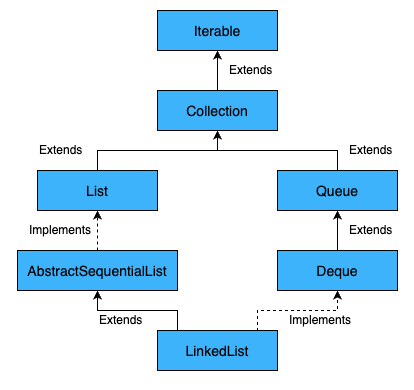
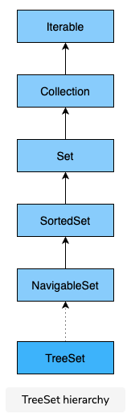
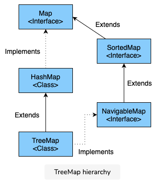
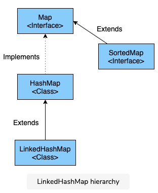

# Java Collections


NB: Course is started with educative.io version and will be expanded the list to include more collection

## Collection v.s. Collections

1. Collection is an interface, collections is a class.
2. A Collection interface provides the standard functionality of a data structure
   to List, Set, and Queue. However, the Collections class provides the utility
   methods that can be used to search, sort, and synchronize collection elements.

## ArrayList

* Default size is 10. Java 8 lazy allocation, 0 on creation, resize to 10 on adding.
* The capacity is checked when added, it reallocate strategy is create $n + n / 2 + 1$.

### Basic Methods

* `List.add(E e)`
* `List.add(int index, E e)`
* `List.addAll(Collection c)`
* `List.addAll(int index, Collection c)`
* `List.get(int index)`
* `List.size()`
* `List.remove(int index)`, e.g. `list.remove(2);`
* `List.remove(Object o)`, e.g. `list.remove(new Integer(2));`
* `List.removeRange(int fromIndex, int toIndex)`
* `List.removeAll(Collection<?> c)`
* `List.clear()`
* `List.replaceAll(UnaryOperator<E> operator)`, e.g. `list.replaceAll((element) -> element.toUpperCase());`
* `List.set(int index, E e)`
* `List.contains(Object o)`
* `List.indexOf(E e)`
* `List.lastIndexOf(E e)`

```java
import java.util.ArrayList;
import java.util.List;

public class ArrayListDemo {
  List list = new ArrayList();
  list.add(1);
  list.add(2);
  list.add(3);
  System.out.println(list);

  list.add(4);
  System.out.println(list);

  list.add(1, 50);
  System.out.println(list);

  List newList = new ArrayList();
  newList.add(500);
  newList.add(600);
  System.out.println(newList);

  list.addAll(newList);
  System.out.println(list);

  list.addAll(1, newList);
  System.out.println(list);
}
// output:
// [1, 2, 3]
// [1, 2, 3, 4]
// [1, 50, 2, 3, 4]
// [1, 50, 2, 3, 4, 150, 160]
// [1, 150, 160, 50, 2, 3, 4, 150, 160]
```

### Using an Iterator

* `Interator<Integer> iter = List.iterator();`
* `iter.hasNext()`
* `iter.next()`
* `iter.remove()`
* `iter.forEachRemaining(Consumer<? super E> action)`
* Once a interator is created, we can not modify the List while interating elements.

```c++
Iterator<Integer> iter = list.iterator();

// remove a element WRONG WRONG
while (iter.hasNext()) {
  int next = iter.next();

  if (next == 30) {
    list.remove(new Integer(30));
  }
}

// CORRECT
while (iter.hasNext()) {
  int next = iter.next();
  if (next == 30) {
    iter.remove();
  }
}

// add an element WRONG WRONG
Iterator<Integer> iter = list.iterator();
list.add(10);
while (iter.hasNext()) {
  System.out.println(iter.next());
}
```

### Using an ListIterator

* `ListIterator<Integer> listIterator = list.ListIterator();`
* `List.hasNext();`
* `List.next();`
* `List.hasPrevious();`
* `List.previous();`
* `List.nextIndex();`
* `List.previousIndex();`
* `List.remove();`, can only be made for each call to `next()` or `previous()`.
* `List.set(E e);`, replace the element returned by `next()` or `previous()`.
* `List.add(E e);`, add before the element returned by `next()`.

### Sort ArrayList

* `Collections.sort(List<T> list)`, type `T` must implement the `Comparable` interface.
* `List<Integer> sortedList = list.stream().sorted().collect(Collectors.toList());`, Java 8.
* `Collections.sort(list, Collections.reverseOrder());`
* `List<Integer> sortedList = list.stream().sorted(Comparator.reverseOrder()).collect(Collectors.toList());`, Java 8.

### Comparable Interface

```java
public class Vehicle implements Comparable<Vehicle> {

  String brand;
  Integer makeYear;

  public Vehicle(String brand, Integer makeYear) {
    super();
    this.brand = brand;
    this.makeYear = makeYear;
  }

  @Override
  public int compareTo(Vehicle o) {
    return this.makeYear - o.makeYear;
    // We can also use the compareTo() method of the Integer class.
    //return this.makeYear.compareTo(o.makeYear);
  }
}
```

### Comparator Interface

* `Collections.sort(List<T> list, Comparator<? super T> c)`.
* Comparator interface has a method, `compare(T o1, T o2)`.

```java
// BrandComparator.java
import java.util.Comparator;

public class BrandComparator implements Comparator<Vehicle> {

  @Override
  public int compare(Vehicle o1, Vehicle o2) {
    return o1.brand.compareTo(o2.brand);
  }
}

// use the comparator in code
Collections.sort(list, new BrandComparator());

// alternatively use anonymous comparator class
Collections.sort(list, new Comparator<Vehicle>() {

  @Override
  public int compare(Vehicle o1, Vehicle o2) {
    return o1.brand.compareTo(o2.brand);
  }
});

// Use Java 8 lambda comparator (functional style)
Collections.sort(list, (o1, o2) -> o1.brand.compareTo(o2.brand));
```

## LinkedList



* LinkedList class implement both the `List` and `Deque` interfaces.
* LinkedList definition

    ```java
    private static class Node<E> {
      E item;
      Node<E> next;
      Node<E> prev;

      Node(Node<E> prev, E element, Node<E> next) {
        this.item = element;
        this.prev = prev;
        this.next = next;
      }
    }

    // construct a LinkedList
    List<Integer> list = new LinkedList<Integer>();

    // construct a LinkedList with existing list
    List<Integer> list = new LinkedList<Integer>(oldList);
    ```

* `LinkedList` operation methods

```java
// add elements
LinkedList.add(E e)
LinkedList.addFirst(E e)
LinkedList.addLast(E e)
LinkedList.add(int index, E e)
LinkedList.addAll(Collection c)
LinkedList.addAll(int index, Collection c)

// fetch elements
LinkedList.getFirst()
LinkedList.getLast()
LinkedList.get(int index)

// remove elements
LinkedList.removeFirst()
LinkedList.removeLast()
LinkedList.remove(int index)
LinkedList.remove(Object 0)

// sorting
Collections.sort(linkedList);
```

## CopyOnWriteArrayList

* creating a `CopyOnWriteArrayList`

    ```java
    private transient volatile Object[] array;

    public CopyOnWriteArrayList() {
      setArray(new Object[0]);
    }

    final void setArray(Object[] a) {
      array = a;
    }

    List list = new CopyOnWriteArrayList();

    // using an existing array
    public CopyOnWriteArrayList(E[] toCopyIn) {
      setArray(Array.copyOf(toCopyin, toCopyIn.length, Object[].class));
    }
    ```

* inserting elements into a `CopyOnWriteArrayList`

    ```java
    CopyOnWriteArrayList.add(E e)
    CopyOnWriteArrayList.add(int index, E element)
    CopyOnWriteArrayList.addAll(Collection c)
    CopyOnWriteArrayList.addIfAbsent(E e)
    CopyOnWriteArrayList.addAllAbsent(Collection c)
    ```

### CopyOnWriteArrayList internal

* Using a reentrant lock `final transient ReentrantLock lock = new ReentrantLock();`
* __Steps:__ writing thread aquire the by `lock.lock()`; make a copy of the data
  with size of `length + 1`; add the element at the end of the copied data;
  point to the new data; release the lock.

### Interation

* Using `forEach(Consumer<? super E> action)`.
* Using `iterator()`. No synchronization is needed while traversing the iterator
  because the iteration is being done on a snapshot.

    ```java
    import java.util.Iterator;
    import java.util.List;
    import java.util.concurrent.CopyOnWriteArrayList;

    public class CopyOnWriteArrayListDemo {

      public static void main(String args[]) {
        List<String> list = new CopyOnWriteArrayList<>();
        list.add("Apple");
        list.add("Banana");
        list.add("Orange");

        //Created an iterator
        Iterator<String> itr = list.iterator();
        //Adding elements after creating iterator. ConcurrentModificationException will not be thrown.
        list.add("Papaya");

        //Iterating the list through the iterator that was created earlier. Papaya will not be present.
        while(itr.hasNext()) {
          System.out.println(itr.next());
        }

        System.out.println("Again getting the iterator");
        //Again creating the iterator. This time papaya will be present.
        itr = list.iterator();
        while(itr.hasNext()) {
          System.out.println(itr.next());
        }
      }
    }
    ```

* `iterator()` of `CopyOnWriteArrayList` class doesn't support `remove()` method.
  We can directly remove a element while iterating throught the list.

    ```java
    import java.util.Iterator;
    import java.util.List;
    import java.util.concurrent.CopyOnWriteArrayList;

    public class CopyOnWriteArrayListDemo {

      public static void main(String args[]) {
        List<String> list = new CopyOnWriteArrayList<>();
        list.add("Apple");
        list.add("Banana");
        list.add("Orange");

        //Created an iterator
        Iterator<String> itr = list.iterator();

        while(itr.hasNext()) {
          System.out.println(itr.next());
          list.remove("Orange");
        }
        System.out.println("Again creating the iterator");
        //Created an iterator
        itr = list.iterator();

        while(itr.hasNext()) {
          System.out.println(itr.next());

        }
      }
    }
    ```

## Sets

* Creating a HashSet `Set<Integer> set = new HashSet<>();`.
* Operations

    ```java
    Set.add(E e)
    Set.contains(E e)
    Set.remove(Object o) // return true if element in the set, false if not in the set.
    Set.clear()
    Set.isEmpty()
    ```

* Iterate a `Set`, using `for` loop, `Iterator`, and `forEach()`.
* `HashSet` is not ordered, it can not be sorted.

## TreeSet



* `TreeSet` doesn't allow duplicate elements.
* `TreeSet` doesn't allow null elements.
* `TreeSet` store elements in ascending order.
* `HashSet` V.S. `TreeSet`
  * allow null values v.s. not allow null values.
  * random order v.s. sorted
  * HashSet is faster for `add`, `remove`, `contains`, `size`, etc.
* Creating a `TreeSet`. `TreeSet` internally uses `TreeMap`.

    ```java
    Set<Integer> set = new TreeSet<>();

    // use a comparator in the constructor
    Comparator<String> comp = (String o1, String o2) -> (o1.compareTo(o2));
    Set<String> treeset = new TreeSet<>(comp);
    ```

* Add element to `TreeSet`. `TreeSet.Add(E e)` or `TreeSet.AddAll(Collection<> c)`.
* get element from a `TreeSet`.

```java
// get elements
TreeSet.first();
TreeSet.last();
TreeSet.subSet(E fromElement, E toElement); // return a range of element
TreeSet.headSet(E toElement);   // return all the smaller elements than toElement
TreeSet.tailSet(E fromElement); // return all the elements which are greater than fromElement

// remove an element
TreeSet.remove(Object o);
TreeSet.isEmpty();
TreeSet.size();
TreeSet.size(Object o);
```

## HashMap

* Creation and insertion

    ```java
    Map<String, Integer> map = new HashMap<>();

    HashMap.put(K key, V value);
    HashMap.putIfAbsent(K key, V value);
    HashMap.putAll(Map<? extends K, ? extends V> m);
    ```

* Update and removal

    ```java
    HashMap.get(Object key);
    HashMap.getOrDefault(Object key, V defaultValue);
    ```

* Replacing a value in HashMap

    ```java
    HashMap.replace(K key, V oldValue, V newValue);
    HashMap.replace(K key, V value);
    HashMap.replaceAll(BiFunction<? super K, ? super V, ? extends V> function);
    ```

* Removing an element from HashMap

    ```java
    HashMap.remove(Object key); // return the value being removed.
    HashMap.remove(Object key, Object value); // return true if the key-value pair are matching and removed.
    ```

* Check presence

    ```java
    HashMap.containsKey(Object key);
    HashMap.containsValue(Object value);
    ```

* fetch all keys `HashMap.keySet()`.
* fetch all values `HashMap.values()`;
* check empty `HashMap.isEmpty()`;
* Java 8 addition `HashMap.compute(K key, BiFunction<? super K, ? super V, ? extends V> remappingFunction)`.

    ```java
    HashMap.compute("China", (K, v) -> v == null ? 10 : v + 1);
    HashMap.computeIfAbsent("China", (K, v) -> v == null ? 10 : v + 1); // for key is absent or key is null
    HashMap.computeIfPresent("China", (K, v) -> v == null ? 10 : v + 1); // for key is absent or key is null
    HashMap.merge()
    ```

* use of `HashMap.merge();`

    ```java
        import java.util.HashMap;
    import java.util.Map;

    public class HashMapDemo {

      public static void main(String args[]) {

        Map<String, Integer> map1 = new HashMap<>();
        map1.put("Jay", 5000);
        map1.put("Rahul", 3000);
        map1.put("Nidhi", 4500);
        map1.put("Amol", 60000);

        Map<String, Integer> map2 = new HashMap<>();
        map2.put("Jay", 7000);
        map2.put("Rahul", 4500);
        map2.put("Nidhi", 1200);
        map2.put("Saurav", 25000);

        map1.forEach((key,value) -> map2.merge(key, value, (v1, v2) -> v1 + v2));

        System.out.println(map2);

      }
    }
    ```

* Design good key for `HashMap`. We need to follow the `equals` and `hashcode` contracts.
    * If two objects are equal, then they must have the same hash code.
    * If two objects have the same hashcode, they may or may not be equal.

    ```java
      class Employee {

        int empId;
        String empName;

        public Employee(int empId, String empName) {
          super();
          this.empId = empId;
          this.empName = empName;
        }

        @Override
        public int hashCode() {
          final int prime = 31;
          int result = 1;
          result = prime * result + empId;
          result = prime * result + ((empName == null) ? 0 : empName.hashCode());
          return result;
        }

        @Override
        public boolean equals(Object obj) {
          Employee emp = (Employee) obj;
          return this.empId == emp.empId;
        }

      }

      // main class
      import java.util.HashMap;
      import java.util.Map;
      import java.util.Map.Entry;

      public class HashMapDemo {

        public static void main(String args[]) {

          Employee emp1 = new Employee(123, "Jane");
          Employee emp2 = new Employee(123, "Jane");

          Map<Employee, Integer> employeeMap = new HashMap<>();

          employeeMap.put(emp1, 56000);
          employeeMap.put(emp2, 45000);

          for(Entry<Employee, Integer> entry : employeeMap.entrySet()) {
            System.out.println("Employee Id: " + entry.getKey().empId + " Employee Name: " + entry.getKey().empName);
          }

        }
      }
    ```

* Iterate a `HashMap`

    ```java
    ...
    Set<Entry<String, Integer>> entrySet = stockPrice.entrySet(); // Returns a Set of Entries

    for (Entry<String, Integer> entry : entrySet) {
      System.out.println("Company Name: " + entry.getKey() + " Stock Price: " + entry.getValue());
    }
    ...

    ...
    Set<Entry<String, Integer>> entrySet = stockPrice.entrySet(); // Returns a Set of Entries

    Iterator<Entry<String, Integer>> itr = entrySet.iterator(); //Getting the iterator

    while (itr.hasNext()) {
      Entry<String,Integer> entry = itr.next();
      System.out.println("Company Name: " + entry.getKey() + " Stock Price: " + entry.getValue());

      if(entry.getKey().equals("Oracle")) {
        itr.remove();
      }
    }
    ...

    ...
    stockPrice.forEach((key, value) -> System.out.println("Company Name: " + key + " Stock Price: " + value));
    ...
    ```

## TreeMap



* natrually sorted by keys
* doesn't allow null key
* not thread-safe, can be made thread-safe by using the `synchronizedMap()`.

```java
import java.util.Comparator;
import java.util.HashMap;
import java.util.Map;
import java.util.TreeMap;

public class TreeMapDemo {

  public static void main(String args[]) {

    // Creating a TreeMap which will store all the elements in reverse order.
    TreeMap<String, Integer> reverseMap = new TreeMap<>(Comparator.reverseOrder());
    reverseMap.put("Oracle", 43);
    reverseMap.put("Microsoft", 56);
    reverseMap.put("Apple", 43);
    reverseMap.put("Novartis", 87);
    System.out.println("Elements are stored in reverse order: " + reverseMap);

    // Creating a HashMap which will store all the elements in random order.
    Map<String, Integer> hashMap = new HashMap<>();
    hashMap.put("Oracle", 43);
    hashMap.put("Microsoft", 56);
    hashMap.put("Apple", 43);
    hashMap.put("Novartis", 87);
    System.out.println("Elements are stored in random order: " + hashMap);

    // Creating a TreeMap using existing HashMap. This will store the elements in ascending order.
    TreeMap<String, Integer> treeMap1 = new TreeMap<>(hashMap);
    System.out.println("Elements are stored in ascending order: " + treeMap1);

    // Creating a TreeMap using existing TreeMap. This will store the elements in the same order as it was in the passed Map.
    TreeMap<String, Integer> treeMap2 = new TreeMap<>(reverseMap);
    System.out.println("Elements are stored in descending order: " + treeMap2);
  }
}
```

* inserting element in a TreeMap

    ```java
    TreeMap.put(K key, V value);
    TreeMap.putAll(Map<? extends K, ? extends V> m);
    TreeMap.remove(Object o);  # return null if key is not presented.
    TreeMap.replace(K key , V value);
    TreeMap.replace(K key , V oldValue, V newValue);  # return true or false
    ```

* sort a `TreeMap` by value.

    ```java
    import java.util.Comparator;
    import java.util.TreeMap;

    public class TreeMapDemo {
      public static TreeMap<String, Integer> sortByValuesLambda(TreeMap<String, Integer> map) {

        Comparator<String> valueComparator = (k1, k2) -> {

          int comp = map.get(k1).compareTo(map.get(k2));
          if (comp == 0)
            return 1;
          else
            return comp;
        };

        TreeMap<String, Integer> mapSortedByValues = new TreeMap<>(valueComparator);

        mapSortedByValues.putAll(map);
        return mapSortedByValues;
      }

      public static TreeMap<String, Integer> sortByValues(TreeMap<String, Integer> map) {

        Comparator<String> valueComparator = new Comparator<String>() {

                // return comparison results of values of two keys
                public int compare(String k1, String k2)
                {
                    int comp = map.get(k1).compareTo(
                        map.get(k2));
                    if (comp == 0)
                        return 1;
                    else
                        return comp;
                }

            };

        TreeMap<String, Integer> mapSortedByValues = new TreeMap<>(valueComparator);

        mapSortedByValues.putAll(map);
        return mapSortedByValues;
      }

      public static void main(String args[]) {

        TreeMap<String, Integer> map = new TreeMap<>();
        map.put("Oracle", 43);
        map.put("Microsoft", 56);
        map.put("Apple", 76);
        map.put("Novartis", 87);
        map.put("Google", 23);
        map.put("Audi", 101);

        System.out.println(sortByValues(map));
      }
    }
    ```

* HashMap Sorting
    * add all element to a TreeMap

        ```java
        Map<Integer, String> employeeMap = new HashMap<>();
        employeeMap.put(123, "Joe");
        employeeMap.put(456, "Ann");
        TreeMap<Integer, String> employeeTreeMap = new TreeMap<>();
        employeeTreeMap.putAll(employeeMap);
        ```

    * add all keys (or values) to a `ArrayList` and sort.

        ```java
        Map<Integer, String> employeeMap = new HashMap<>();
        employeeMap.put(123, "Joe");
        employeeMap.put(456, "Ann");

        List<Integer> keyList = new ArrayList<>(employeeMap.keySet()):
        Collections.sort(keyList);

        List<Integer> valueList = new ArrayList<>(employeeMap.valueSet()):
        Collections.sort(valueList);
        ```

    * Using Lambda and streams

        ```java
        Map<Integer, String> employeeMap = new HashMap<>();
        employeeMap.put(123, "Joe");
        employeeMap.put(456, "Ann");

        employeeMap.entrySet()
        .stream()
        .sorted(Map.Entry.<Integer, String>comparingByKey())
        .forEach(System.out::println);

        employeeMap.entrySet()
        .stream()
        .sorted(Map.Entry.<Integer, String>comparingByValue())
        .forEach(System.out::println);
        ```

## LinkedHashMap

`LinkedHashMap` can maintains the insertion order. It is not synchronized.



* creating a `LinkedHashMap`

    ```java
    LinkedHashMap();
    LinkedHashMap(int capacity); // capacity should be > 0, otherwise IllegalArgumentException
    LinkedHashMap(int capacity, float, loadFactor); // capacity should be > 0, otherwise IllegalArgumentException
    // accessOrder: true, sorted in order of access; false, sorted in order of insertion.
    LinkedHashMap(int capacity, float loadFactor, boolean accessOrder);
    LinkedHashMap(Map<? extends K, ? extends V> m);
    ```

* The `LinkedHashMap` is using a doubly LinkedList to track the insertion order
  elements. You can think of them first as a `List` structure and then the `Map`
  properties are added such as Hash bucket and chaining to resolve the conflict.

## ConcurrentHashMap

* `ConcurrentHashMap` and `SynchronizedMap`
    * segement of the map is locked v.s. entire map is locked
    * read/write can access the same time v.s. returns interator, fails fast on concurrent modification
    * doesn't allow null key v.s. allow only one null key
* create a `ConcurrentHashMap`
    * like create other HashMap, with parameters: `apacity`, `loadFactor`, `aExistingMap`.
* inserting into the `ConcurrentHashMap`
    ```java
    ConcurrentHashMap<String, Integer> map = new ConcurrentHashMap<>();
    ConcurrentHashMap.put(K key, V value);
    ConcurrentHashMap.putIfAbsent(K key, V value);
    ConcurrentHashMap.putAll(Map<? extends K, ? extends V> m);
    ```

## IdentityHashMap

* `IdentityHashMap` is reference-equality semantics oriented.
* A simple example to show how `HashMap` and `IdentityHashMap` are different.

    ```java
    import java.util.HashMap;
    import java.util.IdentityHashMap;
    import java.util.Map;

    class Employee {
      int empId;
      String empName;

      public Employee(int empId, String empName) {
        super();
        this.empId = empId;
        this.empName = empName;
      }

      @Override
      public int hashCode() {
        final int prime = 31;
        int result = 1;
        result = prime * result + empId;
        result = prime * result + ((empName == null) ? 0 : empName.hashCode());
        return result;
      }

      @Override
      public boolean equals(Object obj) {
        Employee other = (Employee) obj;
        if (empId != other.empId)
          return false;
        if (empName == null) {
          if (other.empName != null)
            return false;
        } else if (!empName.equals(other.empName))
          return false;
        return true;
      }
    }

    public class IdentityHashMapDemo {
      public static void main(String args[]) {

        Employee emp1 = new Employee(123, "Saurav");
        Employee emp2 = new Employee(123, "Saurav");


        Map<Employee, String> hashMap = new HashMap<>();
        hashMap.put(emp1, "emp1");
        hashMap.put(emp2, "emp2");


        Map<Employee, String> identityHashMap = new IdentityHashMap<>();
        identityHashMap.put(emp1, "emp1");
        identityHashMap.put(emp2, "emp2");

        System.out.println("The employee objects in HashMap are:");
        System.out.println(hashMap);
        // Output:
        // The employee objects in HashMap are:
        // {Employee@93301da6=emp2}

        System.out.println();
        System.out.println("The employee objects in IdentityHashMap are:");
        System.out.println(identityHashMap);
        // Output:
        // The employee objects in HashMap are:
        // {Employee@93301da6=emp2, Employee@93301da6=emp1}
      }
    }
    ```

## Arrays Class

* `Arrays.binarySearch(int[])` to search an `Array of elements`

    ```java
    int[] numbers = { 1, 2, 3, 4, 5, 6, 7, 8, 9, 10 };
    int index = Arrays.binarySearch(numbers, 4);
    int index = Arrays.binarySearch(numbers, 5, 9, 4);
    ```

* Search comparable object with `Arrays.binarySearch`

    ```java
    Employee[] employees = { new Employee(123, "Jay"), new Employee(124, "Roy"), new Employee(125, "Nikki")};
    int index = Arrays.binarySearch(employees, new Employee(124, "Roy"), (emp1, emp2) -> emp1.empId - emp2.empId);
    ```

* Sort an Array: `Arrays.sort(array)`, `Arrays.sort(array, fromIndex, toIndex)`
* Sort an Array in parallel `Arrays.parallelSort()`, not always parallel sort.
* Copy an Array

    ```java
    int[] numbers = {1, 2, 3, 4, 5, 6, 7, 8, 9, 10};
    int[] newArray = Arrays.copyOf(numbers, numbers.length);
    int[] newArray = Arrays.copyOfRange(numbers, 0, 5);
    ```

* Copy an Array of objects will deep copy, modify the original objects will not
  change the copied objects.
* `Arrays.asList(Integer[])`
* `Arrays.equals(Integer[], Integer[])`
* `Arrays.asList(Integer[], int)`

## Collections Class

```java
List<Integer> list = new ArrayList<>();
  list.add(34);
  list.add(12);

List<Integer> list2 = new ArrayList<>();
  list.add(34);
  list.add(12);

Collections.min(list);
Collections.max(list);
Collections.frequency(list, 9);
Collections.binarySearch(list, new Integer(222))
Collections.copy(list, list2); // requires list.length >= list2.length
Collections.fill(list, 10);

// unmodifiable
List<String> unmodifiableList = Collections.unmodifiableList(list);

// synchronized, not efficient to use in practice
List<String> unmodifiableList = Collections.synchronizedList(list);
```

