# Machine Learning (Coursera)

## Week 1 Introduction

!!! Quote
    Machine Learning is a field of study that gives computers the ability to
    learn without being explicitly programmed. -- Arthur Samuel (1959)

!!! Quote
    A computer program is said to learn from experience E with respect to some
    task T and some performance measure P, if its performance on T, as measured
    by P, improves with experience E. -- Tom Mitchell (1998)

- Well-posed Learning Problem
  - Experience **E**
  - Task **T**
  - Performance **P**
- Supervised learning: give the "right answer" of existing
- Unsupervised learning
- Reinforcement learning
- Recommendation system
- **Regression V.S. classification**

    1. Regression, predict a continuous value across range
        - a function of independent variable
    2. Classification, predict a discrete value

### Cost Function

- Cost function (squared error function)

$$J(\theta_0, \theta_1) = \frac{1}{2m}\sum_{i=1}^{m}(h_\theta(x^{(i)}) - y^{(i)})^2$$

- Goal

$$\underset{\theta_0, \theta_1}{\text{minimize}} J(\theta_0, \theta_1)$$

- Some Intuitions

    1. when the sample is `{1, 1}, {2, 2}, and {3, 3}`.
        $h_\theta(x) =  x, (\theta_0 = 0, \theta_1 = 1)$, we can calculate
        $J(\theta_0, \theta_1) = 0.$
    2. when the sample is `{1, 1}, {2, 2}, and {3, 3}`.
        $h_\theta(x) =  0.5 x, (\theta_0 = 0, \theta_1 = 0.5)$, we can
        calculate $J(\theta_1) = \frac{3.5}{6}.$
    3. we can plot $J(\theta_1)$ vs. $\theta_1$, the function plotted would
        be a quadratic curve.

### Cost Function Intuition I

- Andrew plot the hypothesis $\textstyle h_\theta(x)$ and the cost
  function $\textstyle {J(\theta_1)}$（setting $\theta_0 = 0$）, The
  function $\textstyle J(\theta_1)$ is a curve have a minimum
  value.

### Cost Function Intuition II

- The plot of $h(x)$ and $J(\theta_0, \theta_1)$ show that
  $J(\theta_0, \theta_1)$ has to be contour plot.

- Our goal is to $\min_{\theta_0, \theta_1}J(\theta_0, \theta_1)$

To summarize, in this lecture, we formulate the hypothesis function and
defined the cost function. We also plotted them to get some insight into
the two functions. The machine learning problem we learn from this
lecture is a minimization problem. Given a hypothesis, we looking for
the $\theta_0$ and $\theta_1$ which minimize the cost function. Then we
solve the problem. We use the Gradient Descent algorithm to search this
minimum value.

### Gradient Descent

- It could solve general minimization problems
    - Given function $J(\theta_0, \theta_1)$
    - Objective: $\min_{\theta_0, \theta_1}J(\theta_0, \theta_1)$

!!! example "Gradient Descent Algorithm"
    - Start with some $\theta_0, \theta_1$
        - Keep changing $\theta_0, \theta_1$ to reduce $J(\theta_0, \theta_1)$
            - Simultianeously update:
             $\theta_j := \theta_j - \alpha \frac{\partial }{\partial \theta_j}J(\theta_0, \theta_1)$,
             for $( j = 0, j = 1)$
    -   Untill we hopefully end up at the minimum.(convergence)

- Question: How to implement the algorithm.

### Gradient Descent Intuition

- learning rate
    1. don't have to adjust the learning rate
- derivative
    1. would reduce automatically

### Gradient Descent and Linear Regression

- Take the linear regression cost function and apply gradient descent algorithm.
- Model: $h_\theta(x) = \theta_0 + \theta_1x$
- Cost function:
  $J(\theta_0, \theta_1) = \frac{1}{2m}\sum_{i=1}^{m}(h_\theta(x^{(i)}) - y^{(i)})^2$
- Gradient Descent in Linear Regression.

repeat
$\begin{Bmatrix}
\theta_0 := \theta_0 - \alpha \frac{1}{m} \sum_{i = 1}^{m}(h_\theta(x^{(i)}) - y^{(i)})  \\
\theta_1 := \theta_1 - \alpha \frac{1}{m} \sum_{i = 1}^{m}(h_\theta(x^{(i)}) - y^{(i)}) x^{(i)}
\end{Bmatrix}$
simultaneously.

- The linear regression cost function is always a **convex function** - always has a single minimum (bowl Shaped).

### Linear Algebra Review

1. **Not commutative:** A x B != B x A except that matrix B is identity matrix.
2. **Associativity:** (A x B) x C = A x (B x C)
3. **Identity Matrix:**
    - Any matrix **A** which can be multiplied by an identity matrix gives you matrix **A** back
    - I\[m, m\] x A\[m, n\] = A\[m, n\]
    - A\[m, n\] x I\[n, n\] = A\[m,n\]
4. **Inverse**
    - Multiplicative inverse(reciprocal): a number multiply it by to
      get the identify element. i.e. if you have `x`, `x * 1/x = 1`.
    - Additive inverse: -3 is 3's additive inverse.
5. **Matrix inverse**
    - $A \cdot A^{-1} = I$
    - Only square matrix, but not all square matrix have an inverse.
6. **singularity**
    - If A is all zeros then there is no inverse matrix
    - Some others don't, intuition should be matrices that don't
      have an inverse are a **singular matrix** or a **degenerate
      matrix** (i.e. when it's too close to 0)
    - So if all the values of a matrix reach zero, this can be
      described as reaching **singularity**

## Week 2 Multiple features(variables) linear regression

1. From feature $x^{(i)}$to features $x_j^{(i)}$, means the $j$th
   feature element of the $i$th feature vector.
2. Hypothesis becomes:
   $\textstyle h_\theta(x) = \theta^{T}x = \theta_0x_0 + \theta_1x_1 + ... + \theta_nx_n$.
3. Cost Function:
   $J(\theta_0, \theta_1, ..., \theta_n) = \frac{1}{2m}\sum_{i=1}^{m}(h_\theta(x^{(i)}) - y^{(i)})^2$
4. Gradient descent:
   $\theta_j := \theta_j - \alpha \frac{\partial }{\partial \theta_j}J(\theta_0, \theta_1, ..., \theta_n)$,
   simultaneously update for every $j = 0, 1, 2, ..., n$.
5. Compare of Gradient descent for multiple variables:
    

### Feature scaling

One of the idea to improve the result in gradient descent is to make
different features in the same scale, i.e. $-1 \leq x_i \leq 1$ range .

For example, in the housing price prediction problem, we have to make
the size of the house (0-2000 square feet), and the number of rooms in
the house (1-5 rooms) in the same scale. We do this by the method of
**mean normalization.**

- **Mean normalization** Replace $x_i$ with $x_i - \mu_i$ to
    make features have approximately zero mean (Do not apply to $x_0 = 1$)
    - E.g. $x_1 = \frac{size - 1000}{2000}$,
      $x_2 = \frac{\#rooms - 2}{5(range)}$ to make
      $-0.5 \le x_1 \le 0.5, -0.5 \le x_2 \le 0.5,$

### Learning rate

Another idea to improve the gradient descent algorithm is to select the
learning rate $\alpha$ to make the algorithm works correctly.

- **Convergence test:** we can declare convergence if
  $J(\theta)$ decreases by less than $10^{-3}$ in one iteration.

For sufficient small $\alpha$, $J(\theta)$ should decrease on every iteration,
but if $\alpha$ is too small, gradient descent can be slow to converge.
If $\alpha$ is too large: $J(\theta)$ may not decrease on every iteration, may not converge.

- **Rule of Thumb:** to choose $\alpha$, try these numbers
    `..., 0.001, 0.003, 0.01, 0.03, 0.1, 0.3, 1, ...`

### Polynomial Regression

In the house price prediction proble. if two features selected are
frontage and depth. we can also take the polynomial problem, take the
area as a single feature, thusly reduce the problem to a linear
regression. We could even take the higher polynomials of the size
feature, like second order, third order, and so on. for example,

$h_\theta = \theta_0 + \theta_1x_1 + \theta_2x_2 + \theta_3x_3 = \theta_0 + \theta_1(size) + \theta_2(size)^2 + \theta_3(size)^3$

In this case, the polynomial regression problem will fit in a curve
instead of a line.

### Normal Equation

Normal Equation: Method to solve for θ analytically. The intuition comes
that we can mathematically sovle
$\frac{\partial}{\partial\theta_j}J(\Theta) = 0$ for
$\theta_0, \theta_1, \dots, \theta_n$, given the $J(\Theta)$.

The equation to get the value of $\Theta$ is $\Theta = (X^TX)^{-1}X^Ty$,
in Octave, you can calculate by the command `pinv(X'*X)*X'*y)`, pay
attention to the dimention of the the matrix `X` and `y`.

### Normal equation and non-invertibility

TBD

## Week 3 Logistic regression model

#### Classification problem

- Email: spam / Not spam?
- Tumor: Malignant / Benign?
- Example:

    

1. y is either 0 or 1
   - 0: Negative class
   - 1: Positive class.
2. With linear regression and a threshold value, we can use linear
   regression to solve classification problem.
3. However linear regression could result in the case when $h_\theta(x)$ is >
   1 or < 0.
4. Need a different method which will make $0 \le h_\theta(x) \le 1$.
   This is why logistic regression comes in.

#### Hypothesis representation

Because we want to have $0 \le h_\theta(x) \le 1$, the domain of sigmoid
function is in the range. From linear regression
$h_\theta(x) = \theta^Tx$, we can have $h_\theta(x)$ for logistic
regression:

$$h_{\theta}(x) = g_\theta(\theta^Tx) = \frac{1}{1 + e^{-\theta^Tx}}, 0 \le h_\theta(x) \le 1$$

$g_\theta(z) = \frac{1}{1 + e^{-z}}$ is [Sigmoid function](https://en.wikipedia.org/wiki/Sigmoid_function), also called
logistic function. now in logistic regress model, we can write

$$h_\theta(x) = \frac{1}{1 + e^{-\theta^Tx}}.$$

#### Interpretation

- Logistic regression model
  $h_\theta(x) = \frac{1}{1 + e^{-\theta^Tx}},$ is the estimated
  probability that y = 1 on input x. i.e. $h_\theta(x) = 0.7$ tell
  patient that 70% chance of tumore being malignant.
- $h_\theta(x) = P(y = 1|x;\theta)$,
- $P(y=0|x; \theta) + P(y=1|x;\theta) = 1$

### Logistic regression decision boundary

1. Gives a better sense of what the hypothesis function is computing
2. Better understanding of what the hypothesis function looks like
   - One way of using the sigmoid function is:
       - When the probability of y being 1 is greater than 0.5 then
         we can predict y = 1
       - Else we predict y = 0
   - When is it exactly that $h_\theta(x)$ is greater than 0.5?
       - Look at sigmoid function
           - g(z) is greater than or equal to 0.5 when z is greater than or equal to 0.
       - So if z is positive, g(z) is greater than 0.5
           - $z = (\theta^T x)$
       - So when
           - $\theta^T x >= 0$
       - Then $h_\theta(x) >= 0.5$
3. So what we've shown is that the hypothesis predicts y = 1 when $\theta^T x >= 0$
    - The corollary of that when $\theta^T x <= 0$ then the hypothesis predicts y = 0
    - Let's use this to better understand how the hypothesis makes its predictions
4. Linear Decision boundary and non-linear decision boundary
    
    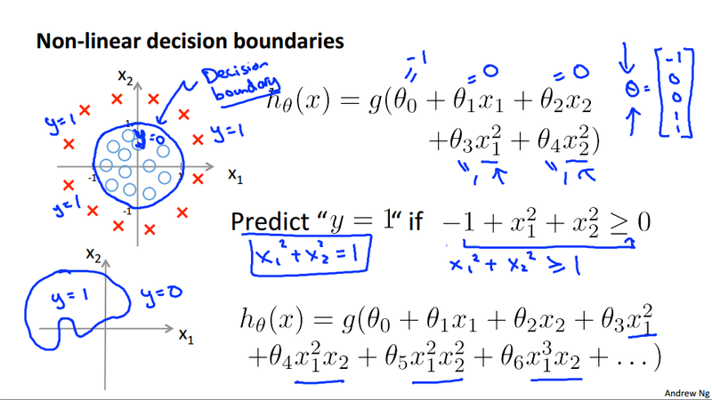

## Logistic regression cost function

### Problem description


### Logistic Regression Cost Function

Out goal to solve a logistic regression problem is to reduce the cost
incurred when predict wrong result. In linear regression, we minimize
the cost function with respect to vector $\theta$. Generally, we can
think the cost function as a penalty of the incorrect classification. It
is a qualitative measure of such penalty. For example, we use the
squared error cost function in linear regression:

$$
J(\theta) = \frac{1}{2m}\sum_{i=1}^{m}(h_\theta(x^{(i)}) - y^{(i)})^2.
$$

In logistic regression, the $h_\theta(x)$  is a much complex function,
so the cost function $J(\theta)$ used in linear regression will be a
non-convex function in logisitic regress. This will produce a hard
problem to solve logistic problems numerically. So we define a convex
logistic regression cost function

$$
Cost(h_\theta(x), y) =\begin{cases}
               -log(h_\theta(x))    & \text{if}\  y = 1\\
               -log(1-h_\theta(x)) & \text{if}\ y = 0
            \end{cases}
$$

It is the logistic regression cost function, it can be interpreted as
the penalty the algorithm pays.

We can plot the function as following:

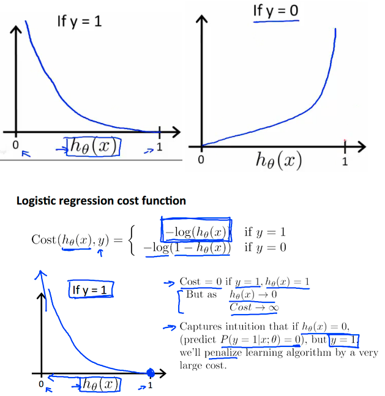

Some intuition/properties about the simplified logistic regression cost
function:

- X axis is what we predict
- Y axis is the cost associated with that prediction.
- If y = 1, and $h_\theta(x) = 1$, hypothesis predicts exactly 1
  (exactly correct) then cost corresponds to 0 (no cost for correct
  predict)
- If y = 1, and $h_\theta(x) = 0$, predict $P(y = 1|x; \theta) = 0$,
  this is wrong, and it penalized with a massive cost (the cost approach positive infinity).
- Similar reasoning holds for y = 0.

### Gradient descent and cost function

We can neatly write the logistic regression function in the following format:

$$
cost(h_\theta(x), y) = -y\log(h_\theta(x)) - (1 - y)\log(1-h_\theta(x))
$$

We can take this cost function and obtained the logistic regression cost function $J(\theta)$:

$$
\begin{align*}
J(\theta) & = \frac{1}{m}\sum_{i=1}^{m}Cost(h_\theta(x^{(i)}),y^{(i)}) \\
 & = -\frac{1}{m}\Big[\sum_{i=1}^{m}y^{(i)}\log(h_\theta(x^{(i)})) + (1 - y^{(i)})\log(1-h_\theta(x^{(i)}))\Big]
\end{align*}
$$

!!! note "Why do we chose this function when other cost functions exist?"
    - This cost function can be derived from statistics using the principle of ***maximum likelihood estimation***.
        - Note this does mean there's an underlying Gaussian assumption relating to the distribution of features.
    - Also has the nice property that it's ***convex*** function.

#### Gradient Descent for logistic regression

The algorithm looks identical to linear regression except the hypothesis function
is Sigmoid function and not linear any more.


### Advanced Optimization

Beside gradient descent algorithm, there are many other optimization algorithm
such as conjugate gradient, BFGS, and L-BFGS, can minimization the cost function
for solving logistic regression problem. Most of those advanced algorithms are
more efficient to compute, you don't have to select the convergent rate $\alpha$.

Here is one function in Octave library, possibly also in Matlab, can be
used for finding the $\theta$

#### Function fminunc()

Octave have a function `fminunc()`.[^1] [^2] To use it, we should first
call `optimset()`. There is three steps we need to take care to solve
optimization problem using these functions

1. calculate the cost function $J(\theta)$
2. calculate the gradient functions $\frac{\partial}{\partial\theta_j}J(\theta)$
3. give initial $\theta$ value
4. call the function `optimset()` and `fminunc()` as following
    ```Octave
    function [jVal, gradient] = costFunction(theta)
            jVal = (theta(1)-5)^2 + (theta(2)-5)^2;
            gradient = zeros(2,1);
            gradient(1) = 2*(theta(1)-5);
            gradient(2) = 2*(theta(2)-5);

    options = optimset(‘GradObj’, ‘on’, ‘MaxIter’, ‘100’);
    initialTheta = zeros(2,1);
    [optTheta, functionVal, exitFlag] = fminunc(@costFunction, initialTheta, options);
    ```

- Note we have `n+1` parameters, we implement the code in the following way.
    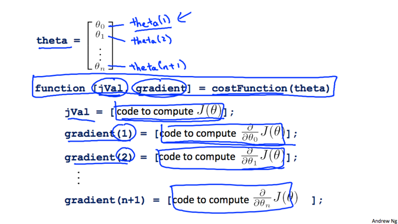

[^1]: <http://stackoverflow.com/questions/12115087/octave-logistic-regression-difference-between-fmincg-and-fminunc>
[^2]: <https://www.gnu.org/software/octave/doc/interpreter/Minimizers.html>

### Multiclass classification

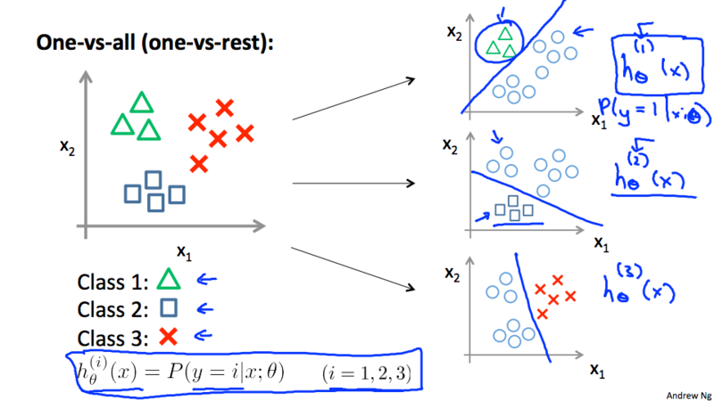

- Train a logistic regression classifier $h_{\theta}^{(i)}(x)$ for each class
  $i$ to predict the probability that $y = i$.
- On a new input $x$, to make a prediction, pick the class $i$ that maximize the $h$,
  $\operatorname*{argmax}_i h_{\theta}^{(i)}(x)$

### Regularization

!!! note "Overfitting"
    If we have too many features, the learned hypothesis may fit the
    training set very well ( $J(\theta) \approx 0$ ), but fail to
    generalize to new examples (predict prices on new examples).

#### Address overfitting problems

1. Reduce the number of features
    1. Manually select what features to keep
    2. feature selection algorithm
2. Regularization
    1. Keep all the features, reduce the value of the parameter $\theta_j$.
    2. work well when we have a lot of data when each of the features contribute
       to the algorithm a bit to predict $y$.

#### Regularization Intuition

To penalize the higher order of polynomial by adding extra terms of high
coefficient for $\theta^n$ terms. i.e. from the cost function minimization problem,
$J(\theta) = \frac{1}{2m}\sum_{i=1}^{m}(h_\theta(x^{(i)}) - y^{(i)})^2$,
we can instead use the regularized form
$J(\theta) = \frac{1}{2m}\sum_{i=1}^{m}(h_\theta(x^{(i)}) - y^{(i)})^2 + \lambda\sum_{j = 1}^{n}\theta_j^2$.
Small values for parameters $\theta_j$ will make "Simpler" hypothesis and Less
prone to overfitting. Please note that the $\theta_0$ is **excluded**
from the regularization term $\lambda\sum_{n = 1}^{n}\theta_j^2$.


#### Regularized linear regression

Gradient Descent:

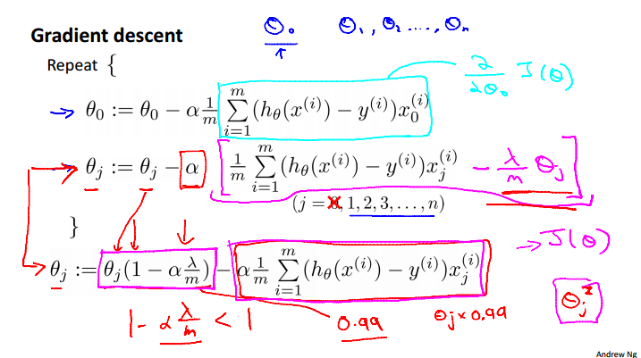

- We don't regularize $\theta_0$, so we explicitly update it in the formula and
  it is the same with the non-regularized linear regression gradient descent.
  All other $\theta_j$, $j = 1, ..., n$ will update differently.

#### Regularized logistic regression

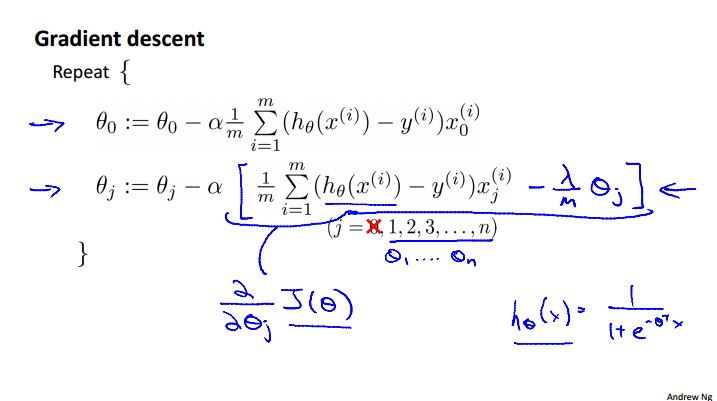

- Doesn't regularize the $\theta_0$
- The cost function is different from the linear regression

#### Advanced optimization

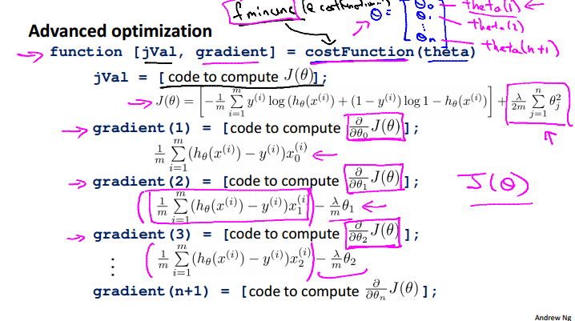

- Add the regularized term in the cost function and gradient calculation

## Week 4 Neural networks model

Neural Networks is originated when people try to mimic the functionality of brain by an algorithm.

### Model representation

In an artificial neural network, a neuron is a logistic unit that

1. Feed input via input wires
2. Logistic unit does the computation
3. Sends output down output wires

The logistic computation is just like our previous logistic regression hypothesis calculation.


### Neural Network


Use the following notation convention:

- $a_i^{(j)}$ to represent the \"activation\" of unit $i$ in layer $j$
- $\Theta^{(j)}$ to represent the matrix of weights controlling function mapping
  from layer $j$ to layer $j+1$

The value at each node can be calculated as

$$
a_1^{(2)} = g(\theta_{10}^{(1)}x_0 + \theta_{11}^{(1)}x_1 + \theta_{12}^{(1)}x_2 + \theta_{13}^{(1)}x_3) \\
a_2^{(2)} = g(\theta_{20}^{(1)}x_0 + \theta_{21}^{(1)}x_1 + \theta_{22}^{(1)}x_2 + \theta_{23}^{(1)}x_3) \\
a_3^{(2)} = g(\theta_{30}^{(1)}x_0 + \theta_{31}^{(1)}x_1 + \theta_{32}^{(1)}x_2 + \theta_{33}^{(1)}x_3) \\
h_{\Theta}(x) = a_1^{(3)} = g(\theta_{10}^{(2)}a_0^{(2)} + \theta_{11}^{(2)}a_1^{(2)} + \theta_{12}^{(2)}a_2^{(2)} + \theta_{13}^{(2)}a_3^{(2)})
$$

If the network has $s_j$ units in layer `j`, $s_{j+1}$ units in layer `j+1`,
then $\Theta^{(j)}$ will be of dimension $s_{j+1} \times (s_j + 1)$. It could be
interpreted as **"the dimension of $\Theta^{(j)}$ is number of nodes in the next
layer $\times$ the current layer's node + 1".**

### Forward propagation implementation

By defining $z_1^{(2)}$, $z_1^{(2)}$, and $z_1^{(2)}$, we could obtain
$a_1^{(2)} = g(z_1^{(2)})$, where
$z_1^{(2)} = \theta_{10}^{(1)}x_0 + \theta_{11}^{(1)}x_1 + \theta_{12}^{(1)}x_2 + \theta_{13}^{(1)}x_3$.
To make it more compact, we define
$x = \left[ \begin{array}{c} x_0 \\ x_1 \\ x_2 \\ x_3 \end{array} \right]$ and
$z^{(2)} = \left[ \begin{array}{c}z_1^{(2)} \\ z_2^{(2)} \\ z_3^{(2)} \end{array} \right]$,
so we have reached the following vectorized implementation of neural
network. It is also called **forward propagation algorithm**.

Input: $x$

Forward Propagation Algorithm:

$z^{(2)} = \Theta^{(1)}x$
$a^{(2)} = g(z^{(2)})$
and $a_0^{(2)} =1$.
$z^{(3)} = \Theta^{(3)}a^{(2)}$
$h_{\Theta}(x) = a^{(3)} = g(z^{(3)})$

### Learning its own features

What neural network is doing is it just like logistic regression, rather than
using hte original feature, $x_1$, $x_2$, $x_3$, it use new feature $a_1^{(2)}$,
$a_1^{(2)}$, $a_1^{(2)}$. Those new feature are learned from the original input
$x_1$, $x_2$, $x_3$.


### XNOR example

We calculate a Non-linear classification example: XOR/XNOR, where $x_1$ and $x_2$
are binary 0 or 1. $y = x_1 \text{ XNOR } x_2 = \text{ NOT } (x_1 \text{ XOR } x_2)$.
But those are all build on the basic non-linear operation `AND`, `OR`, and `NOT`.


Don't worry about how we get the $\theta$. This example just to give some
intuitions of how neural network problem can be solved.

### Multiclass classification

Suppose our algorithm is to recognize pedestrian, car, motorbike or
truck, we need to build a neural network with four output units. We
could use a vector to do this When image is a pedestrian get `[1,0,0,0]`
and so on.

- 1 is 0/1 pedestrain
- 2 is 0/1 car
- 3 is 0/1 motorcycle
- 4 is 0/1 truck

Just like one vs. all classifier described earlier. here we have four
logistic regression classifiers


Contrast to the previous notation we wrote $y$ as an integer ${1, 2, 3, 4}$ to
represent four classes. Now we use the following notation to represent $y^{(i)}$
as one of $\left[ \begin{array}{c} 1 \\ 0 \\ 0 \\ 0 \end{array} \right]$,
$\left[ \begin{array}{c} 0 \\ 1 \\ 0 \\ 0 \end{array} \right]$,
$\left[ \begin{array}{c} 0 \\ 0 \\ 1 \\ 0 \end{array} \right]$,
$\left[ \begin{array}{c} 0 \\ 0 \\ 0 \\ 1 \end{array} \right]$.

## Week 5 Neural networks learning

### Neural network classification

The cost function of neural network would be a generalized form of the regularized
logistic regression cost function as shown below.

### Cost Function

#### Logistic regression

$$
J(\theta) = -\frac{1}{m}\Bigg[\sum_{i=1}^{n}y^{(i)}\log(h_\theta(x^{(i)})) + (1 - y^{(i)})\log(1-h_\theta(x^{(i)}))\Bigg] + \frac{\lambda}{2m}\sum_{j=1}^{n}\theta_j^2
$$

#### Neural Network

We have the hypothesis in the K dimensional Euclidean space, denoted as
$h_{\Theta}(x) \in \mathbb{R}^K$, K is the number of output units.
$(h_{\Theta}(x))_i = i^{th}$ output.

$$
J(\Theta) = -\frac{1}{m}\Bigg[\sum_{i=1}^{m}\sum_{k=1}^Ky_k^{(i)}\log(h_\Theta(x^{(i)}))_k + (1 - y_k^{(i)})\log(1-(h_\Theta(x^{(i)}))_k)\Bigg] + \frac{\lambda}{2m}\sum_{l=1}^{L-1}\sum_{i=1}^{s_l}\sum_{j=1}^{s_{l+1}}(\Theta_{ji}^{(l)})^2
$$

Noticed that all the summation is start from `1` not `0`. For example,
the index `k` and `j`. Because we don't regularize the bias unit which is
with subscript `0`.

### Gradient computation

We have the cost function for the neural network. Next step we need to calculate
the gradient of the cost function. As we can see that the cost function is too
complicated to derive its gradient. Here we will use **back propagation** method
to calculate the partial derivative. Before dive into the details of the back
propagation, we need to summarize some of the ideas we had for the neural network
so far.

#### Forward propagation

- Forward propagation takes initial input into that neural network and pushes
  the input through the neural network
- It leads to the generation of an output hypothesis, which may be a single real
  number, but can be a vector.

#### Back propagation

The appearance of the back propagation algorithm isn't very natural. Instead, it
is a very smart way to solve the optimization problem in neural network. Because
it is difficult to follow the method we used in linear regression or logistic
regression to analytically get the derivative of the cost function. Back propagation
come to help solving the optimization problem numerically.

To compute the partial derivative
$\frac{\partial}{\partial\Theta_{i,j}^{(l)}}J(\Theta)$ (the gradient of cost
function in neural network), thus allow us to find the parameter $\Theta$ that
minimize the cost $J(\Theta)$ (using gradient descent or advanced optimization
algorithm), which will result in a hypothesis with parameters learn from the existing data.

#### How to derive the back-prop

1. We define $\delta_{j}^{(l)} =$ \"error\" of node $j$ in layer $l$
2. We calculate $\delta^{(L)} = a^{(L)} - y$, which is the vector of errors
   defined above at last layer $L$. Note $\delta^{(L)}$ is vectorized
   representation of $\delta_{j}^{(l)}$. So our "error values" for the last
   layer are simply the differences of our actual results $a^{(L)}$ in the last
   layer and the correct outputs in $y$.
3. To get the delta values of the layers before the last layer, we can use an
   equation that steps us back from right to left, thereby **back propagate**,
   by $\delta^{(l)} = ((\Theta^{(l)})^T\delta^{(l+1)}).*g'(z^{(l)})$. It can be
   interpreted as the error value of layer $l$ are calculated by multiplying the
   error values in the next layer with theta matrix of layer $l$. We then element
   wise multiply that with the derivative of the activation function
   $a^{(l)} = g(z^{(l)})$， namely $g'(z^{(l)}) = a^{(l)}.*(1-a^{(l)}).$ The
   derivation of this deviative can be found at the course wiki.
4. **Partial derivative.** With all the calculated $\delta^{(l)}$ values, We can
   compute our partial derivative terms by multiplying our activation values and
   our error values for each training example $t$,
   $\dfrac{\partial}{\partial \Theta_{i,j}^{(l)}}J(\Theta) = \frac{1}{m}\sum_{t=1}^m a_j^{(t)(l)} {\delta}_i^{(t)(l+1)}$.
   This is ignoring regularization terms.
5. Notations:
    - $t$ is the index of the training examples, we have total of $m$ samples.
    - $l$ is the layer, we have total layer of $L$.
    - $i$ is the error affected node in the target layer, layer $l+1$.
    - $j$ is the node in the current layer $l$.
    - $\delta^{(l+1)}$ and $\ a^{(l+1)}$ are vectors with $s_{l+1}$ elements.
    Similarly, $\ a^{(l)}$ is a vector with $s_{l}$ elements. Multiplying them
    produces a matrix that is $s_{l+1}$ by $s_{l}$ which is the same dimension as
    $\Theta^{(l)}$. That is, the process produces a gradient term for every element
    in $\Theta^{(l)}$. |

#### Backpropagation Algorithm

- Given training set $\lbrace (x^{(1)}, y^{(1)}) \cdots (x^{(m)}, y^{(m)})\rbrace$
- Set $\Delta^{(l)}_{i,j} := 0$ for all $(l,i,j)$
- For training example $t = 1$ to $m$:
    - Set $a^{(1)} := x^{(t)}$
    - Perform forward propagation to compute $a^{(l)}$ for $l = 2,3,\dots ,L$
    - Using $y^{(t)}$, compute $\delta^{(L)} = a^{(L)} - y^{(t)}$
    - Compute $\delta^{(L-1)}, \delta^{(L-2)},\dots,\delta^{(2)}$ using
      $\delta^{(l)} = ((\Theta^{(l)})^T \delta^{(l+1)})\ .*\ a^{(l)}\ .*\ (1 - a^{(l)})$
    - $\Delta^{(l)}_{i,j} := \Delta^{(l)}_{i,j} + a_j^{(l)} \delta_i^{(l+1)}$
      or with vectorization, $\Delta^{(l)} := \Delta^{(l)} + \delta^{(l+1)}(a^{(l)})^T$
      (programmatic calculation of $\frac{1}{m}\sum_{t=1}^m a_j^{(t)(l)} {\delta}_i^{(t)(l+1)}$)
- $D^{(l)}_{i,j} := \dfrac{1}{m}\left(\Delta^{(l)}_{i,j} + \lambda\Theta^{(l)}_{i,j}\right)$
  If $j \neq 0$ (NOTE: Typo in lecture slide omits outside parentheses. This version is correct.)
- $D^{(l)}_{i,j} := \dfrac{1}{m}\Delta^{(l)}_{i,j}$ If $j = 0$

The capital-delta matrix is used as an \"accumulator\" to add up our
values as we go along and eventually compute our partial derivative.

The actual proof is quite involved, but, the $D^{(l)}_{i,j}$ terms are
the partial derivatives and the results we are looking for:
$D_{i,j}^{(l)} = \dfrac{\partial J(\Theta)}{\partial \Theta_{i,j}^{(l)}}.$

#### Math representation

- There is a $\Theta$ matrix for each layer in the network
    - This has each node in layer $l$ as one dimension and each node in $l+1$ as the other dimension
- Similarly, there is going to be a $\Delta$ matrix for each layer
    - This has each node as one dimension and each training data example as the other

#### A high level description

- Back propagation basically takes the output you got from your network, compares
  it to the real value (y) and calculates how wrong the network was (i.e. how wrong the parameters were)
- It then, using the error you\'ve just calculated, back-calculates the error
  associated with each unit from right to left.
- This goes on until you reach the input layer (where obviously there is no error,
  as the activation is the input)
- These \"error\" measurements for each unit can be used to calculate the **partial derivatives**
    - Partial derivatives are the bomb, because gradient descent needs them to minimize the cost function
- We use the partial derivatives with gradient descent to try minimize the cost function and update all the $\Theta$ values
- This repeats until gradient descent reports convergence

#### What we need to watch out?

- We don\'t have $\delta^{(1)}$ because we have all $x$, it is zero.
- We don\'t calculate the bias node.

### Backpropagation Intuition

Backpropagation very similar to the forward propagation, we can use a example to
calculate the $\lambda_i^{(\ell)}$ or the $z^{(\ell)}$ as bellow. To further
understand the algorithm, refer to the code in assignment 4.


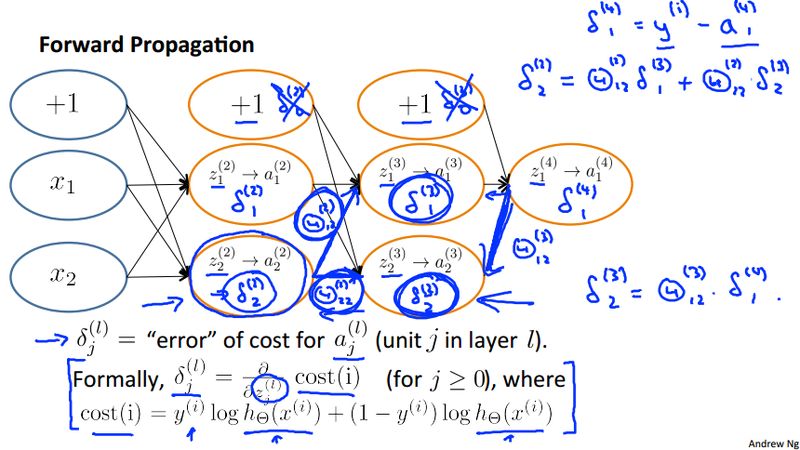

As it is shown in the slide, $z_1^{(2)}$ is calculate by multiply the corresponding
$\Theta^{(2)}_{ij}$ value. the index $i$ is the same as in $z_i^{(2)}$. The index
$j$ means the $j$th node in the previous layer.

### Unrolling parameters

With neural networks, we are working with sets of matrices: $\Theta^{(1)}$,
$\Theta^{(2)}$, $\Theta^{(3)}, \dots$. $D^{(1)}, D^{(1)}, D^{(3)}, \dots$

In order to use optimizing functions such as "fminunc()", we will want to
"unroll" all the elements and put them into one long vector

```Octave
# unroll the matrices
thetaVector = [ Theta1(:); Theta2(:); Theta3(:); ]
deltaVector = [ D1(:); D2(:); D3(:) ]
```

If the dimensions of Theta1 is 10x11, Theta2 is 10x11 and Theta3 is 1x11, then
we can get back our original matrices from the "unrolled" versions as follows

```Octave
# using reshape function to build matrix from vectors
Theta1 = reshape(thetaVector(1:110),10,11)
Theta2 = reshape(thetaVector(111:220),10,11)
Theta3 = reshape(thetaVector(221:231),1,11)
```

In Octave, if we want to implement the back propagation algorithm, we have to do
the unrolling and reshaping back and forth in order to calculate the `gradientVec`.
Notice that the last two lines are shifted in the picture, it should read "Use
forward propagation and back propagation to compute $D^{(1)}, D^{(1)}, D^{(3)}$
and $J(\Theta)$. Unroll $D^{(1)}, D^{(1)}, D^{(3)}$ to get `gradientVec`.


### Gradient Checking

To ensure a bug free back propagation implementation, one method we can
use is gradient checking. It is a way of numerically estimate the
gradient value in each computation point. It works as a reference value
to check the back propagation is correct.


In Octave, we can implement this gradient checking as follows. We then
want to check that gradApprox $\approx$ deltaVector. Remove the gradient
checking when you checking is done, otherwise the code is going to be
very slow.

```Octave
epsilon = 1e-4;
for i = 1:n,
  thetaPlus = theta;
  thetaPlus(i) += epsilon;
  thetaMinus = theta;
  thetaMinus(i) -= epsilon;
  gradApprox(i) = (J(thetaPlus) - J(thetaMinus))/(2*epsilon)
end;
```

### Random Initialization

Initializing all theta weights to zero does not work with neural networks. When
we back propagate, all nodes will update to the same value repeatedly.

Instead we can randomly initialize our weights: initialize each
$\Theta_{ij}^{(l)}$ to a random value between $[-\epsilon, \epsilon]$.

In Octave, we can use the following code to generate the initial theta values.

```Octave
#If the dimensions of Theta1 is 10x11, Theta2 is 10x11 and Theta3 is 1x11.

Theta1 = rand(10,11) * (2 * INIT_EPSILON) - INIT_EPSILON;
Theta2 = rand(10,11) * (2 * INIT_EPSILON) - INIT_EPSILON;
Theta3 = rand(1,11) * (2 * INIT_EPSILON) - INIT_EPSILON;
```

`rand(x,y)` will initialize a matrix of random real numbers between 0
and 1. (Note: this $\epsilon$ is unrelated to the $\epsilon$ from
Gradient Checking)

### Putting it Together

First, pick a network architecture; choose the layout of your neural
network, including how many hidden units in each layer and how many
layers total.

- Number of input units = dimension of features $x^{(i)}$
- Number of output units = number of classes
- Number of hidden units per layer = usually more the better (must balance with
  the cost of computation as it increases with more hidden units)

Defaults: 1 hidden layer. If more than 1 hidden layer, then the same number of
units in every hidden layer.


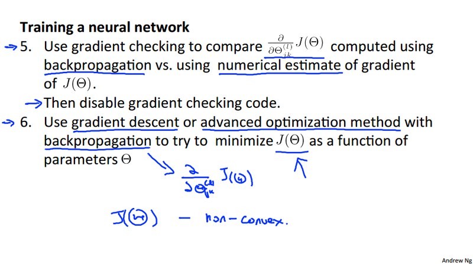

## Week 6 Advice for applying machine learning

### Deciding what to try next

1. Get more training examples
2. Try smaller sets\'of features
3. Try getting additional features
4. Try adding polynomial features
5. Try decreasing $\lambda$
6. Try increasing $\lambda$

### Machine learning diagnostic

**Diagnostic**: A test that you can run to gain insight what is/isn\'t
working with a learning algorithm, and gain guidance as to how best to
improve its performance. It can take time to implement, but doing so can
be a very good use of your time.

### Evaluating a hypothesis

Diagnostic over-fitting by splitting the training set and test set

1. Training set (70%)
2. Test set (30%)

If the cost function $J(\theta)$ calculated for training set is low, it
is high for test set, over-fitting happens. This is apply to both
logistic regression and linear regression.

### Model selection and Train/Validation/Test sets

Normally we choose a model from a series of different degree of
polynomial hypothesis, We choose the model that have the least cost for
testing data. More specifically, we learned the parameter $\theta^{(d)}$
(d is the degree of polynomial) from the training set and calculate the
cost for the test dataset with the learned $\theta$. This is not the
best practice for the reason that the hypothesis we selected has been
fit to the test set. It is very likely the model will not fit new data
very well.

We can improve the model selection by introduce the cross validation
set. We divide our available data as

1. Training set (60%)
2. Cross validation set (20%)
3. test set (20%)

We use the cross validation data to help us to select the model, and
using the test data, which the model never see before to evaluate
generalization error.

!!! Warning
    Avoid to use the test data to select the model (select the least cost model
    calculated on the test data set) and then report the generalization error
    using the test data.

### Diagnosing bias vs. variance

The important point to understand bias and variance is to understand how the
cost for training data, cross validation data (or test data) changes.

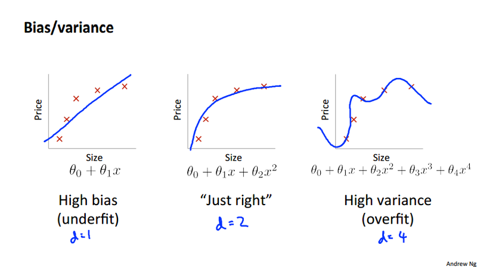


### Regularization and bias/variance

The regularization parameter $\lambda$ could play important role in selecting
the best model to fit the data (both cross validation data and test data). This
section will study how $\lambda$ affect the cost function both for the training
data and cross validation data.

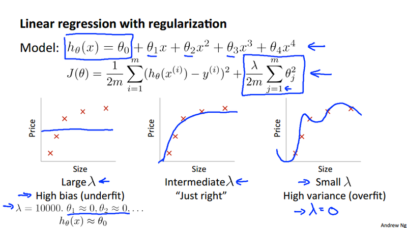

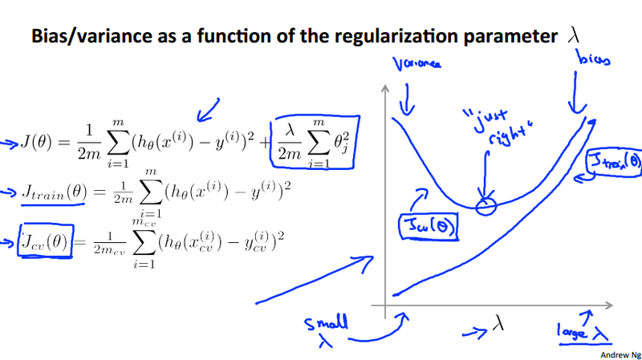

### Learning curve

This section mainly discuss how the sample size affect the cost
function. There are two kinds of problem we face, high bias and high
variance

#### High bias

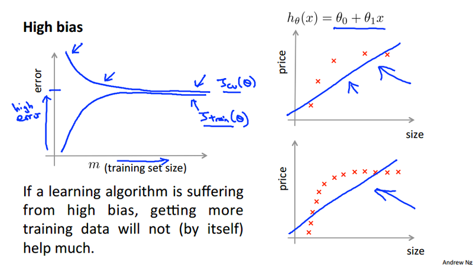

#### High variance


### Deciding what to do next revisited

| bias/variance |    underfitting/overfitting   |  regularization  |            to improve           |
|:-------------:|:-----------------------------:|:----------------:|:-------------------------------:|
| High bias     | underfitting                  | bigger $lambda$  | more sample will not help much  |
| High variance | overfitting (high polynomial) | smaller $lambda$ | more sample will likely to help |

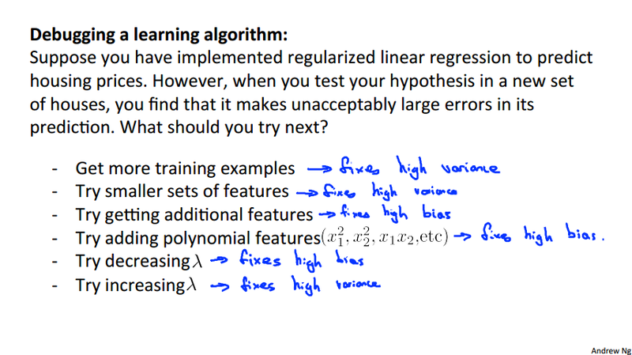
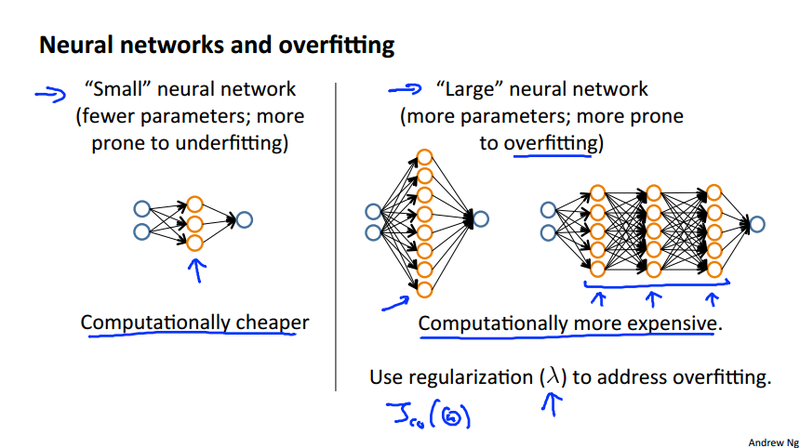

### Prioritizing what to work on

### Building a spam classifier

### Error analysis

1. Start simple algorithm, implement it and test it on cross-validation data.
2. Plot learning curves to decide if more data, more features, etc. are like to help.
3. Error analysis: Manually examine the examples (in cross validation set) that
   you algorithm make errors on. See if you spot any systematic trend in what type
   of examples it it making error on.

### Error metrics for skewed classes

Problem arise in error analysis when only very small(less than 0.5%)
negative samples possibly exist. Take the cancer classification as a
example.


#### Precision and Recall


#### Trading off precision and recall

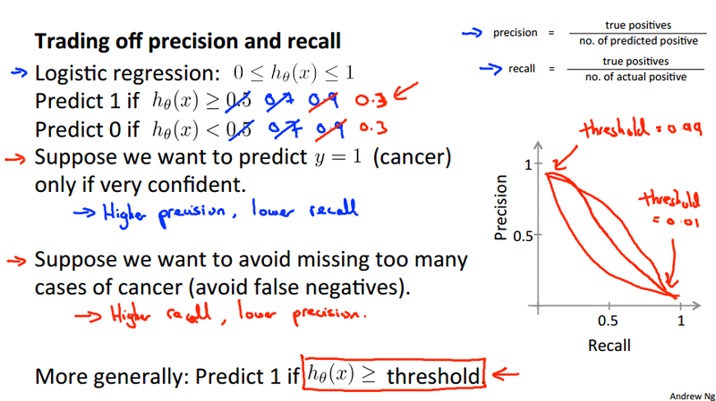

#### F score {#f_score}

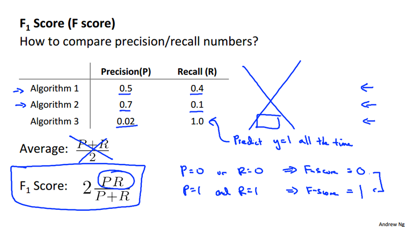

### Data for machine learning

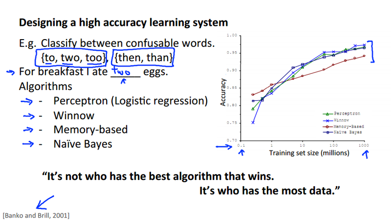
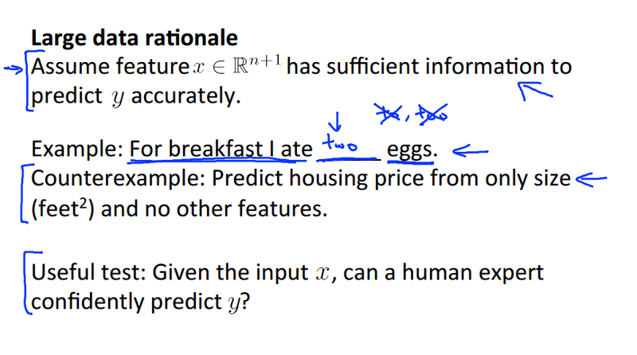
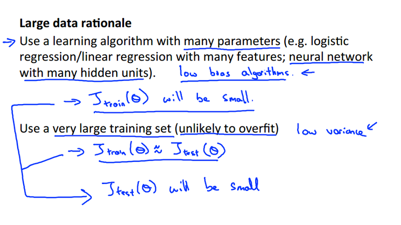

## Week 7 Support Vector Machine

### Optimization objective

SVM will be derived from logistic regression. There are not that much of logic,
just following the derivation in the lecture. Let's first review the hypothesis
of the logistic regress and its cost function:


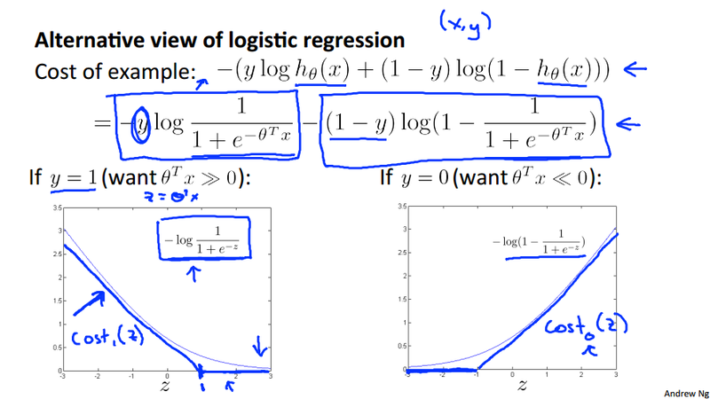

Notice in the second figure above, we define approximate functions $cost_0(z)$
and $cost_1(z)$. These functions will be used in the SVM cost function we will
see next.

#### SVM cost function

Compare to logistic regression, SVM use a different parameters $C$. As in
logistic regression, we use $\lambda$ to control the trade off optimizing the
first term and the second term in the objective function.

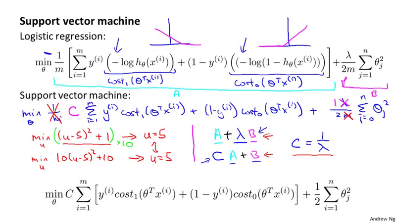

What's more, the SVM hypothesis doesn\'t give us a probability prediction, it
give use either `1` or `0`. Such as
$h_\theta = \begin{cases}
          1 \qquad \text{if}\  \Theta^Tx \geq 0\\
          0 \qquad \text{otherwise}
            \end{cases}$

### Large margin intuition

Suppose we make the parameter $C$ very large, we want to make the first term in
the summation approximate `0`. We can derive the problem as a optimization
problem subject to some condition. This optimization problem will lead us to
discuss the decision boundary. when $C$ is very large, the decision boundary
will have a large margin, thus large margin classifier. Later we will see that
using different kernel and parameters can control this margin.

!!! Question
    How the large margin classifier related to the optimization problem when `C` is very large?


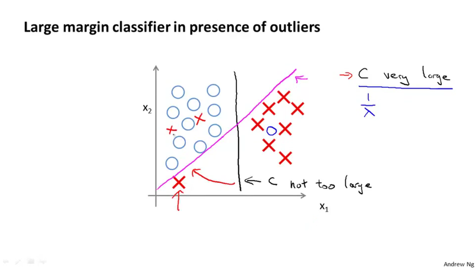

When $C$ is very large, we have the magneto decision boundary, if $C$ is
not very large, we will have the black decision boundary, which is
having the large margin properties.

### Mathematics behind large margin classification

Using the vector inner product to transform the constrain from
$\theta^T x^{(i)} \geq 1$ to $p^{(i)}\Vert\theta \Vert \geq 1$ for $y^{(i)} = 1$


The point of this section is to discuss the mathematical insight why SVM choose
the large margin decision boundary. (because, the large margin decision boundary
will produce a larger $p^{(i)}$, thus a smaller $\Vert\theta \Vert$ in the
constrain of the optimization problem, so as to minimize the objective function
$\min_\theta \frac{1}{2} \sum_{j=1}^{n} \theta_j^2$)

### Kernel

#### Non-linear decision boundary

Is there a different/better choice of the features $f_1, f_2, f_3, \dots,$

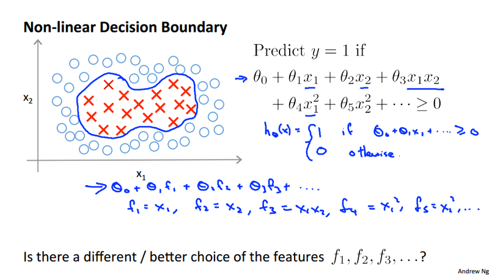

#### Landmarks

To respond the above question, we use the following way to generate the
new features $f_1, f_2, f_3, \dots,$. Compare the similarity between the
examples and the landmarks using a similarity function.

#### Gaussian kernel

We use the Guassian kernel
$k(x, \ell^{(i)}) = \exp(-\frac{\Vert x - \ell^{(i)}\Vert^2}{2\delta^2})$
as the similarity function to generate the new feature.

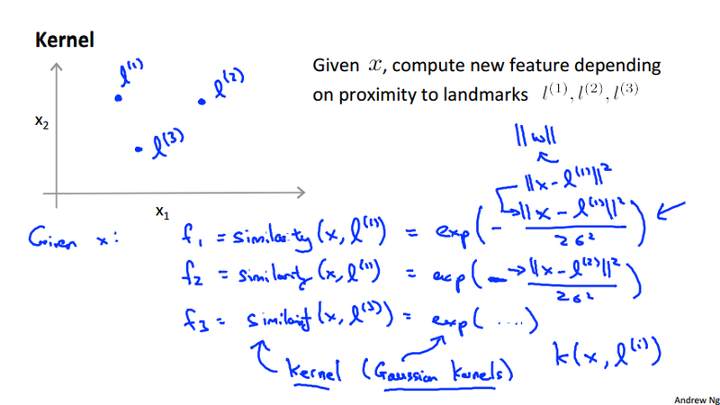

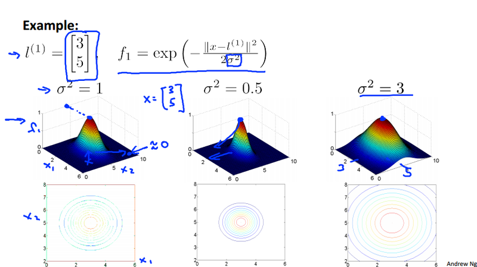


#### Choosing the landmarks

Naturally, we are going to choose the example itself as the landmark, thus we
are able to transform the feature $x^{(i)}$ to feature vector $f^{(i)}$ for
training example $(x^{(i)}, y^{(i)})$.


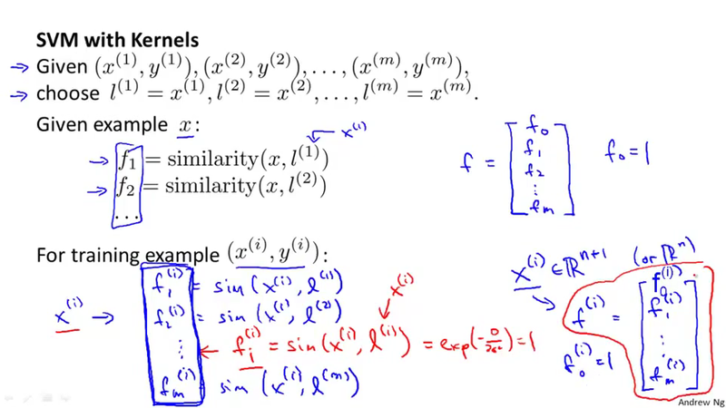


### Using SVM

- Choice of parameter $C$.
- Choice of kernel (similarity function):
    - No kernel ("linear Kernel")
    - Gaussian kernel (need to choose $\delta^2$)

Because the similarity function is apply to each feature, we\'d better to perform
feature scaling before using the Gaussian kernel. (take the house price features
as an example, the areas and the number of rooms are not in the same scale.)

!!! Note
    Not all similarity functions $similarity(x, \ell)$ make valid kernels. Need
    to satisfy technical condition called "Mercer's Theorem" to make sure SVM
    packagesl' optimizations run correctly, and do not diverge).

Many off-the-shelf kernels available:

- Polynomial kernel:
  $k(X, \ell) = (X^T\ell + c)^{p}$, such as $k(x, \ell) = (X^T\ell + 1)^2.$
- More esoteric: **String kernel, chi-square kernel, histogram intersection kernel,** ...

!!! Note SVM multi-class classification
    Many SVM packages already have built-in multi-class classification functionality.
    Otherwise, we can use one-vs.-all method. Specifically, train $K$ SVMs, one
    to distinguish $y = i$ from the rest, for $i = 1, 2, \dots, K$, get
    $\theta^{(1)}, \theta^{(2)}, \dots, \theta^{(K)}$, pick class $i$ with largest
    $(\theta^{(i)})^Tx$.

#### Logistic regression vs. SMVs

This section mainly discuss when to use logistic regression vs. SVM from the high
level. I summarize the content of the slides in the table.

|                 n                  |            m             |                          logistic regression vs. SVMs                          |
|:----------------------------------:|:------------------------:|:------------------------------------------------------------------------------:|
| large (relative to mm) i.e. 10,000 | 10 - 1000                | use logistic regression, or SVM without a kerenl ("linear kernel")             |
| small (i.e. 1-1000)                | intermediate (10-10,000) | use SVM with Gaussian kernel                                                   |
| small (i.e. 1-1000)                | large (50,000+)          | create/add more features, then use logistic regression or SVM without a kernel |


## Week 8 Unsupervised Algorithms

### K-Means Algorithm

In the k-means clustering algorithm. We have input $K$ (number of clusters) and
traning set $\{x^{(1)}, x^{(1)}, \dots, x^{(m)}\}$, for each of the training
example $x^{(i)}\in \R^n$. Note here we drop the $x_0 = 1$ convention.
To visualize the algorithm, we have the following three picture.


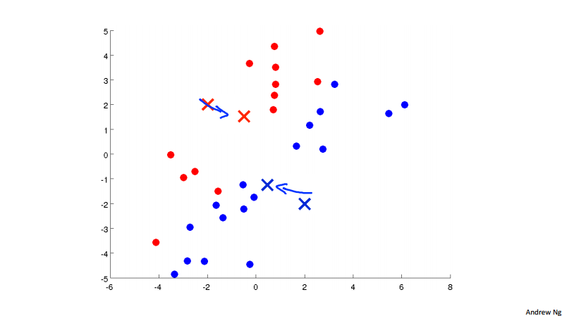
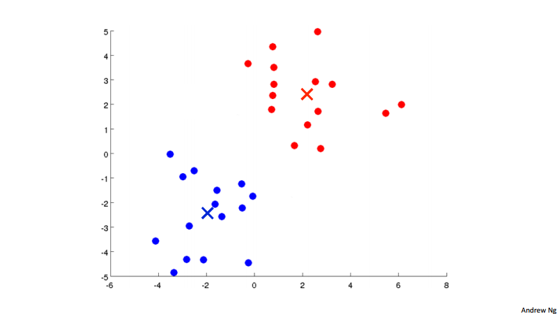

Concretely, the k-means algorithm is:

- Input: training set $\! \{x^{(i)}\}_{i=1}^m,$ and number of clusters $K$.
- Algorith:
    1. Randomly initialize $K$ cluster centroids $\mu_1, \mu_1, \dots,  \mu_K\in \R^n$.
    2. Repeat:
        - for $i = 1$ to $m$: // cluster assignment step
            - $c^{(i)}$ := index (from 1 to $K$) of cluster centroid closest to $x^{(i)}$
        - for $k = 1$ to $K$: // move centroid step
            - $\mu_k$ := average (mean) of points assigned to cluster $k$
    3. Until convergence

### Optimization objective


### Random initialization

We can random initialize the centroid by randomly pick $K$ training examples and
set $\mu_1, \dots, \mu_K$ equal to these $K$ examples. Obviously, we should have
$K < m$. However, some of the random initialization would lead the algorithm to
achieve local optima, which is shown below in the pictures. To solve this
problem, we can random initialize multiple times then to pick clustering that
gave lowest cost $J(c^{(1)}, \dots, c^{(m)}, \mu_1, \dots \mu_K)$.

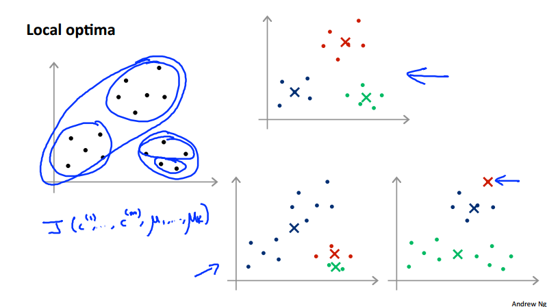


### Choosing the K

It depends on the problem we are trying to solve. One straightforward problem is
using a method called the Elbow method as the following picture. Secondly, the K
value should be picked to maximize some practical utility function, for example,
we cluster the size of different T-shirts, whether we want to have 3 sizes or 5
sizes is depends on the profitability.


### Dimensionality reduction

The two motivation of Dimensionality Reduction are:

1. Data compression, for example, reduce data from 2D to 1D.
2. Visualization, we can reduce the high dimensionality data to 2 or 3 dimensions,
   and visualize them. For example, to visualize some complex economical data for different countries.

### Principal Component Analysis (PCA)

To reduce from 2-dimension to 1-dimension: Find a direction (a vector
$u^{(1)}\in \R^n$) onto which to project the data so as to minimize the
projection error. To reduce from n-dimension to k-dimension: Find k direction
vectors $u^{(1)}, u^{(2)}, \dots, u^{(k)}$ onto which to project the data so as
to minimize the projection error.

!!! Note
    Note the difference between PCA and linear regression.


### PCA algorithm

Before carry out the PCA, we\'d better to do some feature scaling/mean
normalization. As in the slides below, the $S_i$ could be the
maximum/minimum value or other values such as variance $\sigma$.


once the pre-proccessing steps are done we can run the following
algorithm in Octave to implement PCA.

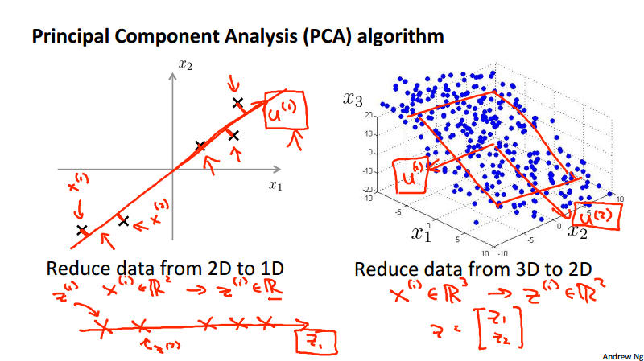
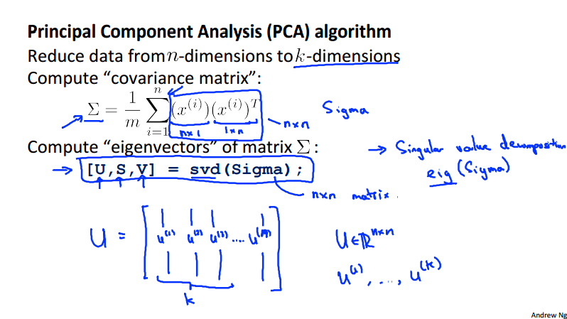

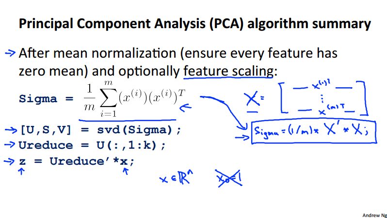

### Reconstruction from PCA compressed data


### Choosing the number of principal components

Two concepts we should define here:

Average squared projection error:

- $\frac{1}{m}\sum_{i=1}^{m}\lVert x^{(i)} - x_{approx}^{(i)}\rVert^2$

Total variation in the data:

- $\frac{1}{m}\sum_{i=1}^{m}\lVert x^{(i)} \rVert^2$

Typically, we choose $k$ to be smallest value so that ration of the two quality
should be less than 1%.

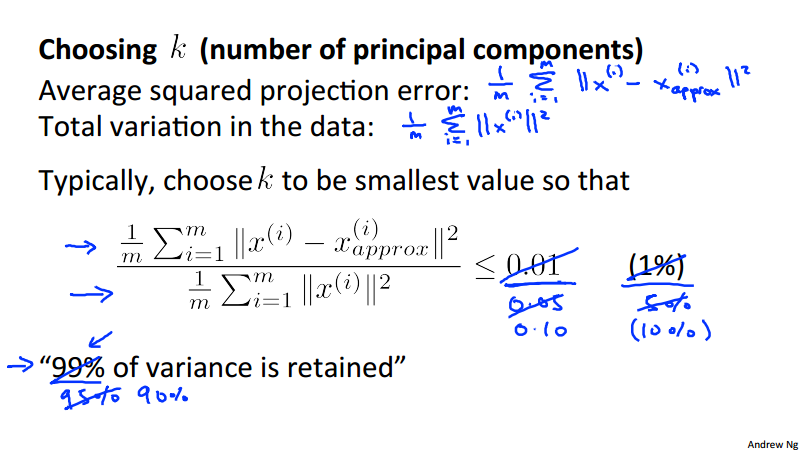


### Advice for applying PCA

One important point should keep in mind when using PCA:

- don't try to use PCA to prevent overfitting, use regularization instead.

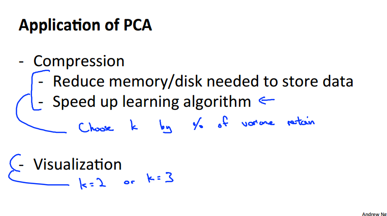


## Week 9 Anomaly Detection

### Anomaly Detection

Given a model $p(x)$, test on the example $x^{(i)}$ to check whether we have
$p(x) < \epsilon$. Generally, the anomaly detection system apply to the scenario
that we don't have much anomaly example, such as a dataset about aircraft engines.

In this particular lecture, the $p(x)$ is [multivariate Gaussian distribution](https://en.wikipedia.org/wiki/Normal_distribution).
The algorithm is to find the parameter $\mu$ and $\sigma^2$. Once we fit the
data with a multivariate Gaussian distribution, we are able to obtain a
probability value, which can be use to detect the anomaly by select a probability
threshold $\epsilon$.

Here is the anomaly detection algorithm:


### Developing and evaluating

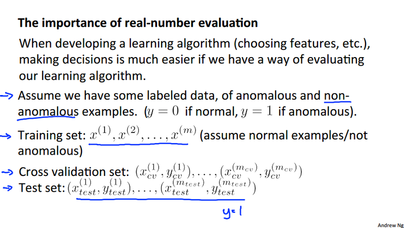

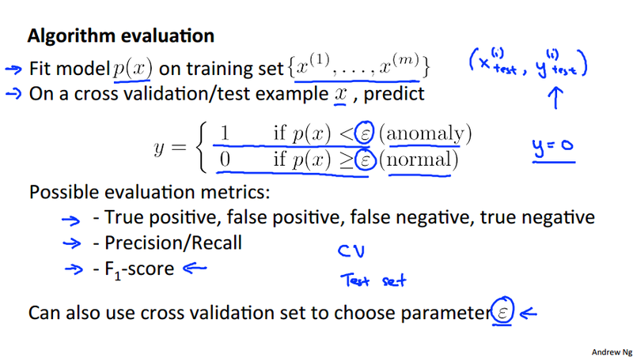

### Anomaly detection vs. supervised learning

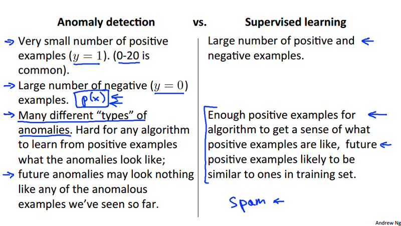
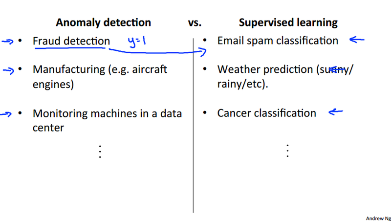

### Multivariate Gaussian distribution

There are plots of different multivariate Gaussian distributions with different
mean and covariance matrix. It intuitively show how changes in the mean and
covariance matrix can change the shape of the plot of the distribution. It also
compared the original model (multiple single variate Gaussian distribution) to
multivariate Gaussian distribution. Generally, if we have multiple features, we
tend to use multivariate Gaussian distribution to fit the data, even thought the
original model is more computationally cheaper.

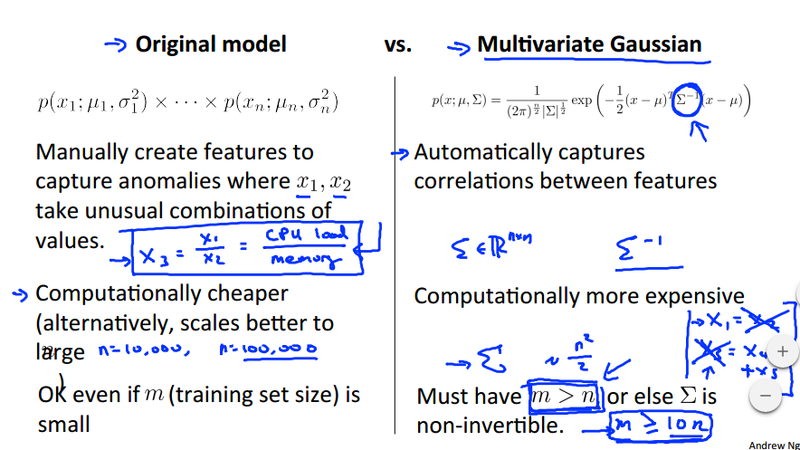

### Predicting movie ratings

#### Problem formulation

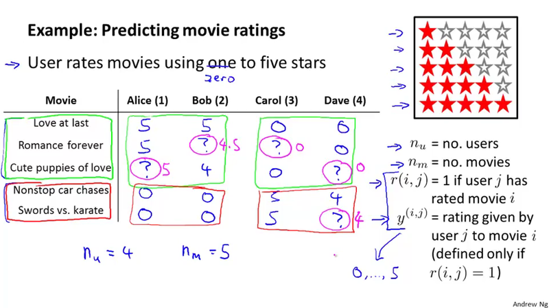

#### Content based recommendations

Suppose we have a feature vector for each of the movie, combining with the rating
values, we can solve the minimization problem to get $\theta^{(j)}$, which is the
parameter vector of user $j$. With this parameter vector, we can predicting the
rating of the movie by $(\theta^{(j)})^T x^{(i)}$.

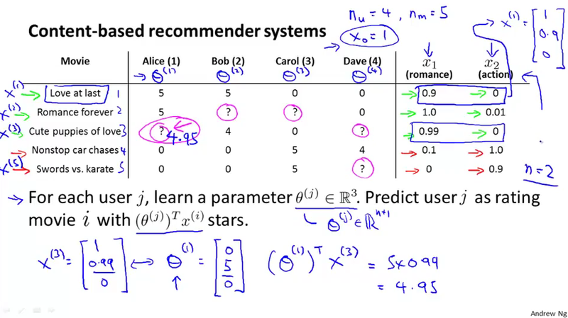


#### Collaborate filtering

In collaborate filtering, we don\'t have the feature, we only have the parameter
vector $\theta^{(j)}$ for user $j$. We can solve a optimization problem in
regarding to the feature vector $x^{(i)}$ through the rating values.

What interesting about this if we don\'t have the initial $\theta^{(j)}$, we can
generate a small random value of $\theta^{(j)}$, and repetitively to get the
feature vector $x^{(i)}$. As later we can say, we can solve a optimization
problem with regarding to both $\theta^{(j)}$ and $x^{(i)}$ all at once. See the
slides for details.


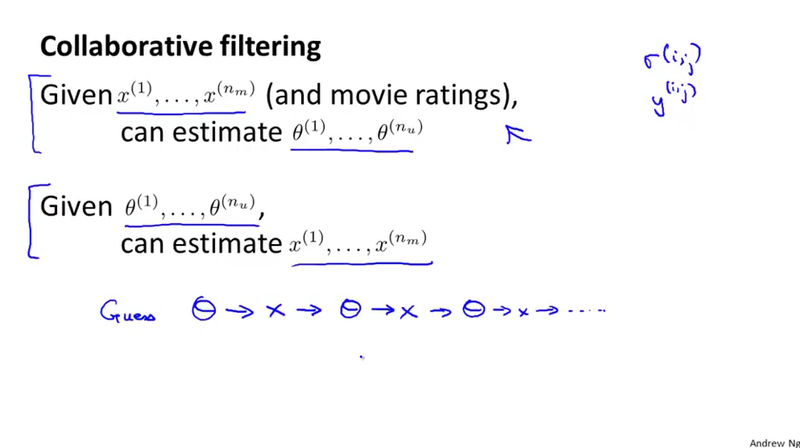

#### Collaborative filtering algorithm

As discussed above, in practice, we solve the optimization problem respect to
both $\theta^{(j)}$ and $x^{(i)}$. See the slides for the optimization problem
we are trying to solve, and the gradient descent algorithm to solve it.

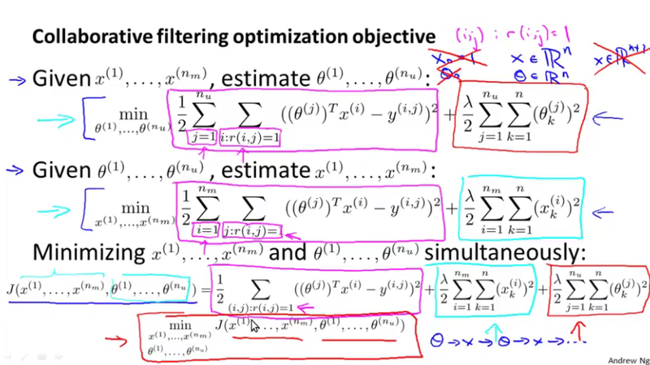

