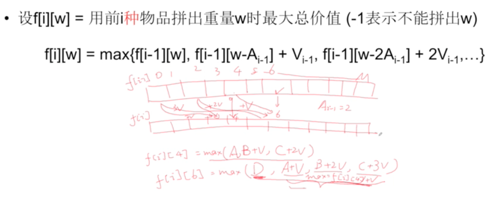
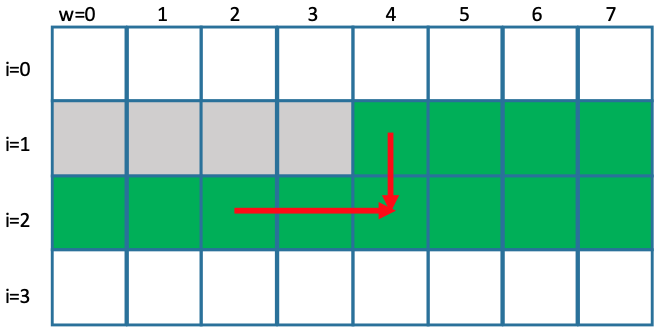

# Dynamic Programming

## 难点

1. 如何在分析最后一步时选择正确角度并考虑所有可能情况，进而写出状态转化方程.
   i.e. Buy and Shell stock, Edit distance, Longest Increasing Subsequence.

## Knapsack problems

[背包问题九讲](https://www.kancloud.cn/kancloud/pack/70125)

The knapsack problems often given the follow conditions

1. `N`, the number of items
2. `M`, the size of the knapsack
3. `s[i]`, the size of the item `i`.
4. `v[i]`, the value of the item `i`.
5. `c[i]`, the maximum time item `i` can be used. `c[i]` could be an all `1` array,
   hence 0-1 knapsack problem. `c[i]` could also be `inf`, meaning the items can
   be used as many time as you want (bounded by the size of the knapsack).

Knapsack problems ask

1. Whether the given items can fit into the size of the knapsack.
2. Find the maximum capacity the items can occupy the knapsack.
3. Find the maximum value of items that can fit into the knapsack.
4. Find the total number of ways the given item can fit into the size of the knapsack.
   (reuse is allowed)

In all the above questions, the items can be reused or not reused, they are very
different and the throught process and the solution are also different.

## Knapsack I

- Given `N`, `M`, `s[i]`, find the maximum size you can put into the Knapsack.

=== "DP O(nm)"

    ```c++
    class Solution {
    public:
        int backPackI(int m, vector<int> A) {
            int n = A.size();
            if (n == 0) return 0;

            bool f[n + 1][m + 1];

            f[0][0] = true;
            for (int j = 1; j <= m; ++j) {
                f[0][j] = false;
            }

            for (int i = 1; i <= n; ++i) {
                for (int j = 0; j <= m; ++j) {
                    f[i][j] = f[i - 1][j];
                    if (j >= A[i - 1]) {
                        f[i][j] = f[i][j] || f[i - 1][j - A[i - 1]];
                    }
                }
            }

            for (int j = m; j >= 0; --j) {
                if (f[n][j] == true)
                    return j;
            }

            return 0;
        }
    }
    ```

=== "DP O(m) space"

    ```c++
    class Solution {
    public:
        int backPackI(int m, vector<int> A) {
            int n = A.size();
            if (n == 0) return 0;

            bool f[m + 1];

            f[0] = true;

            for (int i = 1; i <= n; ++i) {
                for (int j = m; j >= 0; --j) {
                    f[j] = f[j - 1]
                    if (j >= A[i - 1]) {
                        f[j] = f[j] || f[j - A[i - 1]];
                    }
                }
            }

            for (int j = m; j >= 0; --j) {
                if (f[j] == true)
                    return j;
            }

            return 0;
        }
    }
    ```

## Knapsack II

- Given `N`, `M`, `s[i]`, `v[i]`, find the maximum value you can put into the
  Knapsack.

- 思考方式任然是从最后一个物品选还是不选，只是我们现在考虑的是价值。此时状态就不能是可行性(Backpack)或者多少种了(Backpack V), 我们要纪录总价值。
- state `f[i][w]`: 表示前i个物品能拼成重量w的总价值(V)。
- state transition equaltion: `f[i][w] = max(f[i−1][w], f[i−1][w−A[i−1]]+V[i−1]|w≥A[i−1]且 f[i−1][w−A[i−1]]≠−1)`
- Initialization: f[0][0] = 0, f[0][1] = -1, ... f[0][w] = -1. -1 代表不能被拼出。

=== "DP O(mn)"

    ```c++
    class Solution {
    public:
        /**
        * f[i][w]: 前i个物品能够拼成w的总价值
        * f[i][w] = max(f[i - 1][w], f[i - 1][w - A[i - 1]] + V[i - 1])
        */
        int backPackII(int m, vector<int> A, vector<int> V) {
            int n = A.size();
            if (n == 0) {
                return 0;
            }

            int f[n + 1][m + 1];

            /* init */
            f[0][0] = 0;
            for (int j = 1; j <= m; j++) {
                f[0][j] = -1;
            }

            for (int i = 1; i <= n; i++) {
                for (int j = 0; j <= m; j++) {
                    f[i][j] = f[i - 1][j]; /* 此处必须初始化 */
                    if (f[i - 1][j - A[i - 1]] != -1 && j >= A[i - 1]) {
                        f[i][j] = max(f[i][j], f[i - 1][j - A[i - 1]] + V[i - 1]);
                    }
                }
            }

            int res = 0;
            for (int j = 0; j <= m; j++) {
                if (f[n][j] != -1 && f[n][j] > res) {
                    res = f[n][j];
                }
            }

            return res;
        }
    };
    ```

=== "DP O(M)"

    ```c++
    class Solution {
    public:
        /**
        * f[i][w]: 前i个物品能够拼成w的总价值
        * f[i][w] = max(f[i - 1][w], f[i - 1][w - A[i - 1]] + V[i - 1])
        */
        int backPackII(int m, vector<int> A, vector<int> V) {
            // write your code here
            int n = A.size();
            if (n == 0) {
                return 0;
            }

            int f[m + 1];

            /* init */
            f[0] = 0;
            for (int j = 1; j <= m; j++) {
                f[j] = -1;
            }

            for (int i = 1; i <= n; i++) {
                for (int j = m; j >= 0; j--) {
                    if (f[j - A[i - 1]] != -1 && j >= A[i - 1]) {
                        f[j] = max(f[j], f[j - A[i - 1]] + V[i - 1]);
                    }
                }
            }

            int res = 0;
            for (int j = 0; j <= m; j++) {
                if (f[j] != -1 && f[j] > res) {
                    res = f[j];
                }
            }

            return res;
        }
    };
    ```

## Knapsack III

- Given `N`, `M`, `s[i]`, `v[i]`, find the maximum value you can put into the
  Knapsack while **reuse is allowed**
- Even though you can reuse, it is not limited, you can use items `i` at most
  `m / s[i]` times. In this sense, this problem is equivalent to the problem
  [Knapsack IV](#knapsack-iv).
- From $O(MNK)$ to $O(MN)$: notice the third loop can be optimized by closely
  looking for the redundant computation. For each `i` and `j`, we check all `k`s
  for the value of `f[i - 1][j - k * A[i - 1]]` to update `f[i][j]`. We can
  remove some of the redundant computation. Because the innermost loop will
  always look back an integer multiple of `s[i]` of the previous row `f[i - 1]`.
  For each `i`, we only looking for multiple times of `s[i - 1]` index before.
  We can use previous results directly for the current calculation then add `v[i]`
  instead of restart from `k = 0`. This way we can get rid of the inner most loop.
  See the below diagram and sketch for the derivation of the state equation change.
  As a result, the solution code is very similar to the problem [Knapsack II](#knapsack-ii),
  except the single difference in indexing (`i` instead of `i - 1`). but they
  are completely different, the similarity of the code is pure a coincidence.

    ```text
            j
            0  1  2  3  4  5  6  7  8  9
    f[i-1]  x  x  x  x  x  x  x  x  x  x
    s[i]    v     v     v     2
    f[i][4] = max(f[i - 1][j - 0*2], f[i - 1][j - 1*2] + 1*v[i - 1], ...)
    f[i][6] = max(f[i - 1][j - 0*2], f[i][4] + v[i - 1])
            = max(f[i - 1][j],       f[i][j - s[i - 1]] + v[i - 1])
    ```

    
    

- From $O(MN)$ to $O(M)$: This is from the following observation explained using
  the figure. It is a very clever idea in noticing that the new value only
  calculated from the the front index `j - k*s[i-1]` and the the old value
  from the same index (hence the `j` is iterating from `0` in the $O(M)$
  solution, in contrast, the $O(M)$ solution in [Knapsack II](#knapsack-ii)
  iterate `j` backward because need the old value not the new ones).
  

=== "DP O(MNK)"

    ```c++
    class Solution {
    public:
        int backPackIII(vector<int>& A, vector<int>& V, int m) {
            int n = A.size();
            int f[n + 1][m + 1];

            f[0][0] = 0;
            for (int j = 1; j < m; ++j) {
                f[0][j] = -1;
            }

            for (int i = 1; i <= n; ++i) {
                for (int j = 1; j <= m; ++j) {
                    f[i][j] = f[i - 1][j];
                    for (int k = 0; k <= m / A[i - 1]; ++k) {
                        if (f[i][j - k * A[i - 1]] != -1 && j >= k * A[i - 1]) {
                            f[i][j] = max(f[i][j], f[i - 1][j - k * A[i - 1]] + k * V[i - 1]);
                        }
                    }
                }
            }

            int res = 0;
            for (int j = 0; j <= m; ++j) {
                if (f[n][j] != -1 && f[n][j] > res)
                    res = f[n][j];
            }

            return res;
        }
    }
    ```

=== "DP O(MN)"

    ```c++ hl_lines="15"
    class Solution {
    public:
        int backPackIII(vector<int>& A, vector<int>& V, int m) {
            int n = A.size();
            int f[n + 1][m + 1];

            f[0][0] = 0;
            for (int j = 1; j < m; ++j) {
                f[0][j] = -1;
            }

            for (int i = 1; i <= n; ++i) {
                for (int j = 1; j <= m; ++j) {
                    f[i][j] = f[i - 1][j];
                    if (f[i][j - A[i - 1]] != -1 && j >= A[i - 1]) {
                        f[i][j] = max(f[i][j], f[i][j - A[i - 1]] + V[i - 1]);
                    }
                }
            }

            int res = 0;
            for (int j = 0; j <= m; ++j) {
                if (f[n][j] != -1 && f[n][j] > res)
                    res = f[n][j];
            }

            return res;
        }
    }
    ```

=== "DP O(M)"

    ```c++
    class Solution {
    public:
        int backPackIII(vector<int>& A, vector<int>& V, int m) {
            int n = A.size();
            if (n == 0) {
                return 0;
            }

            int f[m + 1];

            /* init */
            f[0] = 0;
            for (int j = 1; j <= m; j++) {
                f[j] = -1;
            }

            for (int i = 1; i <= n; i++) {
                for (int j = 0; j <= m; j++) {
                    if (f[j - A[i - 1]] != -1 && j >= A[i - 1]) {
                        f[j] = max(f[j], f[j - A[i - 1]] + V[i - 1]);
                    }
                }
            }

            int res = 0;
            for (int j = 0; j <= m; j++) {
                if (f[j] != -1 && f[j] > res) {
                    res = f[j];
                }
            }

            return res;
        }
    };
    ```

## Knapsack IV

- Given `N`, `M`, `s[i]`, `v[i]`, `c[i]`, find the maximum value you can put
  into the Knapsack while the max time of usage of each item is given in `c[i]`.

```c++

```

## Knapsack V

- Given `N`, `M`, `s[i]`, find the number of possible Knapsack fills if
  **each item can be used once**.

=== "DP O(nm)"

    ```c++
    class Solution {
    public:
        int backPackV(vector<int>& nums, int T) {
            int n = nums.size();
            if (n == 0) {
                return 0;
            }

            int f[n + 1][T + 1];
            f[0][0] = 1;

            for (int j = 1; j <= T; j++) {
                f[0][j] = 0;
            }

            for (int i = 1; i <= n; i++) {
                for (int j = 0; j <= T; j++) {
                    f[i][j] = f[i - 1][j];
                    if (j >= nums[i - 1]) {
                        f[i][j] += f[i - 1][j - nums[i - 1]];
                    }
                }
            }

            return f[n][T];
        }
    };
    ```

=== "DP O(m)"

    ```c++
    class Solution {
    public:
        int backPackV(vector<int>& nums, int T) {
            int n = nums.size();
            if (n == 0) {
                return 0;
            }

            int f[T + 1];
            f[0] = 1;

            for (int j = 1; j <= T; j++) {
                f[j] = 0;
            }
            for (int i = 1; i <= n; i++) {
                for (int j = T; j >= 0; j--) {
                    //f[j] = f[j - A[i - 1]] ==> f'[j]
                    if (j >= nums[i - 1]) {
                        // f'[j]
                        // cover old f[j]
                        f[j] += f[j - nums[i - 1]];
                    }
                }
            }

            return f[T];
        }
    };
    ```

## Knapsack VI

- Given `N`, `M`, `s[i]`, find the number of possible Knapsack fills if
  **each item can be used unlimited times**.
- 这道题等同于Leetcode里 [Combinations Sum IV]()
- 这里可以随便取，似乎题目变得无法下手，考虑“最后一步”这个技巧不能用了，因为最后一步可以是任意一个了。
- 但仍然可以用子问题来考虑。先不管最后一步是哪一个，最后一步之前的相加的总和一定是 Target - x. 这样就转化成一个子问题可以用DP来做。
- 具体做法我们可以对于每一个小于“总承重”的重量进行枚举最后一步x。可能的x是 A[0], ..., A[i - 1] 中任意一个.

!!! Note "Compare With knapsack V, how to deal with the unlimited usage"

=== "DP O(m)"

    ```c++
    class Solution {
    public:
        int backPackVI(vector<int>& nums, int T) {
            int n = nums.size();
            if (n == 0) {
                return 0;
            }
            int f[T + 1];
            f[0] = 1;
            /* for each sub problem */
            for (int i = 1; i <= T; i++) {
                f[i] = 0;
                /* enumerate the last step */
                for (int j = 0; j < n; j++) {
                    if (i >= nums[j]) {
                        f[i] += f[i - nums[j]];
                    }
                }
            }

            return f[T];
        }
    };
    ```

=== "How to print such solutions"

    ```c++
    // Suppose we also interested in print one of the possible solution. How could we change the code?
    // f[i]: 存多少种方式
    // pi[i]: 如果 f[i] >= 1, 最后一个数字可以是pi[i]
    class Solution {
    public:
        int backPackVI(vector<int>& nums, int T) {
            int n = nums.size();
            if (n == 0) {
                return 0;
            }

            int f[T + 1];
            /* pi[i]: 如果i可拼出(f[i] >= 1), 最后一个是pi[i] */
            int pi[T + 1];
            f[0] = 1;

            for (int i = 1; i <= T; i++) {
                f[i] = 0;
                for (int j = 0; j < n; j++) {
                    if (i >= nums[j]) {
                        f[i] += f[i - nums[j]];
                        /* 最后一个是nums[j]的可拼出i */
                        if (f[i - nums[j]] > 0) {
                            /* 纪录下来 */
                            pi[i] = nums[j];
                        }
                    }
                }
            }

            if (f[T] > 0) {
                int i = T;
                cout << i << "=" << endl;
                while (i != 0) {
                    // sum is i now;
                    // last number is pi[i]
                    // previuos sum is i - pi[i]
                    cout << pi[i] << endl;
                    i -= pi[i];
                }
            }

            return f[T];
        }
    };
    ```

### Race Car

waymo

## 坐标型

### Triangle

### [Unique Paths](../../../courses/9chap-dynamic-prog/notes/#unique-paths)

### [Unique Paths II](../../../courses/9chap-dynamic-prog/notes/#unique-paths-ii)

### [Minimum Path Sum](../../../courses/9chap-dynamic-prog/notes/#minimum-path-sum)

### [Bomb Enemy](../../../courses/9chap-dynamic-prog/notes/#bomb-enemy)

### Dungeon Game

### 221. Maximal Square

- Solution 1 [monotonic stack](../../stack/notes/#221-maximal-square)
- Solution 2 [Dynamic Programming](https://zxi.mytechroad.com/blog/dynamic-programming/leetcode-221-maximal-square/)

=== "C++ DP memoization"

    ```c++
    class Solution {
    public:
        int maximalSquare(vector<vector<char>>& matrix) {
            if (matrix.empty()) return 0;
            int m = matrix.size();
            int n = matrix[0].size();
            vector<vector<int>> sum(m + 1, vector<int>(n + 1, 0));
            int res = 0;

            for (int i = 1; i <= m; ++i) {
                for (int j = 1; j <= n; ++j) {
                    sum[i][j] = matrix[i - 1][j - 1] - '0'
                        + sum[i - 1][j]
                        + sum[i][j - 1]
                        - sum[i - 1][j - 1];
                }
            }

            int area = 0;
            for (int i = 1; i <= m; ++i) {
                for (int j = 1; j <= n; ++j) {
                    for (int k = min(m - i + 1, n - j + 1); k > 0; --k) {
                        area = sum[i + k - 1][j + k - 1]
                                - sum[i + k - 1][j - 1]
                                - sum[i - 1][j + k - 1]
                                + sum[i - 1][j - 1];

                        if (area == k * k) {
                            res = max(res, area);
                            break;
                        }
                    }
                }
            }

            return res;
        }
    };
    ```

=== "C++ DP subproblem"

    ```c++
    class Solution {
    public:
        int maximalSquare(vector<vector<char>>& matrix) {
            if (matrix.empty()) return 0;
            int m = matrix.size();
            int n = matrix[0].size();
            vector<vector<int>> sizes(m, vector<int>(n, 0));
            int res = 0;

            for (int i = 0; i < m; ++i) {
                for (int j = 0; j < n; ++j) {
                    sizes[i][j] = matrix[i][j] - '0';
                    if (sizes[i][j] == 0) continue;

                    if (i > 0 && j > 0)
                        sizes[i][j] = min(min(sizes[i - 1][j - 1], sizes[i - 1][j]), sizes[i][j - 1]) + 1;

                    res = max(res, sizes[i][j] * sizes[i][j]);
                }
            }

            return res;
        }
    };
    ```
=== "Python DP"

    ```Python
    class Solution:
        def maximalSquare(self, matrix: List[List[str]]) -> int:
            res = 0
            m = len(matrix)
            n = len(matrix[0])
            dp = [[0 if matrix[i][j] == "0" else 1 for j in range(n)] for i in range(m)]

            for i in range(1, m):
                for j in range(1, n):
                    if dp[i][j] > 0:
                        dp[i][j] = min(dp[i - 1][j], dp[i][j - 1], dp[i - 1][j - 1]) + 1

            res = max([max(row) for row in dp])
            return res ** 2
    ```

### 1277. Count Square Submatrices with All Ones

- solution 1 Similar to [221. Maximal Square](./#221-maximal-square)

```python
class Solution:
    def countSquares(self, matrix: List[List[int]]) -> int:
        res = 0
        for i in range(0, len(matrix)):
            for j in range(0, len(matrix[0])):
                if matrix[i][j] > 0 and i > 0 and j > 0:

                    matrix[i][j] = min(matrix[i - 1][j], matrix[i][j - 1], matrix[i - 1][j - 1]) + 1

                res += matrix[i][j]
        return res
```

## 序列型

### Perfect Squares

### [Longest Increasing Subsequence](#longest-increasing-subsequence)

### Number of Longest Increasing Subsequence

### [Longest Increasing Continuous Subsequence](#longest-increasing-continuous-subsequence)

## 序列型 + 状态

### [Paint House](../../../courses/9chap-dynamic-prog/notes/#paint-house)

### [Paint House II](../../../courses/9chap-dynamic-prog/notes/#paint-house-ii)

### [House Robber](../../../courses/9chap-dynamic-prog/notes/#house-robber)

### [House Robber II](../../../courses/9chap-dynamic-prog/notes/#house-robber-ii)

### [Best Time to Buy and Sell Stock](../../../courses/9chap-dynamic-prog/notes/#best-time-to-buy-and-sell-stock)

### [Best Time to Buy and Sell Stock II](../../../courses/9chap-dynamic-prog/notes/#best-time-to-buy-and-sell-stock-ii)

### [Best Time to Buy and Sell Stock III](../../../courses/9chap-dynamic-prog/notes/#best-time-to-buy-and-sell-stock-iii)

### [Best Time to Buy and Sell Stock IV](../../../courses/9chap-dynamic-prog/notes/#best-time-to-buy-and-sell-stock-iv)

### [Portfolio Value Optimization](https://leetcode.com/discuss/interview-question/625536/robinhood-phone-portfolio-value-optimization)

There are two questions regarding this problem:

[leetcode discussion](https://leetcode.com/discuss/interview-question/625536/robinhood-phone-portfolio-value-optimization)

1. Can buy fractions of a stock
2. Cannot buy fractions of a stock

=== "DP solution"

    ```c++
    #include <iostream>
    #include <vector>
    #include <climits>
    #include <numeric>
    #include <algorithm>
    using namespace std;

    class Solution {
    public:
        int maxProfit(vector<int> curr_price, vector<int> new_price, vector<int> amount, int A) {
            int n = curr_price.size();
            int f[n + 1][A + 1]; // max profit of the first i stocks with payment j

            // init
            f[0][0] = 0;
            for (int j = 1; j <= A; ++j) {
                f[0][j] = -1;
            }

            // f[i][j] = max(f[i - 1][j], f[i - 1][j - k * curr_price[i]] + k * new_price[i])
            for (int i = 1; i <= n; ++i) {
                    for (int j = 0; j <= A; ++j) {
                    f[i][j] = f[i - 1][j];
                    for (int k = 0; k <= amount[i]; ++k) {
                        if (f[i - 1][j - k * curr_price[i - 1]] != -1 && j >= k * curr_price[i - 1]) {
                        f[i][j] = max(f[i][j], f[i - 1][j - k * curr_price[i - 1]] + k * new_price[i - 1]);
                        }
                    }
                }
            }

            int res = 0;
            for (int j = A; j >= 0; --j) {
                if (f[n][j] != -1 && f[n][j] > res) {
                    res = f[n][j];
                }
            }

            return res;
        }
    };

    int main() {

        // test1 res = 255
        // vector<int> v{15, 40, 25, 30};
        // vector<int> w{45, 50, 35, 25};
        // vector<int> s{3, 3, 3, 4};
        // int m = 140;
        // test2 res = 60
        vector<int> v{15, 20};
        vector<int> w{30, 45};
        vector<int> s{3, 3};
        int m = 30;
        int res = 0;

        Solution sol = Solution();

        res = sol.maxProfit(v, w, s, m);
        cout << res;
    }
    ```

=== "DP space O(M)"

    ```c++
    #include <iostream>
    #include <vector>
    #include <climits>
    #include <numeric>
    #include <algorithm>
    using namespace std;

    class Solution {
    public:
        int maxProfit(vector<int> curr_price, vector<int> new_price, vector<int> amount, int A) {
            int n = curr_price.size();
            int f[A + 1]; // max profit of the first i stocks with payment j

            // init
            f[0] = 0;
            for (int j = 1; j <= A; ++j) {
                f[j] = -1;
            }

            // f[i][j] = max(f[i - 1][j], f[i - 1][j - k * curr_price[i]] + k * new_price[i])
            for (int i = 1; i <= n; ++i) {
                for (int j = A; j >= 0; --j) {
                for (int k = 0; k <= amount[i]; ++k) {
                    if (f[j - k * curr_price[i - 1]] != -1 && j >= k * curr_price[i - 1]) {
                    f[j] = max(f[j], f[j - k * curr_price[i - 1]] + k * new_price[i - 1]);
                    }
                }
                }
            }

            int res = 0;
            for (int j = A; j >= 0; --j) {
            if (f[j] != -1 && f[j] > res) {
                res = f[j];
            }
            }

            return res;
        }
    };

    int main() {
        // test1 res = 255
        // vector<int> v{15, 40, 25, 30};
        // vector<int> w{45, 50, 35, 25};
        // vector<int> s{3, 3, 3, 4};
        // int m = 140;
        // test2 res = 60
        vector<int> v{15, 20};
        vector<int> w{30, 45};
        vector<int> s{3, 3};
        int m = 30;
        int res = 0;

        Solution sol = Solution();

        res = sol.maxProfit(v, w, s, m);
        cout << res;
    }
    ```

## 划分型

### Word Break

Solution 1 use set dictionary O(n^2), iterate forwards

```C++
class Solution {
public:
    bool wordBreak(string s, vector<string>& wordDict) {
        int m = s.length();
        unordered_set<string> wordSet(wordDict.begin(), wordDict.end());

        bool f[m + 1] = {0};
        f[0] = true;

        for (int i = 1; i <= m; i++) {
            for (int j = 0; j <= i; j++) {
                if (f[j] && wordSet.count(s.substr(j, i - j)) != 0) {
                    f[i] = true;
                    break;
                }
            }
        }

        return f[m];
    }
};
```

Solution 2 use set dictionary O(n^2), iterate backwards

```C++
class Solution {
public:
    bool wordBreak(string s, vector<string>& wordDict) {
        int n = s.length();
        unordered_set<string> dict(wordDict.begin(), wordDict.end());

        int f[n + 1] = {0};
        f[0] = 1;

        for (int i = 0; i <= n; ++i) {
            for (int j = n - 1; j >= 0; --j) {
                if (f[j] && dict.count(s.substr(j, i - j))) {
                    f[i] = 1;
                    break;
                }
            }
        }

        return f[n];
    }
};
```

Solution 3 (best solution) use vector, iterate through string

- Do not use word set to check exist or not, use each word as the last step.

```C++
class Solution {
public:
    bool wordBreak(string s, vector<string>& wordDict) {
        int n = s.length();

        int f[n + 1] = {0};
        f[0] = 1;

        for (int i = 0; i <= n; ++i) {
            for (string word : wordDict) {
                if (word.length() <= i && f[i - word.length()]) {
                    if (s.substr(i - word.length(), word.length()) == word) {
                        f[i] = 1;
                        break;
                    }
                }
            }
        }

        return f[n];
    }
};
```

### Maximum Vacation Days

Solution 1

```c++
class Solution {
public:
    int maxVacationDays(vector<vector<int>>& flights, vector<vector<int>>& days) {
        int n = flights.size();
        int k = days[0].size();

        vector<vector<int>> f(n, vector<int>(k, -1));
        f[0][0] = days[0][0];

        for (int i = 1; i < n; ++i) {
            if (flights[0][i]) {
                f[i][0] = days[i][0];
            }
        }

        for (int d = 1; d < k; ++d) {
            for (int i = 0; i < n; ++i) {
                for (int j = 0; j < n; ++j) {
                    if ((flights[j][i] || i == j) && f[j][d - 1] != 1) {
                        f[i][d] = max(f[i][d], f[j][d - 1] + days[i][d]);
                    }
                }
            }
        }

        int result = 0;
        for (int i = 0; i < n; ++i) {
            result = max(result, f[i][k - 1]);
        }

        return result;
    }
};
```

Solution 2 DFS with Cache

```C++
class Solution {
    vector<vector<int>> memo;
public:
    int maxVacationDays(vector<vector<int>>& flights, vector<vector<int>>& days) {
        vector<vector<int>> memo(flights.size(), vector<int>(days[0].size(), INT_MIN));

        return dfs(flights, days, 0, 0, memo);
    }
    int dfs(vector<vector<int>>& flights, vector<vector<int>>& days, int start, int day, vector<vector<int>>& memo) {
        if (day == days[0].size()) {
            return 0;
        }
        if (memo[start][day] != INT_MIN) {
            return memo[start][day];
        }

        int maxVal = 0;
        for (int i = 0; i < flights.size(); ++i) {
            if (flights[start][i] || start == i) {
                maxVal = max(maxVal, days[i][day] + dfs(flights, days, i, day + 1, memo));
            }
        }
        memo[start][day] = maxVal;
        return maxVal;
    }
};
```

Solution 3 (greedy, wrong)

```C++
class Solution {
public:
    int maxVacationDays(vector<vector<int>>& flights, vector<vector<int>>& days) {
        int n = flights.size();
        int k = days[0].size();
        int start = 0;
        int result = 0;
        set<pair<int, int>, std::greater<pair<int, int>>> s;

        for (int col = 0; col < k; ++col) {
            for (int row = 0; row < n; ++row) {
                s.insert({days[row][col], row});
            }
            int stay = 1;
            for (auto p : s) {
                if (flights[start][p.second]) {
                    result += p.first;
                    cout << p.first << " " << p.second << endl;
                    start = p.second;
                    stay = 0;
                    break;
                }
            }
            if (stay) {
                result += days[start][col];
            }
            s.clear();
        }

        return result;
    }
};
```

### [Decode Ways](../../../courses/9chap-dynamic-prog/notes/#decode-ways)

### Decode Ways II

Solution 1

```C++
class Solution {
public:
    int numDecodings(string s) {
        const int MOD = 1000000007;
        int n = s.length();
        long long f[n + 1] = {0};
        if (n == 0) return 0;

        f[0] = 1;
        for (int i = 1; i <= n; ++i) {
            if (s[i - 1] == '*') { // not include '0' according to the problem statement
                f[i] = (f[i] + f[i - 1] * 9) % MOD; // number of ways only decode one digit
                if (i > 1) { // number of ways decode two digits
                    if (s[i - 2] == '*') {
                        f[i] = (f[i] + f[i - 2] * 15) % MOD; // 11 - 26
                    } else if (s[i - 2] == '1') {
                        f[i] = (f[i] + f[i - 2] * 9) % MOD; // 11 - 19
                    } else if (s[i - 2] == '2') {
                        f[i] = (f[i] + f[i - 2] * 6) % MOD; // 21 - 26
                    }
                }
            } else { // s[i - 1] != '*', have to consider the case '0'
                if (s[i - 1] != '0') { // number of ways only decode one digit
                    f[i] = (f[i] + f[i - 1]) % MOD;
                }
                if (i > 1) { // number of ways decode two digits
                    if (s[i - 2] == '*') {
                        if (s[i - 1] <= '6') { // '*' can represent 1, 2
                            f[i] = (f[i] + f[i - 2] * 2) % MOD;
                        } else { // '*' can only represent 1
                            f[i] = (f[i] + f[i - 2]) % MOD;
                        }
                    } else { // no '*' case
                        int t = (s[i - 2] - '0') * 10 + s[i - 1] - '0';
                        if (t >= 10 && t <= 26) {
                            f[i] = (f[i] + f[i - 2]) % MOD;
                        }
                    }
                }
            }
        }

        return f[n] % MOD;
    }
};
```

## 双序列型

### Longest Common Subsequence

Solution 1

- consider the last step, the case is NOT `A[n-1] == B[l-1]` and `A[n-1] != B[m-1]`
  but, three cases: `A[n-1]` is included, `B[m-1]` is included, both `A[n-1]` and
  `B[m-1]` are included, `(A[n-1] == B[m-1])`.

```C++

```

### Interleaving String

Solution 1

```C++
class Solution {
public:
    bool isInterleave(string s1, string s2, string s3) {
        // f[i][j] = OR(f[i][j - 1]|B[j - 1] in C, f[i - 1][j]|A[i - 1] in C);
        int m = s1.length();
        int n = s2.length();
        int l = s3.length();
        if (m + n != l)
            return false;

        int f[m + 1][n + 1] = {0};
        f[0][0] = 1;
        for (int i = 0; i <= m; ++i) {
            for (int j = 0; j <= n; ++j) {
                if (i > 0 && s1[i - 1] == s3[i + j - 1]) {
                    f[i][j] |= f[i - 1][j];
                }
                if (j > 0 && s2[j - 1] == s3[i + j - 1]) {
                    f[i][j] |= f[i][j - 1];
                }
            }
        }

        return f[m][n];
    }
};
```

### Edit Distance

Solution 1

- state: `f[i][j]` is min edit distance to make the first i chars of A the same
  as first `j` chars of B, as we consider the last operation (insert, delete,
  replace). One key idea of this problem is after the operation, the length of
  the A and B are not necessarily `i` and `j`. The focus here is the "min edit
  distance", not the length of A or B. For example, if the last step is insert,
  A's length will become `i + 1`, B's length will maintain `j`. You should also
  note that the A, B concept is imaginary, B is actually changed from A by
  editing once. As a result, we know `i + 1 == j` after the insertion operation.
  Don't iterpret the state `f[i][j]` as min edit distance of first `i` chars in
  A and first `j` chars in B and after the editing, A's length is `i` and B's
  length is `j`. You should seperate the two intepretations.

```C++
class Solution {
public:
    int minDistance(string word1, string word2) {
        int m = word1.length();
        int n = word2.length();

        int f[m + 1][n + 1];
        int i, j;

        for (i = 0; i <= m; i++) {
            for (j = 0; j <=n; j++) {
                if (i == 0) {
                    f[i][j] = j;
                    continue;
                }
                if (j == 0) {
                    f[i][j] = i;
                    continue;
                }

                           // delete           insert
                f[i][j] = min(f[i - 1][j] + 1, f[i][j - 1] + 1);
                                        // replace
                f[i][j] = min(f[i][j], f[i - 1][j - 1] + 1);

                if (word1[i - 1] == word2[j - 1]) {
                    f[i][j] = min(f[i][j], f[i - 1][j - 1]);
                }
            }
        }

        return f[m][n];

    }
};
```

Solution 2 Space optimized

```C++
class Solution {
public:
    int minDistance(string word1, string word2) {
        int m = word1.length();
        int n = word2.length();

        int f[2][n + 1];
        int prev = 0, curr = 0;
        for (int i = 0; i <= m; i++) {
            prev = curr;
            curr = 1 - curr;
            for (int j = 0; j <=n; j++) {
                if (i == 0) {
                    f[curr][j] = j;
                    continue;
                }
                if (j == 0) {
                    f[curr][j] = i;
                    continue;
                }
                          // delete               insert
                f[curr][j] = min(f[prev][j] + 1, f[curr][j - 1] + 1);
                                             // replace
                f[curr][j] = min(f[curr][j], f[prev][j - 1] + 1);

                if (word1[i - 1] == word2[j - 1]) {
                    f[curr][j] = min(f[curr][j], f[prev][j - 1]);
                }
            }
        }

        return f[curr][n];
    }
};
```

## Memoization

### 1049. Last Stone Weight II

- Solution 1 Recursion + memoization
- Solution 2 Use two set to simulate
- Solution 3 Transform into knapsack
    - Thinking it as adding "+" and "-" in front of each number. The sum of all
      the numbers with "+" S1, the sum of all number with "-" S2, we want to
      find the minimum of `|S1 - S2|` because we have `S1 + S2 = total`. suppose
      `S1 <= S2`, we want to minimize `S2 - S1 = total - S1 - S1 = total - 2 * S1`;
      We wil achieve the goal by maximizing `S1`, so that the stete would be.
      `f[i][j]` represent the optimal value of use first `i` stones to achieve
       maximum `j` (`S1`) value.

=== "C++ Memoization"

    ```c++
    class Solution {
        int memo[30][3001];
    public:
        int lastStoneWeightII(vector<int>& stones) {
            return helper(stones, 0, 0);
        }

        int helper(vector<int>& stones, int i, int sum) {
            if (i == stones.size())
                return abs(sum);
            if (memo[i][sum] != 0)
                return memo[i][sum];

            memo[i][sum] = min(helper(stones, i + 1, abs(sum - stones[i])),
                            helper(stones, i + 1, sum + stones[i]));

            return memo[i][sum];
        }
    };
    ```

=== "C++ Set simulation"

    ```c++
    class Solution {
    public:
        int lastStoneWeightII(vector<int>& stones) {
            if (stones.size() == 0)
                return 0;

            unordered_set<int> set_left({stones[0]});

            for (int i = 1; i < stones.size(); ++i) {
                unordered_set<int> set_right = set_left;
                set_left.clear();
                for (int y : set_right) {
                    set_left.insert(y + stones[i]);
                    set_left.insert(y - stones[i]);
                }
            }

            int ans = INT_MAX;
            for (int z : set_left) {
                ans = min(ans, abs(z));
            }

            return ans;
        }
    };
    ```

=== "C++ knapsack"

    ```c++
    class Solution {
    public:
        int lastStoneWeightII(vector<int>& stones) {
            int n = stones.size();
            int sum = accumulate(begin(stones), end(stones), 0);

            vector<vector<int>> f(n + 1, vector<int>(sum / 2 + 1, 0));

            for (int i = 1; i <= n; ++i) {
                for (int j = 1; j < sum / 2 + 1; ++j) {
                    if (j < stones[i - 1]) {
                        f[i][j] = f[i - 1][j];
                    } else {
                        f[i][j] = max(f[i - 1][j], f[i - 1][j - stones[i - 1]] + stones[i - 1]);
                    }
                }
            }

            return sum - 2 * f[n][sum / 2];
        }
    };
    ```

=== "C++ knapsack O(1) space"

    ```c++
    class Solution {
    public:
        int lastStoneWeightII(vector<int>& stones) {
            int n = stones.size();
            int sum = accumulate(begin(stones), end(stones), 0);

            vector<int> f(sum / 2 + 1, 0);

            for (int i = 1; i <= n; ++i) {
                for (int j = sum / 2; j >= 0; --j) {
                    if (j >= stones[i - 1]) {
                        f[j] = max(f[j], f[j - stones[i - 1]] + stones[i - 1]);
                    }
                }
            }

            return sum - 2 * f[sum / 2];
        }
    };
    ```

### Sentence Screen Fitting

Solution 1

- You can view the sentence as a space seperated English sentence and then use
  each row to "frame" the sentence. If the end of the frame overlap a space, we
  continue move to the next frame if available. If the end of the frame overlap
  a character, we should move the right the frame to the end of the prev word
  and move on to the next frame.

```C++
class Solution {
public:
    int wordsTyping(vector<string>& sentence, int rows, int cols) {
        int n = sentence.size();
        string s;
        for (string w : sentence) {
            s += string(w + " ");
        }

        int start = 0, len = s.length(); //s with an extra trailing space.
        for (int i = 0; i < rows; i++) {
            start += cols;
            if (s[start % len] == ' ') {
                ++start;
            } else {
                while (start > 0 && s[(start - 1) % len] != ' ') {
                    --start;
                }
            }
        }

        return start / len;
    }
};
```

Solution 2

- One insight of this solution is that every word in the sentence is possible to
  start a new row, but not necessary. For example, a long row can contain
  multiple of the setences, but the last word cannot fit into this sigle row, it
  start a new row. In this case only the first word in the sentence and the last
  word can start a new row. We use this insight in the following way, for each
  word, we assume it could start a new row, then use the following words in the
  sentence to fix the row, we record the total number of words that can fit this
  row in `dp[i]`, `i` is the index of the starting word in the sentence. After
  the calculation, we could count `sum(dp[i])`, `i` is starting word's index.

```C++
class Solution {
public:
    int wordsTyping(vector<string>& sentence, int rows, int cols) {
        int n = sentence.size();
        int f[n] = {0};

        for (int i = 0; i < n; ++i) {
            int len = 0, count = 0, idx = i;
            while (len + sentence[idx % n].length() <= cols) {
                len += (sentence[idx % n].length() + 1);
                idx++;
                count++;
            }
            f[i] = count;
        }

        int total = 0;
        for (int i = 0, idx = 0; i < rows; ++i) {
            total += f[idx];
            idx = (f[idx] + idx) % n;
        }


        return total / n;
    }
};
```

TODO:
This solution may be further improved because for some of the count, we never
used. Can we calculate the final result by only one loop, or in a nested loop?
