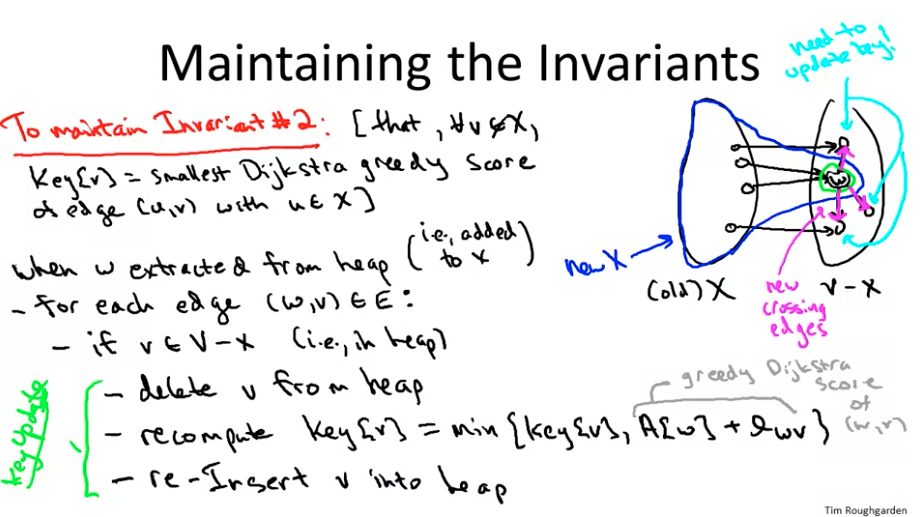

# Graph

## Representations

### Edge lists

An edge is represented using an array of two vertex numbers or objects contain
the vertex numbers. Weights can be added as the third number or another member
of the objects.

* Example: `[[0,1], [0,6], [0,8], [1,4], [1,6], [1,9], [2,4], [2,6], [3,4], [3,5]]`
* Space: $\Theta(E)$
* Search edge: $O(E)$

### Adjacency matrix

Use a `matrix[i][j]` to represent the edges. `1` is connected, `0` is not connected.

* Example:

    ```text
    [ [0, 1, 0, 0, 0, 0, 1, 0, 1, 0],
    [1, 0, 0, 0, 1, 0, 1, 0, 0, 1],
    [0, 0, 0, 0, 1, 0, 1, 0, 0, 0],
    [0, 0, 0, 0, 1, 1, 0, 0, 1, 0],
    [0, 1, 1, 1, 0, 1, 0, 0, 0, 1],
    [0, 0, 0, 1, 1, 0, 0, 0, 0, 0],
    [1, 1, 1, 0, 0, 0, 0, 0, 0, 0],
    [0, 0, 0, 0, 0, 0, 0, 0, 1, 1],
    [1, 0, 0, 1, 0, 0, 0, 1, 0, 0],
    [0, 1, 0, 0, 1, 0, 0, 1, 0, 0] ]
    ```

* Check edge `(i, j)` exists: $O(1)$
* Space: $\Theta(V^2)$
* Search djacent vertex: $O(V)$
* For undirected graph, adjacency matrix is symmetric. For a directed graph, the
  adjacency matrix need not be symmetric.

### Adjacency list

Representing a graph with adjacency lists combines adjacency matrices with edge lists. For each vertex `i`, store an array of the vertices adjacent to it. Each vertex has a list.


* Space: $\Theta(2E)$ for undirected graph. $\Theta(E)$ for directed graph.
* Check edge `(i, j)` exists: $O(d)$, `d` is the degree of the vertex `i`. $0 \leq d \leq V - 1$.
* If the graph is weighted, then each item in each adjacency list is either a two-item array or an object, giving the vertex number and the edge weight.

[Representing graphs](https://www.khanacademy.org/computing/computer-science/algorithms/graph-representation/a/representing-graphs)

## Algorithms

* Weighted Graph
* Unweighted Graph
* Directed Graph
* Undirected Graph
* Graph Traversal
* Single Source Shortest Path
* Connected components
* Minimum spanning tree

### Kosaraju's Two-pass algorithm

1. Reverse each arc of the original graph.
2. First run of the  `DFS-Loop` to computer the "finish" time of each node in
   the reversed graph. Book keeping:
       - The "source node of a node". A source node is the first node in the DFS tree.
       - The "finish time of a node".
3. Second run of the `DFS-Loop` to computer the strongly connected components (SCC).
   The SCC is represented by the source node.

### Dijkstra algorithm (No negative edge)

* Dijkstra algorithm implementation need one data structure (think of it as an
  array) to record the path distance, another data structure (priority queue) to
  maintain the min-heap which is ordered by the key of the edge weights. The
  algorithm greedily select the smallest edge from the queue and update the
  optimal solution so far (called **relaxation** in graph algorithm jargon).
* Dijkstra algorithm Implemention requires to maintain two invariant, 1. All the
  vertices $w_i$ that not in $S$ will be kept in the heap. 2. The key should be
  the minimum weight of all the edges who's tail in $S$, head point to $w_i$. In
  every iteration, each $w_i$ need to run a local turnament to decide its new key
  and then update the heap.
* To compare Dijkastra to BFS, when you visit a new node, Dijkastra will do a
  relaxation (update keys by local turnament and reinsert heap) while BFS simply
  add the node to the queue.



=== "Dijkastra algorithm psudo code"

```text
INITIALIZE-SINGLE-SOURCE(G, s)
  for each vertex v in G.V:
    v.d = inf
    v.parent = null
  s.d = 0

RELAX(u, v, w)
  if v.d > u.d + w(u, v)
    v.d = u.d + w(u, v)
    v.parent = u

DIJKSTRA(G,w,s)
  INITIALIZE-SINGLE-SOURCE(G, s)
  S = None
  Q = G.V
  while Q != None
    u = EXTRACT-MIN(Q)
    S = S + {u}
    for each vertex v in G.adj[u]:
      RELAX(u, v, w)
```

### Bellman-Ford

[Bellman-Ford algorithm](https://en.wikipedia.org/wiki/Bellman%E2%80%93Ford_algorithm)
take care of negative edges in finding the single source shortest path in a graph.
In addition, it also can be used to detect negative cycles reachable from the source.
Notice Bellman-Ford algorithm can be optimized by exit when there is no new update
happening. However, the worst case runtime is still $O(V \cdot, E)$.

=== "Bellman-Ford algorithm psudo code"

```text
function BellmanFord(list vertices, list edges, vertex source) is

    // This implementation takes in a graph, represented as
    // lists of vertices (represented as integers [0..n-1]) and edges,
    // and fills two arrays (distance and predecessor) holding
    // the shortest path from the source to each vertex

    distance := list of size n
    predecessor := list of size n

    // Step 1: initialize graph
    for each vertex v in vertices do
        distance[v] := inf             // Initialize the distance to all vertices to infinity
        predecessor[v] := null         // And having a null predecessor

    distance[source] := 0              // The distance from the source to itself is, of course, zero

    // Step 2: relax edges repeatedly
    repeat |V|−1 times:
        for each edge (u, v) with weight w in edges do
            if distance[u] + w < distance[v] then
                distance[v] := distance[u] + w
                predecessor[v] := u

    // Step 3: check for negative-weight cycles
    for each edge (u, v) with weight w in edges do
        if distance[u] + w < distance[v] then
            error "Graph contains a negative-weight cycle"

    return distance, predecessor
```

### Shortest Path Faster Algorithm

The algorithm is an improvement on Bellman-Ford algorithm. The idea is to limit
the relaxation operation on only those nodes that have been relaxed before. We
can use a queue to keep such nodes. However, the worst case runtime complexity
is the same as Bellman-Ford, it is still $O(V \cdot, E)$.

```text
procedure Shortest-Path-Faster-Algorithm(G, s)
  1    for each vertex v ≠ s in V(G)
  2        d(v) := ∞
  3    d(s) := 0
  4    push s into Q
  5    while Q is not empty do
  6        u := poll Q
  7        for each edge (u, v) in E(G) do
  8            if d(u) + w(u, v) < d(v) then
  9                d(v) := d(u) + w(u, v)
 10                if v is not in Q then
 11                    push v into Q
```

### Bipartise

1. One algorithm to use in graph bipartition is using coloring, namely apply DFS
   and color each node with different colors when visited them differently.

### Directed graph strongly connected components

### Interivew Strategy

#### Clarification questions

1. What's the input scale? What's the limit of depth?
2. Does the graph have self-edge or duplications? what's the corresponding
   return value should be if yes?

#### Solving graph problems

1. DFS/BFS/UF -> topological -> Bellman Ford -> Dijkastra ->
2. To traverse a cyclic graph, we could not use visited, think of remove a edge
   after visited it. One example problem is [332. Reconstruct Itinerary]()

## Problems

### 332. Reconstruct Itinerary

### 407. Trapping Rain Water II

```c++
class Solution {
public:
    int trapRainWater(vector<vector<int>>& heightMap) {
        if (heightMap.empty()) return 0;
        int m = heightMap.size();
        int n = m ? heightMap[0].size() : 0;
        if (m <= 2 || n <= 2) {
            return 0;
        }

        int res = 0, mx = 0;
        priority_queue<pair<int, int>, vector<pair<int, int>>, greater<pair<int, int>>> pq;
        vector<vector<bool>> visited(m, vector<bool>(n, false));

        int x[4] = {-1, 0, 1, 0};
        int y[4] = {0, 1, 0, -1};

        // initialize the pq.
        for (int i = 0; i < m; i++) {
            for (int j = 0; j < n; j++) {
                if (i == 0 || i == m - 1 || j == 0 || j == n - 1) {
                    pq.push({heightMap[i][j], i * n + j});
                    visited[i][j] = true;
                }
            }
        }

        while (!pq.empty()) {
            auto t = pq.top(); pq.pop();
            int h = t.first;
            int i = t.second / n;
            int j = t.second % n;
            mx = max(h, mx);
            for (int k = 0; k < 4; k++) {
                int p = i + x[k];
                int q = j + y[k];
                if (p >= 0 && p < m && q >= 0 && q < n && !visited[p][q]) {
                    visited[p][q] = true;
                    if (heightMap[p][q] < mx) {
                        res += mx - heightMap[p][q];
                    }

                    pq.push({heightMap[p][q], p * n + q});
                }
            }
        }

        return res;
    }
};
```

### Critical Connections in a Network

### [Critical Routers](https://leetcode.com/discuss/interview-question/436073/)

### 743. Network Delay Time

* Solution 1 Dijkstra algorithm
  1. What's the key for heap node?
  2. What's the data structure is needed? (`dist` array, and a heap)
* Solution 2 Bellman Ford algorithm
* Solution 3 Shortest Path Best algorithm

=== C++ Dijkstra

    ```c++
    class Solution {
    public:
        int networkDelayTime(vector<vector<int>>& times, int n, int k) {
            vector<vector<pair<int, int>>> graph(n + 1, vector<pair<int, int>>());
            for (auto& t: times) {
                graph[t[0]].push_back({t[1], t[2]});
            }

            priority_queue<pair<int, int>, vector<pair<int, int>>, greater<pair<int, int>>> pq;
            pq.push({0, k});
            vector<int> dist(n + 1, INT_MAX);
            dist[k] = 0;

            while (!pq.empty()) {
                pair<int, int> t = pq.top();
                pq.pop();

                int u = t.second;
                for (auto x: graph[u]) {
                    int v = x.first;
                    int w = x.second;

                    if (dist[v] > dist[u] + w) {
                        dist[v] = dist[u] + w;
                        pq.push({dist[v], v});
                    }
                }
            }

            int res = *max_element(dist.begin() + 1, dist.end());

            return res == INT_MAX ? -1 : res;
        }
    };
    ```

=== C++ Bellman Ford

    ```c++
    class Solution {
    public:
        int networkDelayTime(vector<vector<int>>& times, int n, int k) {
            vector<int> dist(n + 1, INT_MAX);
            dist[k] = 0;
            for (int i = 0; i < n; ++i) {
                for (auto& t : times) {
                    int u = t[0], v = t[1], w = t[2];
                    if (dist[u] != INT_MAX && dist[v] > dist[u] + w) {
                        dist[v] = dist[u] + w;
                    }
                }
            }

            int res = *max_element(dist.begin() + 1, dist.end());

            return res == INT_MAX ? -1 : res;
        }
    };
    ```

### 778. Swim in Rising Water

Solution 1 Binary search + DFS
Solution 2 Dijkstra

=== "C++ Binary Search + DFS"

    ```c++
    class Solution {
        int x[4] = {0, -1, 0, 1};
        int y[4] = {-1, 0, 1, 0};
    public:
        int swimInWater(vector<vector<int>>& grid) {
            int n = grid.size();
            int begin = grid[0][0], end = n * n - 1;
            // binary search find a path with mini elevation
            while (begin < end) {
                int mid = begin + (end - begin) / 2;
                if (pathExist(grid, mid)) {
                    end = mid;
                } else {
                    begin = mid + 1;
                }
            }

            return begin;
        }

        bool pathExist(vector<vector<int>> & grid, int mid) {
            int n = grid.size();
            vector<vector<int>> visited(n, vector<int>(n, 0));
            return dfs_helper(grid, visited, n, mid, 0, 0);
        }

        bool dfs_helper(vector<vector<int>> & grid, vector<vector<int>>& visited,
                        int n, int mid, int i, int j) {
            visited[i][j] = 1;
            for (int k = 0; k < 4; ++k) {
                int a = i + x[k];
                int b = j + y[k];
                if (a < 0 || a >= n || b < 0 || b >= n || visited[a][b] == 1 || grid[a][b] > mid) continue;
                if (a == n - 1 && b == n - 1) return true;
                if (dfs_helper(grid, visited, n, mid, a, b)) return true;
            }

            return false;
        }
    };
    ```

=== "C++ Dijkstra"

    ```c++
    class Solution {
        int d[5] = {0, -1, 0, 1, 0};
    public:
        int swimInWater(vector<vector<int>>& grid) {
            int n = grid.size();

            priority_queue<pair<int, int>, vector<pair<int, int>>, greater<pair<int, int>>> pq;
            pq.push({grid[0][0], 0});
            vector<vector<int>> visited(n, vector<int>(n, 0));
            visited[0][0] = 1;

            int res = 0;

            while (!pq.empty()) {
                pair<int, int> t = pq.top();
                pq.pop();
                int x = t.second / n;
                int y = t.second % n;

                res = max(res, t.first);

                if (x == n - 1 && y == n - 1)
                    break;

                for (int i = 0; i < 4; ++i) {
                    int a = x + d[i];
                    int b = y + d[i + 1];

                    if (a >= 0 && a < n && b >= 0 && b < n && visited[a][b] == 0) {
                        visited[a][b] = 1;
                        pq.push({grid[a][b], a * n + b});
                    }
                }
            }

            return res;
        }
    };
    ```

### 785. Is Graph Bipartite?

Solution 1 Coloring neighboring nodes with alternative color

```c++
class Solution {
public:
    bool isBipartite(vector<vector<int>>& graph) {
        int n = graph.size();
        vector<int> visited(n, -1);

        for (int i = 0; i < n; ++i) {
            if (visited[i] == -1 && !dfs_helper(graph, visited, i, 1)) {
                return false;
            }
        }

        return true;
    }

    bool dfs_helper(vector<vector<int>>& graph, vector<int>& visited, int i, int color) {
        if (visited[i] != -1) {
            return visited[i] == color; // the color is ok
        }

        visited[i] = color; // not colored before, now color it
        for (auto v : graph[i]) {
            if (!dfs_helper(graph, visited, v, 1 - color)) {
                return false;
            }
        }

        return true;
    }
};
```

### 1102. Path With Maximum Minimum Value

Solution 1 Dijkstra
Solution 2 Union-Find

=== "Python Union Find"

    ```python
    class Solution:
        def maximumMinimumPath(self, A: List[List[int]]) -> int:
            R, C = len(A), len(A[0])
            parent = [i for i in range(R * C)]
            dire = [(0, 1), (0, -1), (1, 0), (-1, 0)]
            seen = [[0 for _ in range(C)] for _ in range(R)]

            def find(x):
                if parent[x] != x:
                    parent[x] = find(parent[x])
                return parent[x]

            def union(x, y):
                rx, ry = find(x), find(y)
                if rx != ry:
                    parent[ry] = rx

            points = [(x, y) for x in range(R) for y in range(C)]
            points.sort(key = lambda x: A[x[0]][x[1]], reverse = True)

            for x, y in points:
                seen[x][y] = 1
                for dx, dy in dire:
                    nx, ny = x + dx, y + dy
                    if 0 <= nx < R and 0 <= ny < C and seen[nx][ny]:
                        union(x * C + y, nx * C + ny)
                if find(0) == find(R * C - 1):
                    return A[x][y]
            return -1
    ```

=== "C++ Dijkstra"

    ```c++
    class Solution {
    public:
        int maximumMinimumPath(vector<vector<int>>& A) {
            int m = A.size();
            int n = A[0].size();

            int res = INT_MAX;
            priority_queue<pair<int, int>, vector<pair<int, int>>> pq; // max heap.
            pq.emplace(A[0][0], 0);
            vector<vector<int>> visited(m, vector<int>(n, 0));
            visited[0][0] = -1;

            int d[5] = {0, 1, 0, -1, 0};

            while (!pq.empty()) {
                pair<int, int> t = pq.top(); pq.pop();
                int cost = t.first;
                int x = t.second / n;
                int y = t.second % n;

                res = min(res, cost);

                if (x == m - 1 && y == n - 1)
                    break;

                for (int k = 0; k < 4; k++) {
                    int r = x + d[k];
                    int c = y + d[k + 1];

                    if (r < 0 || r >= m || c < 0 || c >= n || visited[r][c] < 0) continue;

                    pq.emplace(A[r][c], r * n + c);
                    visited[r][c] = -1;
                }
            }

            return res;
        }
    };
    ```

### 1514. Path with Maximum Probability

```c++
class Solution {
public:
    double maxProbability(int n, vector<vector<int>>& edges,
        vector<double>& succProb, int start, int end) {

        unordered_map<int, vector<pair<int, double>>> graph;

        for (int i = 0; i < edges.size(); ++i) {
            graph[edges[i][0]].push_back({edges[i][1], succProb[i]});
            graph[edges[i][1]].push_back({edges[i][0], succProb[i]});
        }

        vector<double> prob(n, 0.0);
        prob[start] = 1.0;

        priority_queue<pair<double, int>> pq;
        pq.push({1.0, start});

        while (!pq.empty()) {
            pair<double, int> u = pq.top(); pq.pop();

            for (auto vp: graph[u.second]) {
                int v = vp.first;
                double p = vp.second;
                if (prob[v] < p * prob[u.second]) {
                    prob[v] = p * prob[u.second];
                    pq.push({prob[v], v});
                }
            }
        }

        return prob[end];
    }
};
```

### 1631. [Path With Minimum Effort](../../binary-search/notes/#1631-path-with-minimum-effort)

=== "C++ Dijkstra"

    ```c++
    class Solution {
    public:
        int minimumEffortPath(vector<vector<int>>& heights) {
            int m = heights.size();
            int n = heights[0].size();

            vector<vector<int>> dist(m, vector<int>(n, INT_MAX)); // min distance found so far.
            priority_queue<pair<int, int>, vector<pair<int, int>>, greater<pair<int, int>>> pq;

            int d[5] = {0, 1, 0, -1, 0};

            pq.emplace(0, 0); // first: min effort, second: encoded (x, y) (=x * n + y);

            while (!pq.empty()) {
                pair<int, int> t = pq.top();
                int effort = t.first;
                int x = t.second / n;
                int y = t.second % n;
                pq.pop();

                if (x == m - 1 && y == n - 1)
                    return effort;

                for (int k = 0; k < 4; ++k) {
                    int a = x + d[k];
                    int b = y + d[k + 1];

                    if (a < 0 || a >= m || b < 0 || b >= n) continue;
                    int currEffort = max(effort, abs(heights[a][b] - heights[x][y]));

                    if (currEffort < dist[a][b]) {
                        dist[a][b] = currEffort;
                        pq.push({currEffort, a * n + b});
                    }
                }

            }

            return -1;
        }
    };
    ```

=== "Python Dijkstra"

    ```python
    class Solution:
        def minimumEffortPath(self, heights: List[List[int]]) -> int:
            m, n = map(len, [heights, heights[0]])
            efforts = [[math.inf] * n for _ in range(m)]
            efforts[0][0] = 0
            heap = [(0, 0, 0)]

            while heap:
                effort, x, y = heapq.heappop(heap);

                if x == m - 1 and y == n - 1:
                    return effort

                for i, j in (x, y - 1), (x, y + 1), (x - 1, y), (x + 1, y):
                    if i < 0 or i >= m or j < 0 or j >= n:
                        continue
                    currEffort = max(effort, abs(heights[x][y] - heights[i][j]))
                    if efforts[i][j] > currEffort:
                        efforts[i][j] = currEffort
                        heapq.heappush(heap, (currEffort, i, j))
    ```

=== "Java Dijkstra"

    ```java
    class Solution {
        private int[] d = {0, 1, 0, -1, 0};

        public int minimumEffortPath(int[][] heights) {
            int lo = 0, hi = 1_000_000;
            while (lo < hi) {
                int effort = lo + (hi - lo) / 2;
                if (isPath(heights, effort)) {
                    hi = effort;
                }else {
                    lo = effort + 1;
                }
            }
            return lo;
        }

        private boolean isPath(int[][] h, int effort) {
            int m = h.length, n = h[0].length;
            Queue<int[]> q = new LinkedList<>();
            q.offer(new int[2]);
            Set<Integer> seen = new HashSet<>();
            seen.add(0);
            while (!q.isEmpty()) {
                int[] cur = q.poll();
                int x = cur[0], y = cur[1];
                if (x == m - 1 && y == n - 1) {
                    return true;
                }
                for (int k = 0; k < 4; ++k) {
                    int r = x + d[k], c = y + d[k + 1];
                    if (0 <= r && r < m && 0 <= c && c < n &&
                        effort >= Math.abs(h[r][c] - h[x][y]) && seen.add(r * n + c)) {
                        q.offer(new int[]{r, c});
                    }
                }
            }

            return false;
        }
    }
    ```

=== "Java Binary search + BFS"

    ```java
    class Solution {
        private int[] d = {0, 1, 0, -1, 0};
        public int minimumEffortPath(int[][] heights) {
            int lo = 0, hi = 1_000_000;
            while (lo < hi) {
                int mid = lo + (hi - lo) / 2;
                if (isPath(heights, mid)) {
                    hi = mid;
                } else {
                    lo = mid + 1;
                }
            }

            return lo;
        }

        private boolean isPath(int[][] h, int mid) {
            int m = h.length, n = h[0].length;
            Queue<int[]> q = new LinkedList<>();
            q.offer(new int[2]);
            Set<Integer> seen = new HashSet<>();
            seen.add(0);

            while (!q.isEmpty()) {
                int[] cur = q.poll();
                int x = cur[0], y = cur[1];
                if (x == m - 1 && y == n - 1)
                    return true;

                for (int k = 0; k < 4; k++) {
                    int r = x + d[k], c = y + d[k + 1];
                    if (0 <= r && r < m && 0 <= c && c < n &&
                        mid >= Math.abs(h[r][c] - h[x][y]) && seen.add(r * n + c)) {
                        q.offer(new int[]{r, c});
                    }
                }
            }

            return false;
        }
    }
    ```