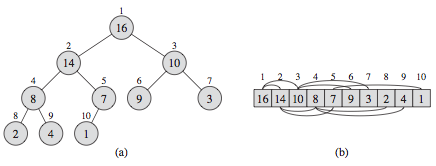

# Heap

## Binary heap properties



* Usually implemented using an array of elements but visualized as a complete
  binary tree (not a full binary tree).
* From the array index, we can compute the parent index from child's index and
  vice versa. The element values are partially ordered, briefly, they are ordered
  level by level. There is no ordering information of element values in the same level.
* The minimum number of elements in a binary heap with height $h$ is $2^h$, the
  maximum elements in it is $2^{h + 1} - 1$
* The height of a binary heap is the floor of $\log n$. $n$ is the total number
  of elements.
* The minimum element of a maximum heap is in the leaf nodes.
* With the array representation for storing an n-element heap, the leaves are
  the nodes indexed by $\lfloor n/2 \rfloor + 1, \lfloor n/2 \rfloor + 2, \dots, n$.

## Heap sort

### Heap implementation using an array

### Heap implementation using HeapNode

## Priority queue operations

### Supported operations

| # |     Operation      | complexity  | comment |
|---|--------------------|-------------|---------|
| 1 | buildMaxHeap(A)  | $O(n)$      | Build a priority queue routine iteratively call `maxHeapify()` $n/2$ times. The complexity is $O(n)$ instead of $O(n \log n)$ |
| 2 | maxHeapify(A, i) | $O(\log n)$ | Maintains the heap properties (by bubble up/down) for subtree rooted at `i`. Assumes the subtrees of `i` are max heap before calling this routine. |
| 3 | insert()         | $O(\log n)$ | Insert a element to the heap. |
| 4 | peekMaximum()    | $O(1)$      | Return the max element without remove it from the max-heap. |
| 5 | popMaximum()     | $O(\log n)$ | Remove the max element from the max-heap. |
| 6 | increaseKey()    | $O(\log n)$ | Update the element's key. This essentially changed the priority of an element. |
| 7 | delete()         | | Not supported by the binary heap implementation, but can be achieved by introduce more complex data structures. |

### C++ STL priority queue

* Notice if the elements in the queue is some complex container or object, you
  have to declare `priority_queue` with its underline container type, and the
  binary predicate `std::greater` if necessary. Here is an example in the solution
  of the problem [Minimum Unique Word Abbreviation](#minimum-unique-word-abbreviation)

    ```C++
    priority_queue<pair<int, string>, vector<pair<int, string>>, greater<pair<int, string>>> pq;
    ```

* This line of code declared a priority queue `pq`, whose element is `piar<int, string>`,
  with the minimum element on the top. But minimum what? How the priority queue sort a
  `pair<int, string>` element? In this case it implicitly sort the `pair<int, string>`
  element base on the first int value. How can we sort the priority queue element based
  on the second value of the `pair<int, string>`. To achieve that, we cannot use the
  building function object greater we have write a customized function object and pass
  to the declaration of the `pq` like this,

    ```C++
    class mycomparison
    {
    public:
        mycomparison() {}
        bool operator() (const pair<int,string> &a,
                         const pair<int,string> &b) const
        {
            return a.second.compare(b.second);
        }
    };
    ...
    priority_queue<pair<int, string>, vector<pair<int, string>>, mycomparison> pq;
    ...
    ```

* We may need to write a customized binary predicate function in order to implement
  the `min-heap` or `max-heap`. The binary predicate function depends on the
  underline container and also the type of the container element.

### Java Priority Queue

=== "Primitive types"

    ```java
    Queue<Integer> pq = new PriorityQueue<>(); // default is min heap
    pq.add(1);
    pq.add(2);
    pq.poll();   // return the min value;
    ```

=== "Use with objects"

    ```java
    public class CustomerOrder implements Comparable<CustomerOrder> {
        private int orderId;
        private double orderAmount;
        private String customerName;

        public CustomerOrder(int orderId, double orderAmount, String customerName) {
            this.orderId = orderId;
            this.orderAmount = orderAmount;
            this.customerName = customerName;
        }

        @Override
        public int compareTo(CustomerOrder o) {
            return o.orderId > this.orderId ? 1 : -1;
        }

        @Override
        public String toString() {
            return "orderId:" + this.orderId + ", orderAmount:" + this.orderAmount + ", customerName:" + customerName;
        }

        public double getOrderAmount() {
            return orderAmount;
        }
    }

    Queue<CustomerOrder> pq = new PriorityQueue<>(new CustomIntegerComparator());

    // to overwrite the compareTo comparator
    static class CustomerOrderComparator implements Comparator<CustomerOrder> {

        @Override
        public int compare(CustomerOrder o1, CustomerOrder o2)
        {
            return o1.getOrderAmount() < o2.getOrderAmount() ? 1 : -1;
        }
    }

    Queue<CustomerOrder> pq = new PriorityQueue<>(new CustomOrderComparator());
    ```

=== "Custom Ordering"

    ```java
    static class CustomIntegerComparator implements Comparator<Integer> {
        @Override
        public int compare(Integer o1, Integer o2) {
            return o1 < o2 ? 1 : -1; // reverse ordering
        }
    }

    Queue<Integer> pq = new PriorityQueue<>(new CustomIntegerComparator());
    ```

=== "Lambda comparator Java 8"

    ```java
    Queue<int []> pq = new PriorityQueue<>(Comparator.comparingInt(a -> a[0]));
    ```

### Python heapq package

Python [`heapq` package](https://docs.python.org/3.8/library/heapq.html) provides
a library of build heap data structure and heap related operations. It supports
the following methods,

1. `heapq.heappush(heap, item)`
2. `heapq.heappop(heap)`
3. `heapq.heappushpop(heap, item)`
4. `heapq.heapify(list)`
5. `heapreplace(heap, item)` equivalent to heappoppush (not exists).
6. `heapq.merge(*iterable, key=None, reverse=False)`
7. `heapq.nlargest(n, iterable, key=None)`
8. `heapq.nsmallest(n, iterable, key=None)`

## Priority Queue

### Merge k Sorted Lists

Solution 1 Priority queue

* Use a min priority queue to store all the list, iteratively pop the "min list",
  take the head node to the final list and push back to the priority queue if the
  "min list" still have node.
* Priority queue solution is $O(N \log k)$

```c++
/**
 * Definition for singly-linked list.
 * struct ListNode {
 *     int val;
 *     ListNode *next;
 *     ListNode(int x) : val(x), next(NULL) {}
 * };
 */
class listComparison {
public:
    listComparison() {}
    bool operator(const ListNode* a, const ListNode* b) const {
        return a->val > b->val;
    }
}

class Solution {
public:
    ListNode* mergeKLists(vector<ListNode*>& lists) {
        priority_queue<ListNode*, vector<ListNode*>, listComparison> q;
        for (auto list : lists) {
            if (list) {
                q.push(list);
            }
        }

        ListNode dummy(INT_MIN);
        ListNode *curr = &dummy;

        while (!q.empty()) {
            curr->next = q.top(); q.pop();
            curr = curr->next;
            if (curr->next) {
                q.push(curr->next);
            }
        }

        return dummy.next;
    }
}
```

Solution 2 Divide and conquer merge

* Use the divide and conquer idea to reduce the problem to a smaller problem and
  then solve the smallest problem, combined together with the solution of small
  problems, we will arrived at the final solution.
* Compare the following solution to merge sort algorithm.
* The complexity is $O(N \log k)$ . Because merge two list will take $O(N)$, and
  we will do $O(\log k)$ time of merging.

```C++
class Solution {
public:
    ListNode* mergeKLists(vector<ListNode*>& lists) {
        return mergeKListsHelper(lists, 0, lists.size() - 1);
    }

    ListNode* mergeKListsHelper(vector<ListNode*>& lists, int s, int e) {
        if (s > e) return nullptr;
        if (s == e) return lists[s];
        if (s < e) {
            int m = s + (e - s) / 2;
            ListNode* l1 = mergeKListsHelper(lists, s, m);
            ListNode* l2 = mergeKListsHelper(lists, m + 1, e);
            return merge(l1, l2);
        }
    }

    ListNode* merge(ListNode* l1, ListNode* l2) {
        ListNode dummy(INT_MIN);
        ListNode *curr = &dummy;

        while (l1 && l2) {
            if (l1->val < l2->val) {
                curr->next = l1;
                l1 = l1->next;
            } else {
                curr->next = l2;
                l2 = l2->next;
            }
            curr = curr->next;
        }

        curr->next = l1 ? l1 : l2;

        return dummy.next;
    }
};
```

### Minimum Unique Word Abbreviation

### Smallest Range Covering Elements from K Lists

Solution 1 Priority queue

* Notice this solution pushed some meta data to the priority queue.

```C++
class Solution {
public:
    struct mycompare {
        bool operator () (pair<int, int>& a, pair<int, int>& b) {
            return a.first > b.first;
        }  
    };

    vector<int> smallestRange(vector<vector<int>>& nums) {
        int n = nums.size();
        priority_queue<pair<int, int>, vector<pair<int, int>>, mycompare> pq;

        int end = INT_MIN;
        for (int i = 0; i < n; i++) {
            end = max(end, nums[i][0]);
            // push the first element of kth vector and k to the pq
            pq.push({nums[i][0], i});
        }

        vector<int> idx(n, 0); // keep tracking the index to the k arrays.

        vector<int> res = {-100000, 100000}; // the range is given.
        while (pq.size() == n) {
            int start = pq.top().first;
            int k = pq.top().second;
            pq.pop();

            if (end - start < res[1] - res[0]) {
                res[0] = start;
                res[1] = end;
            }
            // if nums[k] have more element, we push next to the queue.
            if (++idx[k] < nums[k].size()) {
                pq.push({nums[k][idx[k]], k});
                end = max(end, nums[k][idx[k]]);
            }
        }

        return res;
    }
};
```

### Kth Largest Element in an Array

Solution 1 priority queue

* Build a heap takes `O(n)`.
* max-heap `O(n) + O(klogk)`.

```C++
class Solution {
public:
    int findKthLargest(vector<int>& nums, int k) {
        priority_queue<int> pq(nums.begin(), nums.end());
        k--;
        while (k-- > 0) {
            pq.pop();
        }

        return pq.top();
    }
};
```

Solution 2 priority queue min-heap `O(n*logk)`.

```C++
class Solution {
public:
    int findKthLargest(vector<int>& nums, int k) {
        priority_queue<int, vector<int>, greater<int>> pq;

        for (int n : nums) {
            pq.push(n);
            if (pq.size() > k) {
                pq.pop();
            }
        }

        return pq.top();
    }
};
```

Solution 3 quickselect algorithm

```C++
class Solution {
public:
    int findKthLargest(vector<int>& nums, int k) {
        int n = nums.size();
        if (n < k) return 0;

        return orderStats(nums, 0, n - 1, k);
    }

    int orderStats(vector<int>& nums, int start, int end, int k) {
        if (start == end) return nums[start];

        int p = partition(nums, start, end);
        int order = p - start + 1;
        if (order == k) {
            return nums[p];
        } else if (order > k) {
            return orderStats(nums, start, p - 1, k);
        } else {
            return orderStats(nums, p + 1, end, k - order);
        }
    }

    int partition(vector<int>& nums, int start, int end) {
        if (start == end) return 0;

        int p = start + floor(rand() % (end - start + 1));
        swap(nums[p], nums[end]);

        int pivot = nums[end];
        int i = start - 1, j;

        for (j = start; j < end; ++j) {
            if (nums[j] >= pivot) {
                swap(nums[++i], nums[j]);
            }
        }

        swap(nums[end], nums[i + 1]);
        return i + 1;
    }
};
```

### The Skyline Problem

Solution 1 priority queue maximum heap

```C++
class Solution {
public:
    vector<pair<int, int>> getSkyline(vector<vector<int>>& buildings) {
        vector<pair<int, int>> res;
        int i = 0, x = 0, h = 0, len = buildings.size();
        priority_queue<pair<int, int>> q; // max heap store <height, end>

        while (i < len || !q.empty()) {
            // building i start before the end of current tallest building
            if (q.empty() || i < len && buildings[i][0] <= q.top().second) {
                x = buildings[i][0]; // current start
                // overlapped start of multiple buildings (compare to if)
                while (i < len && buildings[i][0] == x) {
                    q.push({buildings[i][2], buildings[i][1]});
                    i++;
                }
            } else { // building i start after the end of current tallest building
                x = q.top().second; // current end
                // pop all buildings that end <= currently tallest buildings
                while (!q.empty() && q.top().second <= x)
                    q.pop();
            }

            h = q.empty() ? 0 : q.top().first;
            if (res.empty() || res.back().second != h) {
                res.push_back({x, h});
            }
        }

        return res;
    }
};
```

Solution 2 multiset + scanline solution

```C++
class Solution {
private:
    static bool cmp(pair<int,int> p1, pair<int,int> p2){
        if(p1.first != p2.first) return p1.first < p2.first;
        return p1.second > p2.second; // if x duplicate, tallest building first
    }

public:
    vector<pair<int, int>> getSkyline(vector<vector<int>>& buildings) {
        vector<pair<int, int>> h; // store the start and end.
        vector<pair<int, int>> res;
        multiset<int, greater<int>> s;
        int prev = 0, curr = 0;
        // scanline technique to obtain the starting point and end point
        for (auto &a : buildings) {
            h.push_back({a[0], a[2]});
            h.push_back({a[1], -a[2]}); // use "-" mark the end point
        }

        sort(h.begin(), h.end(), cmp);
        s.insert(0); // edge case, consider a.second == 0
        for (auto &a : h) {
            if (a.second > 0) s.insert(a.second); // if it is a start, insert to the set
            else s.erase(s.find(-a.second)); // if it is a end, erase the inserted start
            curr = *s.begin(); // take the maximum from the set
            if (curr != prev) { // remove duplicate
                res.push_back({a.first, curr});
                prev = curr;
            }
        }

        return res;
    }
};
```

#### Sliding Window Median

Solution 1 heap + hash (simulated)

```C++
class Solution {
public:
    vector<double> medianSlidingWindow(vector<int>& nums, int k) {
        int n = nums.size();
        vector<double> res;
        priority_queue<int> lo;
        priority_queue<int, vector<int>, greater<int>> hi;
        unordered_map<int, int> hash_heap;

        int i = 0;
        while (i < k) lo.push(nums[i++]);

        for (int j = 0; j < k / 2; j++) {
            hi.push(lo.top());
            lo.pop();
        }

        while (true) {
            res.push_back(k & 1 ? lo.top() : ((double) lo.top()  + (double) hi.top()) * 0.5);

            if (i >= nums.size()) break;

            int out_num = nums[i - k]; // first element in the window
            int in_num = nums[i++]; // new element entering window
            int balance = 0; // -1, when out_num in lo, +1 when out_num in hi.
            // balance is the count of element diff in lo and hi.
            // lo.size() == hi.size() -> balance = 0
            // lo.size() > hi.size() --> balance > 0
            // lo.size() < hi.size() --> balance < 0
            balance += (out_num <= lo.top() ? -1 : 1);
            hash_heap[out_num]++; // count of the invalid element, will remove when it on the top.

            if (!lo.empty() && in_num <= lo.top()) {
                balance++;
                lo.push(in_num);
            } else {
                balance--;
                hi.push(in_num);
            }

            if (balance < 0) { // lo lack of element.
                lo.push(hi.top());
                hi.pop();
                balance++;
            } else if (balance > 0) { // hi lack of element
                hi.push(lo.top());
                lo.pop();
                balance--;
            }

            // lazy remove of elements previous removed, mimic hashheap of java.
            while (!lo.empty() && hash_heap[lo.top()]) {
                hash_heap[lo.top()]--;
                lo.pop();
            }

            // lazy remove of elements previous removed, mimic hashheap of java.
            while (!hi.empty() && hash_heap[hi.top()]) {
                hash_heap[hi.top()]--;
                hi.pop();
            }
        }

        return res;
    }
};
```

### 373. Find K Pairs with Smallest Sums

* use the following visual add when writing your code. The best solution choose
  the smallest K pairs **layer by layer** from top left to bottom right.
* From the visualization, you can see that this problem is equivalent to the
  problem [Kth Smallest Element in a Sorted Matrix](#kth-smallest-element-in-a-sorted-matrix)

```text
      2   4   6
   +------------
 1 |  3   5   7
 7 |  9  11  13
11 | 13  15  17
```

=== "Python heapq and generator"

    ```python
    def kSmallestPairs(self, nums1, nums2, k):
        streams = map(lambda u: ([u+v, u, v] for v in nums2), nums1)
        stream = heapq.merge(*streams)  # streams is iterables
        return [suv[1:] for suv in itertools.islice(stream, k)]
    ```

=== "Java O(KlogK)"

```
https://leetcode.com/problems/find-k-pairs-with-smallest-sums/discuss/84551/simple-Java-O(KlogK)-solution-with-explanation
```

=== "C++ Priority Queue"

    ```c++
    class cmp {
    public:
        bool operator() (const pair<int, int>& a, const pair<int, int>& b) {
            return a.first + a.second < b.first + b.second;
        }
    };

    class Solution {
    public:
        vector<pair<int, int>> kSmallestPairs(vector<int>& nums1, vector<int>& nums2, int k) {
            vector<pair<int, int>> res;
            priority_queue<pair<int, int>, vector<pair<int, int>>, cmp> pq;

            for (int i = 0; i < min((int)nums1.size(), k); ++i) {
                for (int j = 0; j < min((int)nums2.size(), k); ++j) {
                    pq.push({nums1[i], nums2[j]});
                    if (pq.size() > k) {
                        pq.pop();
                    }
                }
            }

            while (!pq.empty()) {
                res.push_back(pq.top()); pq.pop();
            }
            return res;
        }
    };
    ```

=== "C++ priority queue optimized (scheduler model)"

    ```c++
    class Solution {
    public:
        vector<pair<int, int>> kSmallestPairs(vector<int>& nums1, vector<int>& nums2, int k) {
            // Base cases
            if (nums1.size() == 0 || nums2.size() == 0 || k == 0) {
                return { };
            }  

            // Result pairs
            vector<pair<int, int>>  result;

            // Prioritized scheduling based on sum (consider it as edge weight in graph)
            // Similar to Prim's algorithm

            // Min sum pq storing pair indices of nums1 index and nums2 index
            auto pqCmp = [&nums1, &nums2](const pair<int, int>& p1, const pair<int, int>& p2) {
                return nums1[p1.first] + nums2[p1.second] > nums1[p2.first] + nums2[p2.second];
            };

            priority_queue<pair<int, int>, vector<pair<int, int>>, decltype(pqCmp)> pq(pqCmp);

            // Visited is required to avoid duplicate scheduling
            vector<vector<bool>> visited(nums1.size(), vector<bool>(nums2.size(), false));

            // Push 0, 0 as the seed for scheduling
            pq.push(make_pair(0, 0));

            // Find k smallest sum pairs
            while (k && !pq.empty()) {
                // Current min sum index pair is at pq top
                auto top = pq.top();

                pq.pop();
                result.push_back(make_pair(nums1[top.first], nums2[top.second]));

                // Advance num1 index and schedule
                ++top.first;

                if (top.first < nums1.size() && !visited[top.first][top.second]) {
                    pq.push(top);
                    visited[top.first][top.second] = true;
                }

                --top.first;

                // Advance num2 index and schedule
                ++top.second;

                if (top.second < nums2.size() && !visited[top.first][top.second]) {
                    pq.push(top);
                    visited[top.first][top.second] = true;
                }

                --top.second;
                --k;
            }

            return result;
        }
    };
    ```

## Use priority queue to rearrange tasks (characters, string, etc.)

### Rearrange String k Distance Apart

Solution 1 Greedy + Priority Queue

```C++
class Solution {
public:
  string rearrangeString(string s, int k) {
    if (k <= 0) return s;

    unordered_map<char, int> mp;
    for (auto& c : s)
      mp[c]++;

    priority_queue<pair<int, char>, vector<pair<int, char>>, std::less<pair<int, char>>> pq; // max heap;

    for (auto& p : mp) {
      pq.push({p.second, p.first});
    }

    string res;
    while (!pq.empty()) {
      vector<pair<int, char>> used;
      int i = 0;
      while (i < k && !pq.empty()) {
        auto t = pq.top(); pq.pop();
        res.push_back(t.second);
        i++;

        if (--t.first > 0) {
          used.push_back(t);
        }
      }

      if (i != k && used.size())
        return "";

      for (auto& p : used) {
        pq.push(p);
      }
    }

    return res;
  }
};
```

## Task Scheduler

Solution 1 Greedy + Priority Queue

```C++
class Solution {
public:
  class cmp {
  public:
    cmp () {}
    bool operator()(const pair<int, char>& a, const pair<int, char>& b){
      return a.first < b.first;
    }
  };

  int leastInterval(vector<char>& tasks, int n) {
    int chmap[26] = {0};
    priority_queue<pair<int, char>, vector<pair<int, char>>, cmp> pq;
    for (char c : tasks) {
      chmap[c - 'A']++;
    }

    for (int i = 0; i < 26; ++i) {
      if (chmap[i]) {
        pq.push({chmap[i], i + 'A'});
      }
    }

    int cycle = n + 1;
    int res = 0;
    while (!pq.empty()) {
      vector<pair<int, char>> used;
      for (int i = 0; i < cycle; ++i) { // pick total of n + 1 in freq order
        if (!pq.empty()) {
          used.push_back(pq.top()); pq.pop();
        }
      }

      for (auto p : used) {
        if (--p.first) {
          pq.push(p);  // put back used chars if extra char exist after the useage.
        }
      }

      // handled partial cycle and full cycle
      res += !pq.empty() ? cycle : used.size();
    }

    return res;
  }
};
```

### Reorganize String

Solution 1 Greedy + Priority Queue

```C++
class Solution {
public:
  class cmp {
  public:
    cmp () {}
    bool operator()(const pair<int, char>& a,const pair<int, char>& b){
      return a.first < b.first;
    }
  };

  string reorganizeString(string S) {
    int n = S.length();
    int chmap[26] = {0};

    // max heap
    priority_queue<pair<int, char>, vector<pair<int, char>>, cmp> pq;
    for (auto& c : S) { //store to map
      chmap[c - 'a']++;
    }

    // push to priority queue
    for (int i = 0; i < 26; ++i) {
      if (chmap[i]) {
        pq.push({chmap[i], i + 'a'});
      }
    }

    if (pq.top().first > (n + 1) / 2) return "";

    string res = "";
    while (!pq.empty()) {
      pair<int, char> p = pq.top(); pq.pop();
      if (res.empty() || res.back() != p.second) {
        res.push_back(p.second);
        if (--p.first > 0) { // use one char
          pq.push(p);
        }
      } else { // cannot use duplicate char, take another
        pair<int, char> q = pq.top(); pq.pop();
        res.push_back(q.second);
        if (--q.first > 0) { // use another char
          pq.push(q);
        }
        // remember put p back to the pq  
        pq.push(p);
      }
    }

    return res;
  }
};
```

## Topological sorting

### Course Schedule

Solution 1 DFS

```C++
class Solution {
public:
    bool canFinish(int numCourses, vector<pair<int, int>>& prerequisites) {
        vector<vector<int>> graph(numCourses, vector<int>(0));
        vector<int> visit(numCourses, 0);

        /* construct the graph in adjacency list */
        for (auto a : prerequisites) {
            graph[a.second].push_back(a.first);
        }

        for (int i = 0; i < numCourses; ++i) {
            if (!canFinishDFS(graph, visit, i))
                return false;
        }
        return true;
    }

    bool canFinishDFS(vector<vector<int>>& graph, vector<int>& visit, int i) {
        if (visit[i] == -1) return false; // visiting
        if (visit[i] == 1) return true;

        visit[i] = -1;
        for (auto a : graph[i]) {
            if (!canFinishDFS(graph, visit, a))
                return false;
        }
        visit[i] = 1;
        return true;
    }
};
```

Solution 2 BFS

```C++
class Solution {
public:
    bool canFinish(int numCourses, vector<pair<int, int>>& prerequisites) {
        vector<vector<int>> graph(numCourses, vector<int>(0));
        vector<int> in(numCourses, 0);
        for (auto a : prerequisites) {
            graph[a.second].push_back(a.first);
            ++in[a.first]; /* indegree of nodes */
        }

        queue<int> q;
        /* locate the "start" of the directed acyclic graph */
        for (int i = 0; i < numCourses; ++i) {
            if (in[i] == 0) q.push(i);
        }

        while (!q.empty()) {
            int t = q.front(); q.pop();
            for (auto a : graph[t]) {
                --in[a]; /* visit the edge t->a */
                if (in[a] == 0) q.push(a);
            }
        }

        /* if there are cycle, (with node indegree > 0) */
        for (int i = 0; i < numCourses; ++i) {
            if(in[i] != 0) return false;
        }

        return true;
    }
};
```

### Course Schedule II

Solution 1 DFS

```C++
class Solution {
public:
    vector<int> findOrder(int numCourses, vector<pair<int, int>>& prerequisites) {
        int n = prerequisites.size();
        vector<vector<int>> graph(numCourses, vector<int>(0));
        vector<int> visit(numCourses, 0); /* 0: not visited, 1: visiting, -1: visited */
        vector<int> res;

        for (auto a : prerequisites) {
            graph[a.second].push_back(a.first);
        }

        for (int i = 0; i < numCourses; ++i) {
            if (!visit[i] && !findOrderDFS(graph, visit, i, res)) {
                return {};
            }
        }

        reverse(res.begin(), res.end());

        return res;
    }

    bool findOrderDFS(vector<vector<int>>& graph, vector<int>& visit, int i, vector<int>& res) {
        if (visit[i] == 1) return false; /* visiting */
        if (visit[i] == -1) return true;

        visit[i] = 1;
        for (auto a : graph[i]) {
            if (!findOrderDFS(graph, visit, a, res)) {
                return false;
            }
        }

        visit[i] = -1;
        res.push_back(i);
        return true;
    }
};
```

Solution 2 BFS

```C++
class Solution {
public:
    vector<int> findOrder(int numCourses, vector<pair<int, int>>& prerequisites) {
        vector<vector<int>> graph(numCourses, vector<int>(0));
        vector<int> in(numCourses, 0);
        vector<int> res;
        // identify the sink edge by indegree
        for (auto a : prerequisites) {
            graph[a.second].push_back(a.first);
            ++in[a.first];
        }

        queue<int> q;
        for (int i = 0; i < numCourses; ++i) { //push the "sink" vetex to the queue
            if (in[i] == 0) q.push(i);
        }

        while (!q.empty()) {
            int t = q.front(); q.pop();
            res.push_back(t);
            for (auto a : graph[t]) {
                --in[a];
                if (in[a] == 0) q.push(a); // add a new sink vertex
            }
        }
        // circle detection
        for (int i = 0; i < numCourses; ++i) {
            if (in[i] != 0) return {};
        }

        return res;
    }
};
```

### Alien Dictionary

Solution 1 Topological Sort

```C++
class Solution {
public:
    string alienOrder(vector<string>& words) {
        set<pair<char, char>> g; // adj list graph, second -> first,
        unordered_set<char> set; // all unique characters set
        vector<int> in(256, 0);  // indegree for each chars

        string res = "";

        for (auto a : words) // store all unique char of the dict words
            set.insert(a.begin(), a.end());

        for (int i = 0; i < words.size() - 1; i++) {
            int min_len = min(words[i].size(), words[i + 1].size()), j;
            for (j = 0; j < min_len; j++) {
                if (words[i][j] != words[i + 1][j]) { // build graph from the dictionary
                    g.insert({words[i][j], words[i + 1][j]}); // word[0][0] is the sink vertex
                    break; // take only one
                }
            }
        }

        // calculate indegree of nodes
        for (auto c : g)
            ++in[c.second];

        // push sink node to the queue
        queue<int> q;
        for (char c : set) {
            if (in[c] == 0) {
                q.push(c);
                res += c; // sink vertex added to result
            }
        }

        while (!q.empty()) { // BFS to output the sorted order
            char a = q.front(); q.pop();
            for (auto c : g) {
                if (c.first == a) { // for each incomming edge of sink node a.
                    --in[c.second]; // here we treat the topological order c.second -> c.first
                    if (in[c.second] == 0) {
                        q.push(c.second);
                        res += c.second;
                    }
                }
            }
        }

        return res.size() == set.size() ? res : "";
    }
};
```

### Sequence Reconstruction

Solution 1 Topological Sort

```C++
class Solution {
public:
    bool sequenceReconstruction(vector<int>& org, vector<vector<int>>& seqs) {
        int n = org.size();
        int m = seqs.size();

        vector<vector<int>> graph(n + 1, vector<int>(0));
        vector<int> in(n + 1, 0);
        bool empty = true;
        for (auto seq : seqs) {
            if (seq.empty()) continue;
            if (seq.size() < 2 && (seq[0] < 1 || seq[0] > n)) return false;
            empty = false;
            for (int i = 0; i < seq.size() - 1; ++i) {
                int u = seq[i];
                int v = seq[i + 1];
                if (u < 1 || u > n || v < 1 || v > n) return false;
                graph[u].push_back(v); // build the graph
                in[v]++; // compute the indegree
            }
        }

        if (empty) return false;

        queue<int> q;
        for (int i = 1; i <= n; ++i) {
            if (in[i] == 0) {
                q.push(i);
            }
        }

        int k = 0;
        while (!q.empty()) { // BFS to compute the topological order
            // inorder to get a unique sequence, the q.size() should always be 1,
            // this means that the topological order is unique, consider the first example
            if (q.size() > 1) return false;
            int t = q.front(); q.pop();
            if (t != org[k++]) return false;
            for (auto a : graph[t]) {
                in[a]--;
                if (in[a] == 0) q.push(a);
            }
        }

        return k == n;
    }
};
```
