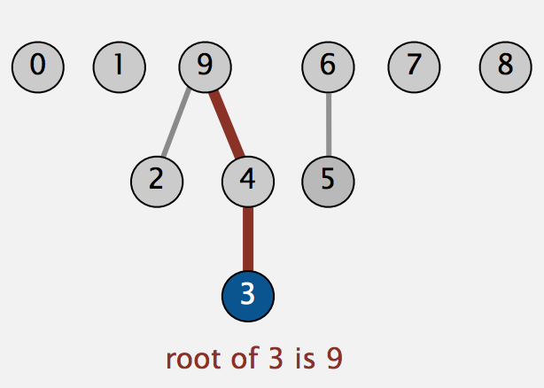

# Union Find

## Introduction

Union Find problem can be used to model the dynamic connectivity problem.
Briefly, given a set of $N$ objects, implement a `union` command to connect two
objects, and a `find` (or `connected`) command to query whether exist a path
connecting the two objects.

To model the connections, we assume the “is connected to” is reflective,
symmetric, and transitive. Moreover, we define the **connected
components** as a maximal set of objects that are mutually connected. We
now implement the following operations.

1. Find query, Check if two objects are in the same components.
2. Union command. Replace components containing two objects with their union.

## Quick find

### Data structure

- integer array `id[N]`
- interpretation: `p` and `q` are connected iff they have the same id.

    ```text
    i = 0  1  2  3  4  5  6  7  8  9
    id=[0, 1, 1, 8, 8, 0, 0, 1, 8, 8]
    ```

- Find. Check if `p` and `q` have the same id.
- Union. Change the id of nodes have same id as `p` to the id of `q`.

### Implementation

```java
public class QuickFindUF
{
    private int[] id;

    public QuickFindUF(int N)
    {
        id = new int[N];
        for (int i = 0; i < N; i++)
            id[i] = i;
    }

    public boolean connected(int p, int q)
    {   return id[p] == id[q];  }

    public void union(int p, int q)
    {
        int pid = id[p];
        int qid = id[q];
        for (int i = 0; i < id.length; i++)
            if (id[i] == pid) id[i] = qid;
    }
}
```

### Complexity

| Algorithm  | Initialization | Find | Union |
| ---------- | -------------- | ---- | ----- |
| Quick Find |    $N$         | 1    |  $N$  |

### Quick find defect

- Union is too expensive ( \(O(N)\))
- Trees are flat, but too expensive to keep them flat.

## Quick union

### Data structure



- Integer array `id[N]`
- Interpretation: `id[i]` is parent of `i`.
- Root of i is `id[id[id[...id[i]...]]]`. (the root’s parent is itself).

    ```text
    i = 0  1  2  3  4  5  6  7  8  9
    id=[0, 1, 9, 4, 9, 6, 6, 7, 8, 9]
    ```

- Find. Check if `p` and `q` have the same root.
- Union. set the id of `p`’s root to the id of `q`’s root.

### Implementation

```java
public class QucikUnionUF
{
    private int[] id;

    public QuickUnionUF(int N)
    {
        id = new int[N];
        for (int i = 0; i < N; i++) id[i] = i;
    }
    private int root(int i)
    {
        while (i != id[i]) i = id[i];
        return i;
    }

    public boolean connected(int p, int q)
    {
        return root(p) == root(q);
    }

    public void union(int p, int q)
    {
        int i = root(p);
        int j = root(q);
        id[i] = j;
    }
}
```

### Complexity

| Algorithm   | Initialization | Find  | Union |
| ----------- | -------------- | ----- | ----- |
| Quick Union |  $N$           |  $N$  |  $N$  |

### Quick union defect

- Trees can get tall
- Find is too expensive \(O(N)\)

## Improvement by weighting

### Principles

- Modify quick-union to avoid tall trees.
- Keep track of the size of each tree.
- Balance by linking root of the smaller tree to root of the large tree.

### Data structure

Same as the quick union, but maintain extra array `sz[i]` to count the
number of objects in the tree rooted at i.

- Find. Identical to the Quick Union
- Union. Link root of the smaller tree to root of the larger tree.

### Implementation

```Java
/* weighted quick union */
public void union(int p, int q)
{
    int i = root(p);
    int j = root(q);
    if (i == j) return;
    if (sz[i] < sz[j])
    {
        id[i] = j;
        sz[j] += sz[i];
    } else {
        id[j] = i;
        sz[i] += sz[j];
    }
}
```

### Weighted quick-union complexity

- Find. takes time proportional to the depth of `p` and `q`.
- Union. Take constant time, given root.

|      Algorithm       | Initialization |   Find    |   Union   |
| :------------------: | :------------: | :-------: | :-------: |
|      Quick Find      |     \(N\)      |     1     |   \(N\)   |
|     Quick Union      |     \(N\)      |   \(N\)   |   \(N\)   |
| Weighted Quick Union |     \(N\)      | \(lg(N)\) | \(lg(N)\) |

#### Analysis

> Proposition. Depth of any node \(x\) is at most \(lg(N)\)  
> Proof. When does depth of \(x\) increse?
>
>   - The depth of \(x\) in tree \(T_1\) will increase 1 when it merged
>     with a larger tree.
>   - How many merges it could possibly happen? Because each merge will
>     double the size of the tree containing \(x\) , it can double the
>     tree at most \(lg(N)\) times. We can prove that it can merge at
>     most \(lg(N)\) times.

## Quick union with path compression

### Principles

After computing the root of the `p`, set the id of each examined node to
point to that root.

### Implementation

```java
/* one-pass solution */
private int root(in i)
{
    while (i != id[i])
    {
        id[i] = id[id[i]]; /* object i's grad parent becomes its parent. */
        i = id[i];
    }
}
```

## Weighted quick-union with path compression

### Amortized analysis

> Proposition. Starting from an empty data structure, any sequence of
> \(M\) union-find ops on \(N\) objects makes \(\leq c(N + Mlg^*N)\)
> array access.

- Analysis can be implemented to \(N + M \alpha(M, N)\).
- The proof is too complex to be discussed here.

Here is a notation of \(lg^*\), which is the iterate log function. it
growing very slow.

In theory, the **Weighted Quick Union Path Compression** algorithm cost
within a constant factor of reading in the data. But not truly linear.
In practice, WQUPC is linear.

### Summary

\(M\) union-find operations on a set of \(N\) objects

|                 Algorithm                  | worst-case time |
| :----------------------------------------: | :-------------: |
|                 quick find                 |     \(MN\)      |
|                quick union                 |     \(MN\)      |
|            weighted quick union            |   \(N+MlgN\)    |
|     quick union with path compression      |   \(N+MlgN\)    |
| weighted quick union with path compression |  \(N+Mlg^*N\)   |

## Problems

### Number of Islands

### Longest Consecutive Sequence

### Surrounded Regions

### Number of Islands II

### Graph Valid Tree

### Number of Connected Components in an Undirected Graph

### Friend Circles

### 765. Couples Holding Hands

Solution 1 Union Find

Briefly, We can view each double seat couch as a node. Each couple in the same
couch is a graph node. For those couple not seat in the same couch, we connect
the two different couch together. We are looking for valid swaps that remove the
inter-counch edge and create a new component in the graph. the conclusion is
that we cannot remove two edges by a single swap. This should proof the greedy will work.

== "C++ Union Find"

```c++

```

Solution 2 Greedy

Notice there is a tick to use here which is `XOR` a number `x` with 1 will get you
to either `x + 1` or `x - 1`.

    x^1 = x + 1, if x is even
    x^1 = x - 1, if x is odd

== "C++ Greedy"

```c++
class Solution {
public:
  int minSwapsCouples(vector<int>& row) {
      int res = 0;
      for (int i = 0; i < row.size(); i += 2) {
          int x = row[i];
          if ((x ^ 1) == row[i + 1]) continue;
          res++;
          for (int j = i + 1; j < row.size(); ++j) {
              if (row[j] == (x ^ 1)) {
                  row[j] = row[i + 1];
                  row[i + 1] = (x ^ 1);
                  break;
              }
          }
      }

      return res;
  }
};
```
