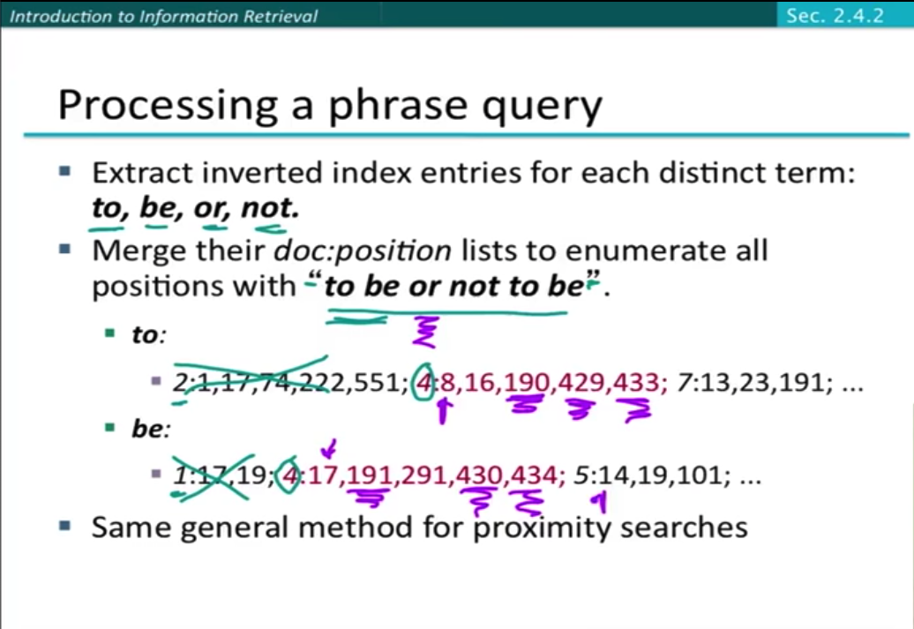
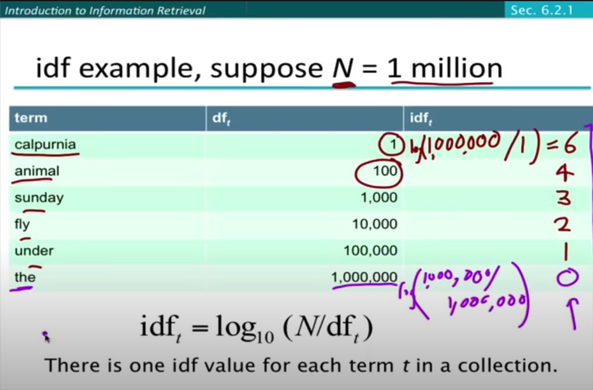
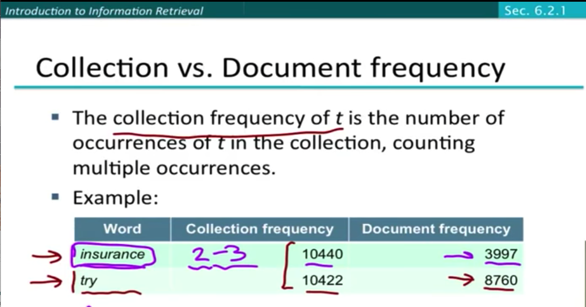

# TF-IDF and Scoring for Information Retrieval

* [Youtube Lecture by Dr. Manning](https://www.youtube.com/watch?v=e81nC0LO0A8&list=PLaZQkZp6WhWwoDuD6pQCmgVyDbUWl_ZUi&index=2)
* [Book chapter](06vect.pdf)
* [tfidf slides](lecture6-tfidf.ppt)

## term document incidence matrices

not practical because of the sparsity.

## The inverted index

token to document list mapping

* word -> [doc1, doc2, ...]
* UA -> [2020-04-01 13:03:23, 2020-04-01 13:03:23]

## Query processing

If we want to query which document have the phrash "information retrival", we'd
like to take the invert index postings list for "information" and "retrival",
then find the document that have both word. (by run a merge algorithm on the two
postings list)

## Boolean query

Mainly leverage the boolean operation on the list merging algorithm.

## Phrase queries

no longer suffice to store `<term, doc>` entries.

* First attempt, biword indexes. treat the two words phrase as a single phrase.
* For longer phrase queries, we can broken into the boolean query on biword.
    * false positive, two words not adjacent
    * index blowup due to big dictionary
* positional indexes, store the positions of each token occurs at a document.
    * use a merge algorithm to recursively at the document level.

  

## Ranked retriveval

* "How can we rank-order the documents in the collection with respect to a query?"
* assign a score to each document - say in `[0, 1]` - to each document.
* This score measures how well document and query match.
* We need a way to assigning a score to a query/document pair.
* The more frequent a term appears in a document, the higher the score for the
  document.

## Scoring with the Jaccard Coefficient

* doesn't consider term frequency.
* wee need a better way of normalizing for length. (compare with cosine similarity)

## Term frequency weighting

* binary vector $\in {0, 1}$
* count vector
* bag of words model

!!! tip 
    We want to use TF when computing query-document match scores, but the
    relevance does not increase proportionally with term frequency

### Log-frequency weighting

$$
w_{t, d} =
\begin{cases}
  1 + \log_{10} (tf_{t,d}), & tf_{t,d} \ge 0 \\
  0,  &  \textrm{otherwise}
\end{cases}
$$

Score for a document-query pair: sum over terms in both $q$ and $d$:

$$
\textrm{score} = \sum_{t\in q \cap d} (1 + \log_{10} (tf_{t, d}))
$$

The score is $0$ if none of the terms is presented in the document.

## (Inverted) Document frequency weighting

* idea: Rare terms are more informative than frequent terms.
* $df_t$ is an inverse measure of informativeness of term $t$.
* There is one idf value for each term $t$ in a collection.

$$
idf_t = \log_{10}(N/df_t)
$$

!!! question
    Does idf have an effect on ranking for one-term queries, like "iPhone"? The
    answer is no, but why?

## collection frequency vs document frequency

## TF-IDF weighting

$$
\textrm{score}(q, d) = \sum_{t\in q \cap d} tf_{t, d} \times idf_{t}
$$

* binary vector -> count vector -> weight matrix

## Vector Space Model

* Euclidean distance, not a good option. because different vector length can have
  large distance

## application for https request embedding

If we can build a dataset, given a "query", it can efficiently retrive how many
relevant "document" are in the past 2 hours? We will be able to tell wether the
"query" is mallicious or not.

in anti-abuse, we can use the current request as the query, all the reprevious
request data that are indexed as the "documents". This will give us a score
about the current request. This score can tell us the malliciousness of the
request.

## problem

* Current distribution score cannot identify scraping that routates headers.
    * How to up weight bad requests with certain patterns?
* Currently, no good way to block signals with low false positives.
    * How to use score instead of text pattern matching to reduce false positives?

## Solution

### calculate tf-idf for individual header fields

This solution models a collection of requests during a window as a document.

* term frequency = count of each UA, HC, CC, and RF in a time window
* document frequency = count of how many windows each UA, HC, CC, and RF occurs

The window can be a time window or a fixed size window. In the fixed size window,
instead of dividing by equal time slots, we divide by the fixed number of
requests and treat each collection as a document. This model can also be used
for the tokenized solution.

### tokenize all request facets

This solution is to break down the header fields into tokens and use a set of
tokens as the query. Compare this to a phrase retrival task.

term frequency = count of each token

!!! question
    Can we use the cosine similarity to compare two queries? Because the
    similarity measure described in the lectures is for query-document pair.
    Can we compare query-query pair? Whether the TF-IDF embedding can capture
    enough similarity info and used for clustering?

## Intuitions

Using TF-IDF, we can measure the speed of damage from requests possess similar
attributes (belongs to certain attacks). Specifically, given a request in realtime,
it can check the current TF, and DF, and calculate the TF-IDF. All these three
values are useful for us.

* TF - If TF is greater than a threshold setting.
  We can it is may be a high qps scraping. If TF is moderate or very small, we
  can check DF.
* DF - If DF is very large, the "term" maybe common to all sample in the space.
  If DF streak is not long enough in a series of previous documents. there might
  be a spike of increase for the term in some window before. If DF is very small,
  and the TF is large, we detected a spike.

| # |   TF  |   DF  |  result  |   |
|---|-------|-------|----------|---|
| 1 | large | small |   bad    | v |
| 2 | large | large | bad/good | x |
| 3 | small | large | bad/good | x |
| 4 | small | small |   good   | x |

TF and IDF used separately can help to observe bad signals, but they are not
enough. We will need to use TF-IDF to help us to enhance our believe about the
badness of a request.

TF-IDF

## Practical consideration

* How to calculation TF-IDF in sliding windows?

title: HTTP requests embedding to score and search bot traffic.