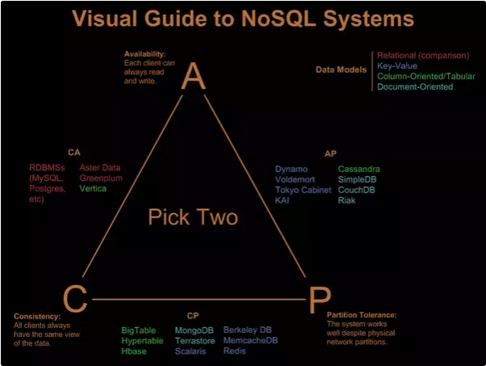

# Distributed System Concepts

## Database normalization

## Database sharding

## ACID and BASE

* ACID：Atomicity, Consistency, Isolation, Durability;
* BASE：Basically Available, Soft-state, Eventually Consistent

Databases are roughly divided into two types: ACID and BASE. Each type comes
with a different set of features, pros, and cons.

ACID databases are strict. Think of them as meticulous, no-nonsense librarians,
constantly making sure that all the books stay organized.

BASE databases are relaxed. Think of them as hands-off substitute teachers—keeping
things running but not maintaining strict classroom rules.

When the ACID and BASE acronyms are expanded out, they describe the technical
features each type of database provides.

ACID databases provide:

* Atomicity: database updates either happen completely, or they don't happen at
  all. (Books are either checked in to the library or checked out; they can't be
  in a weird in-between state.)
* Consistency: rules in the database are always enforced. (All the books are
  shelved correctly and in order.)
* Isolation: concurrent updates happen as if they ran one after the other.
  (Everybody is quiet in the library; no other patrons are distracting you.)
* Durability: once an update finishes, it stays in the database, even if
  something fails later on. (The library's records stick around even if the power goes out.)

BASE databases have fewer guarantees:

* Basically Available: the database usually works. (Class goes on as scheduled.)
* Soft State: different database replicas might not be in sync with each other.
  (Students can be working on different things at the same time.)
* Eventually Consistent: updates eventually make it to all replicas. (Someday
  students will figure out the lesson plan that should have been covered.)

ACID databases provide more features, so they're better, right?

Not necessarily.

All those features don't come for free. ACID databases are difficult to scale—if
your database is huge, it's expensive to ensure everything stays consistent.
It's especially tricky if your database spans multiple machines or data centers,
since all your machines will need to be kept in sync.

So, which type of database should you use? ACID or BASE?

It depends on what you need for the system you're building.

Does your system need consistency and data reliability? If so, go with an ACID
database. Does your system need to be distributed and highly available? Then a
BASE database may be a better choice.

## CAP Principle

* Consistency
* Availability
* Partition Tolerance

## Consistency model

* [分布式系统的事务处理](https://coolshell.cn/articles/10910.html)

* Master-Slave
* Master-Master
* 2/3 Phase Commit

### Eventually Consistent

## Consistent hashing

## Geo Hashing

* [Geospatial Performance Improvements in MongoDB 3.2](https://www.mongodb.com/blog/post/geospatial-performance-improvements-in-mongodb-3-2)

## Bloom filter

## Cuckoo filter

## Collaborate filtering

## Cassandra

## Dynamo

* [Dynamo: Amazon’s Highly Available Key-value Store]

## Memcached

## Redis

[Cassandra vs MongoDB vs CouchDB vs Redis vs Riak vs HBase vs Couchbase vs OrientDB vs Aerospike vs Neo4j vs Hypertable vs ElasticSearch vs Accumulo vs VoltDB vs Scalaris vs RethinkDB comparison](https://kkovacs.eu/cassandra-vs-mongodb-vs-couchdb-vs-redis)

## Kafka

* [The Log: What every software engineer should know about real-time data's unifying abstraction](https://engineering.linkedin.com/distributed-systems/log-what-every-software-engineer-should-know-about-real-time-datas-unifying)
* [Kafka Tutorial From Confluent](https://kafka-tutorials.confluent.io/)

## CouchDB

## Neo4j

## [k-d Tree](https://en.wikipedia.org/wiki/K-d_tree)

## Beam search

## A* search

## Minmax Algorithm

## Distributed System Design Process

0. scalability (vertical sharding, horizontal sharding)
1. fault tolerance (replication, auto failover)
2. consistency (choose consistency models, ACID v.s BASE)
3. performance (distributed cache system)
