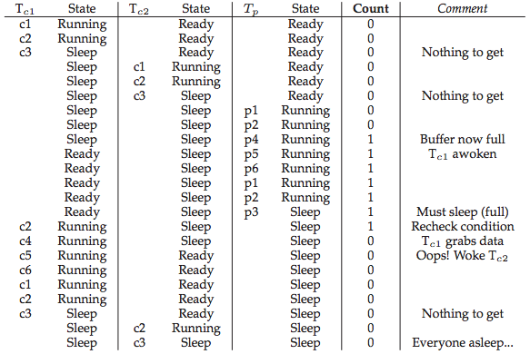

# Concurrency and Synchronization

## Thread and concurrency

### Thread memory model

1. Multiple threads run within the context of a process.
2. Each thread has its own separate thread context
    - Thread ID, stack, stack pointer, PC, condition codes, and GP registers
3. All threads share the remaining process context
    - Code, data, heap, and shared library segments in the process virtual address space
    - File descriptors and opened handles

However, the above conceptual model is not strictly enforced in practice.
Operationally, the registers are truly separated and protected, but any thread
can read and write the stack of any other thread!

### Variable mapping in memory

#### Global variables

- Definition: Variable declared outside of a function
- Virtual memory contains exactly one instance of any global variable.

#### Local variables

- Definition: Variable declared inside a function without **static** keyword.
- Each thread stack contains one instant of each local variable.

#### Local static variables

- Definition: Variable declared inside a function with **static** keyword.
- Virtual memory contains exactly one instance of any local static variable.

While different threads try to access the same shared variable (data structure)
at the same time, they face a synchronous problem. The operations involved have
to pertain a certain order so as the variable value will be correct. We need to
design a mechanism to prevent this type of synchronous problem from happening.
We do so by ensuring **mutual exclusive** of the two events, namely, event A and
event B must not happen at the same time.

## Synchronization basic concepts

- A **critical section** is a piece of code that accesses a shared resource,
  usually a variable or data structure.
- A **race condition** arises if multiple threads of execution enter the critical
  section at roughly the same time; both attempt to update the shared data structure,
  leading to a surprising (and perhaps undesirable) outcome.
- **Mutual exclusive** is the requirement one want to fulfill if multiple threads
  want to access/update/modify the same variable. This property guarantees that
  if one thread is executing within the critical section, the others will be
  prevented from doing so.

## Lock

### pthread example

A lock is just like a variable, To use a lock, you first declare a lock variable,
the variable hold the state of the lock across all instance of time. Its state
is either in available (unlocked or free) or in acquired (locked or held). To use
a lock, we add some code around the critical section like the following code.

```c++
pthread_mutex_t lock = PTHREAD_MUTEX_INITIALIZER;
pthread_mutex_lock(&lock);
balance = balance + 1; // critical section
pthread_mutex_unlock(&lock);
```

### Implement a lock

Many programming interfaces provide locking mechanisms through interfaces that
are easy to use, but:

- How can we build an efficient lock?
- What hardware support is needs?
- What OS support is needed?

Before building locks, let's summarize the properties a lock might have so that
we can evaluate the lock we build.

1. **mutual exclusive**. Basic task, make sure event A and event B cannot happen at
  the same time.
2. **fairness**. Each thread competing for the lock should get a fair chance to
  acquire the lock once the lock has been released.
3. **performance**. How much overhead is added by using the lock? There are three
  cases we have to consider:
    - single thread using the lock.
    - multiple threads contending for the lock and run on a single CPU.
    - multiple threads contending for the lock and run on multiple CPUs.

#### Controlling Interrupts

- pros
    1. simplicity
- cons
    1. performing operations on interrupts are privileged. OS need to fully trust
       the applications. Otherwise, abuses of the system facility may happen, such
       as monopolize the CPU or faulty applications go into an endless loop.
    2. doesn't work on multiprocessors.
    3. Turning off interrupts for extended periods of time can lead to interrupts
       becoming lost. e.g. missing a disk I/O interrupt may cause a process waiting
       for the completion of the file write never wakeup.
    4. Inefficient due to slow execution of the code that interrupts have been
       masked and unmasked.

#### Test-and-set (automic exchange)

One idea that could be potentially useful in implementing a lock is using a flag
as a lock. Thread who acquires the lock will set the flag to `1` while entering
the critical section and reset to `0` when finished the critical section. This
idea will **NOT** work since if two threads attempt to acquire the lock at the
same time, the operations may interleave thus result in acquiring the lock at the
same time.

The problem with the above simple idea is that the operations to test the flag
and set it to 1 aren't atomic. Nowadays, most hardware architecture has instructions
that support lock. In x86 platform, the atomic exchange instruction `xchg` enables
us to implement a "spin-lock" using the above "flag" idea. Such hardware support
instructions are generally referred to as "Test-and-set" operation. Below includes
the C snippet of a "Test-and-set" operation. It is an atomic operation. Imagine
it as an equivalent to the single instruction `xchg`. What it does is return the
old value and set the old value to the new value in one operation.

=== "implement the spin lock using Test-and-set"

    ```c
    int TestAndSet(int *old_ptr, int new_val) {
        int old = *old_ptr; //fetch old value at old_ptr
        *old_ptr = new_val; //store new_val into old_ptr
        return old;         //return the old value
    }

    typedef struct __lock_t {
        int flag;
    } lock_t;

    void init(lock_t *lock) {
        // 0 indicate free, 1 indicate acquired
        lock->flag = 0;
    }

    void lock(lock_t *lock) {
        while (TestAndSet(&lock->flag, 1) == 1)
            ; //spin wait
    }

    void unlock(lock_t *lock) {
        lock->flag = 0;
    }
    ```

!!! Note "Evaluation of the spin lock using Test-and-set"
    1. Correctness: provide mutual exclusive
    2. Fairness: not fair.
    3. Performance: spinning waste CPU cycles.

#### Compare-and-swap

Compare-and-swap is another hardware primitive that some system provided.
Compare-and-swap on SPARC systems and compare-and-exchange on x86. Here is the C
snippet of the operations. It is atomically accomplished in machine level instruction.

=== "Implement spin lock with Compare-and-swap"

    ```c
    int CompareAndSwap(int *old_ptr, int expected, int new_val) {
        int old = *old_ptr;
        if (*old_ptr == expected) {
            *old_ptr = new_val;
        }
        return old;
    }

    void lock(lock_t *lock) {
        while (CompareAndSwap(&lock->flag, 0, 1) == 1)
            ; //spin wait
    }
    ```

!Note ""
    Although we saw that Test-and-set and compare-and-swap atomic instructions
    are very similar in implementing spinlocks, the later is more powerful
    instruction. We will see some of the good properties of the compare-and-swap
    instruction in [lock-free synchronization]().

#### Load-linked and store-conditional

TBD

#### Fetch-and-add

TBD

#### How to avoid spinning

Hardware support gets enable us to implement locks with correctness, namely mutual
exclusive. We could also rely on hardware support to provide fairness as we saw
in the fetch-and-add primitives in implementing ticket lock. But hardware alone
will not provide us an efficient lock implementation. We need OS support to make
the lock we discussed have good performance.

Our first try is to yield when a thread tries to acquire a lock that already held
by others. Instead of spinning, it immediately yields the CPU to allow other threads
to finish the critical section. If we have only two processes contending for the
lock, this approach works pretty well. But if we have many threads lets say 100
contending for the lock, this approach will be problematic again. There might be
99 threads yielding and doing context switches, the work of which can be
substantially wasteful.

Another solution to reduce the spinning is using queues. Put the thread into
sleeping in a queue instead of spinning. When the lock is about to be released,
the thread wakes up one of the sleeping threads in the sleeping queue attempted
to acquire the lock. What we do here is to exert some control over which thread
next gets to acquire the lock after the current holder release it. This solved
the problem in the previous approaches. Using a queue to track the thread who
want to acquire the lock and the thread who finished the critical section will
select from the queue the next thread to run. Previously we leave too much to
opportunity. It is the scheduler who determines which thread to run next. No
matter which thread to select, it leaves too much CPU time spinning or yielding.

Solaris example, use `park()`, `unpark`, and `setpark()`

## Conditional variables

### Backgroud

In the case that a thread wants to check whether a condition is true before
continuing its execution, such as a parent thread may check whether its child
has completed before continue its own execution. (i.e. `join()`) But how to
implement such a `wait()`? Generally, a **shared variable** will work but not
efficient enough because the parent have to spin.

A not efficient implementation of wait(). Parent wait for child, spin based approach.

```c++
volatile int done = 0;

void *child(void *arg) {
    printf("child\n");
    done = 1;
    return NULL;
}

int main(int argc, char *argv[]) {
    printf("parent: begin\n");
    pthread_t c;
    pthread_create(&c, NULL, child, NULL);
    while (done == 0)
        ; //spin wait
    printf("parent: end\n");
    return 0;
}
```

### Definition

A **conditional variable** is an explicit queue that threads can put themselves
in and sleep (wait for being notified to change to ready) when a condition has
not been met; some other thread later changes the condition and then wake one of
those sleeping threads from the queue to notify them to continue.

### C++ pthread routine

1. `pthread_cond_wait(pthread_cond_t *c, pthread_mutex_t *m);`
    - mutex m should be acquired before calling wait()
    - nutex m should be released when enter the wait()
    - nutex m should be re-acquired upon return to caller.
2. `pthread_cond_signal(pthread_cond_t *c);`

### basic ideas

- The general idea is when a thread wants to access the critical section, it
  first checks a conditional variable (like a flag) to decide whether it should
  wait on the condition (using pthread_cond_wait();) or keep running (fall off
  toward the function end).
- Another thread will set the conditional variable and wake up (using pthread_cond_signal();)
  the sleeping thread from the queue.

### Example of using a conditional variable

```c++
// Parent waiting for child: using a conditional variable
int done = 0
pthread_mutex_t m = PTHREAD_MUTEX_INITIALIZER;
pthread_cond_t c = PTHREAD_COND_INITIALIZER;

void thr_exit() {
    pthread_mutex_lock(&m);
    done = 1;
    pthread_cond_signal(&c);
    pthread_mutex_unlock(&m);
}

void thr_join() {
    pthread_mutex_lock(&m);
    while (done == 0)
        pthread_cond_wait(&c, &m);    
    pthread_mutex_unlock(&m);
}

void *child(void *arg) {
    printf("child\n");
    thr_exit();
    return NULL;
}

int main(int argc, char *argv[]) {
    printf("parent: begin\n");
    pthread_t p;
    pthread_create(&p, NULL, child, NULL);
    thr_join();
    printf("parent: end\n");
    return 0;
}
```

!!! Note "Analysis of the code snippet"
    - We interested in three variables in this program:
        1. `int done`
        2. `pthread_mutex_t m`
        3. `pthread_cond_t c`
    - One may wondering whether the done and `m` state variables are a must. Let's
    see what if we don't have the done state variable. In this case, if the child
    run before the parent, the child will signal and there is no thread in the
    queue, child returns and then the parent start running, parent will wait if
    at this time the child is finished, no one will signal it. The parent just stuck!
    - Let's see if we remove the lock m. It will introduce a race condition.
    Considering if the child interrupts the parent at the time right before the
    parent call `pthread_cond_wait()`, the child set the conditional variable and
    signal, there is no thread in the waiting queue, so child return. Then the
    parent goes to sleep, and not be able to wait up.

## Producers-consumers problem

In this problem, we have to carefully synchronize the two (or more) threads in
order for them to work correctly. Here are the `put()` to populate the buffer,
and `get()` to read the buffer.

### Our first solution

Producers and consumers synchronization example,

```c++
int buffer;
int count = 0;

void put(int value) {
    assert(count == 0);
    count = 1;
    buffer = value;
}

int get() {
    assert(count == 1);
    count = 0;
    return buffer;
}

pthread_cond_t cond;
pthread_mutex_t mutex;

void *producer(void *arg) {
    int i;
    int loops = (int) arg;
    for (i = 0; i < loops; i++) {
        pthread_mutex_lock(&mutex);            // p1
        if (count == 1) // or use while        // p2
            pthread_cond_wait(&cond, &mutex);  // p3
        put(i);                                // p4
        pthread_cond_signal(&cond);            // p5
        pthread_mutex_unlock(&mutex);          // p6
    }
}

void *consumer(void *arg) {
    int i;
    int loops = (int) arg;
    for (i = 0; i < loops; i++) {
        pthread_mutex_lock(&mutex);            // c1
        if (count == 0)  // or use while       // c2
            pthread_cond_wait(&cond, &mutex);  // c3
        int tmp = get();                       // c4
        pthread_cond_signal(&cond);            // c5
        pthread_mutex_unlock(&mutex);          // c6
        printf("%d\n", tmp);
    }
}
```

Problem with this solution,

1. It works ok if we have only one consumer and one producer.
2. Problems could arise when we have more than one consumer.
3. If we have more than one consumer, one of them might sneak in to consume the
   buffer before the other consumer return from `pthread_cond_wait()`.




### Mesa semantics and Hoare semantics

The problem with the `if` statement is that signaling a thread only wakes them
up; it is thus a hint that the state of the world has changed but there is no
guarantee that when the woken thread runs. This interpretation of what a signal
means is often referred to as **Mesa semantics**; in contrast, referred to as
**Hoare semantics**, is harder to build but provides a stronger guarantee that
the woken thread will run immediately upon being woken.

### Single buffer producer/consumer solution

We saw from the above discussion that even change the if statement to while, we
are still facing some problem that all producer thread and consumer thread will
sleep. This is because one consumer signaled another consumer and the producer
never be able to run again. To solve this problem we'd better to add another
conditional variable, one for the producer and another for the consumer so that
the producer can only signal the consumer and the consumer can only signal the
producer. This sounds most plausible and the problem will never occur.

Finally here is our workable solution with two conditional variables.

```c++
pthread_cond_t empty, fill;
pthread_mutex_t mutex;

void *producer(void *arg) {
    int i;
    int loops = (int) arg;
    for (i = 0; i < loops; i++) {
        pthread_mutex_lock(&mutex);
        while (count == 1)
            pthread_cond_wait(&empty, &mutex);
        put(i);
        pthread_cond_signal(&fill);
        pthread_mutex_unlock(&mutex);
    }
}

void *consumer(void *arg) {
    int i;
    int loops = (int) arg;
    for (i = 0; i < loops; i++) {
        pthread_mutex_lock(&mutex);
        while (count == 0)
            pthread_cond_wait(&fill, &mutex);
        int tmp = get();
        pthread_cond_signal(&empty);
        pthread_mutex_unlock(&mutex);
        printf("%d\n", tmp);
    }
}
```

### Producer consumer solution

Now let's change the one element buffer to a more general solution, which has
more buffers slots to work on for the consumers and the producers. This solution
even support concurrent producing and consuming for multiple threads.

```c++
int buffer[MAX];
int fill_ptr = 0;
int use_ptr = 0;
int count = 0;

void put(int value) {
    buffer[fill_ptr] = value;
    fill_ptr = (fill_ptr + 2) % MAX;
    count++;
}

int get() {
    int tmp = buffer[use_ptr];
    use_ptr = (use_ptr + 1) % MAX;
    count--;
    return tmp;
}

pthread_cond_t empty, fill;
pthread_mutex_t mutex;

void *producer(void *arg) {
    int i;
    int loops = (int) arg;
    for (i = 0; i < loops; i++) {
        pthread_mutex_lock(&mutex);
        while (count == MAX)
            pthread_cond_wait(&empty, &mutex);
        put(i);
        pthread_cond_signal(&fill);
        pthread_mutex_unlock(&mutex);
    }
}

void *consumer(void *arg) {
    int i;
    int loops = (int) arg;
    for (i = 0; i < loops; i++) {
        pthread_mutex_lock(&mutex);
        while (count == 0)
            pthread_cond_wait(&fill, &mutex);
        int tmp = get();
        pthread_cond_signal(&empty);
        pthread_mutex_unlock(&mutex);
        printf("%d\n", tmp);
    }
}
```

### Covering Conditions

TBD

## Semaphore

1. What is the definition of a semaphore?
2. How can we use semaphores instead of locks and condition variables?
3. What is a binary semaphore?
4. Is it straightforward to build a semaphore out of locks and condition variables?
   to build locks and condition variables out of semaphores?

### Definition

A semaphore is an object with an integer value that we can manipulate with two
routines; in the POSIX standard, these routines are `sem_wait()` and `sem_post()`.

```c++
int sem_wait(sem_t *s) {
    decrement the value of semaphore s by one
    wait if value of semaphore s is negative
}

int sem_post(sem_t *s) {
    increment the value of semaphore s by one
    if there are one or more threads waiting, wake one
}
```

### Semaphore as a lock

```c++
sem_t m;
sem_init(&m, 0, X); // initialize semaphore to X; what should X be?
sem_wait(&m);
// critical section here
sem_post(&m);
```

### Semaphores as conditional variables

* Parent waiting for its child
* Producers and consumers

TBD

## Deadlock

TBD

## Monitor

TBD

## Dining philosophers problem

TBD

## Applications

A timer is a child thread that wakes up periodically to check whether an expiration
happened or not. The maximum number of timers is limited by the OS because many
systems support a small number of concurrent threads. To implement arbitrary many
timers using software, we can use a timer queue to reach the goal. Don't expect
too much accuracy for this timer implementation, it is not. However, this approach
is acceptable in most of the projects. A good reference is here[1]. source code.

## Reference

- [Operating Systems: Three Easy Pieces](http://pages.cs.wisc.edu/~remzi/OSTEP/threads-locks.pdf)
- [timer queue – a way to handle multiple timers using one thread](https://davejingtian.org/2013/09/28/timer-queue-a-way-to-handle-multiple-timers-using-one-thread/)
