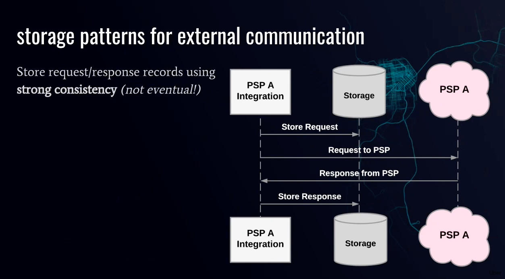
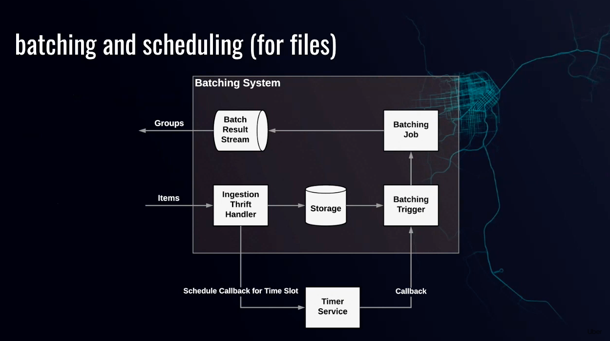

# Payment platform

## Uber Payment Platform

[Youtube](https://youtu.be/MJABqwzBkHs)

* focus on externally facing systems
* Disbursement
* Collection
* Payment Service Provider (PSP) (JSON API, one transaction per request/resposne)
* Bank (File-based API, multiple transactions per request/response)
* things responsible for preventing
    * lack of payment
    * duplicate payments
    * Incorrect currency conversion
    * Incorrect payment
    * Dangling authorization
* 
* Storage for multiplexing and retries
    * idempotency/deduplication
    * track each request/response before we make the call to PSP
    * strong consistency
    * 
* Generate unique external ID
    * ID generation clients (allocate batch of IDs to client)
    * serve IDs in memory (backed up)
    * Can only advance
    * 
* Deterministic Batching
    * Same group of transaction for every try
    * 

## GreenField MVP

### Authorization

* client -> Merchant(POS) -> Acquirer -> Network (MasterCard) -> issuer (bank)

## Shopify eCommerce

### Keywords

* Customers
* Products
* Orders
* Payment
* Shop owners
* Isolation of items
* Plugins
* Storefront v.s. backend API

## Write ahead log (WAL)

The payment transaction need to be logged before the API call is made.

